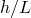

# 31.1 Assembly 对象

以下命令对 Assembly 对象进行操作。有关 Assembly 对象的更多信息，请参见 ["Assembly 对象，" 第 6.1 节](pt01ch06pyo01.md)。

**访问**

```
import mesh
```

### 31.1.1 assignStackDirection(...)

此方法为几何单元分配堆叠方向。堆叠方向将用于在网格生成期间定向单元。

**必需参数**

*cells*

[Cell](pt01ch07pyo01.md) 对象序列，指定要分配堆叠方向的区域。

*referenceRegion*

[Face](pt01ch07pyo05.md) 对象，指定堆叠方向的顶部。

**可选参数**

无。

**返回值**

无

**异常**

无。

### 31.1.2 associateMeshWithGeometry(...)

此方法将几何实体与网格实体关联，这些网格实体可以是孤儿单元、边界孤儿单元或使用自底向上网格技术创建的单元。

**必需参数**

*geometricEntity*

[Cell](pt01ch07pyo01.md)、[Face](pt01ch07pyo05.md)、[Edge](pt01ch07pyo03.md) 或 [Vertex](pt01ch07pyo15.md) 对象，指定要与一个或多个网格实体关联的几何实体。

如果几何实体是 [Cell](pt01ch07pyo01.md) 对象，则必须指定 *elements* 参数。

如果几何实体是 [Face](pt01ch07pyo05.md) 对象，则必须指定 *elemFaces* 参数。

如果几何实体是 [Edge](pt01ch07pyo03.md) 对象，则必须指定 *elemEdges* 参数。

如果几何实体是 [Vertex](pt01ch07pyo15.md) 对象，则必须指定 *node* 参数。

**可选参数**

*elements*

[MeshElement](pt01ch31pyo05.md) 对象序列，指定要与几何单元关联的单元。

*elemFaces*

[MeshFace](pt01ch31pyo08.md) 对象序列，指定要与几何面关联的单元面。

*elemEdges*

[MeshEdge](pt01ch31pyo04.md) 对象序列，指定要与几何边关联的单元边。

*node*

[MeshNode](pt01ch31pyo09.md) 对象，指定要与几何顶点关联的网格节点。

**返回值**

无

**异常**

无。

### 31.1.3 createVirtualTopology(...)

此方法通过基于一组几何参数自动合并面和边来创建虚拟拓扑特征。在网格生成期间将被忽略的边和顶点将被合并。

**必需参数**

*regions*

[Face](pt01ch07pyo05.md) 对象序列或 [PartInstance](pt01ch06pyo04.md) 对象序列，指定要搜索需要合并的几何实体的域。从指定区域外部识别为候选合并的实体可能会与区域外的实体合并。

**可选参数**

*mergeShortEdges*

Boolean，指定是否合并短边。默认值为 False。

*shortEdgeThreshold*

Float，指定确定哪些边被视为短边的阈值。这些边是要合并的候选实体。如果 *mergeShortEdges* 等于 True，则此参数是必需参数；如果 *mergeShortEdges* 等于 False，则此参数被忽略。

*mergeSmallFaces*

Boolean，指定是否合并面积小的面。默认值为 False。

*smallFaceAreaThreshold*

Float，指定确定哪些面被视为小面积的阈值。这些面是要合并的候选实体。如果 *mergeSmallFaces* 等于 True，则此参数是必需参数；如果 *mergeSmallFaces* 等于 False，则此参数被忽略。

*mergeSliverFaces*

Boolean，指定是否合并高纵横比的面。默认值为 False。

*faceAspectRatioThreshold*

Float，指定确定哪些面被视为高纵横比的阈值。这些面是要合并的候选实体。如果 *mergeSliverFaces* 等于 True，则此参数是必需参数；如果 *mergeSliverFaces* 等于 False，则此参数被忽略。

*mergeSmallAngleFaces*

Boolean，指定是否合并具有尖角的面。默认值为 False。

*smallFaceCornerAngleThreshold*

Float，指定确定哪些面角被视为小角的阈值。这些面将是候选合并实体。如果 *mergeSmallAngleFaces* 等于 True，则此参数是必需参数；如果 *mergeSmallAngleFaces* 等于 False，则此参数被忽略。

*mergeThinStairFaces*

Boolean，指定是否合并表示薄楼梯状特征的面。默认值为 False。

*thinStairFaceThreshold*

Float，指定确定哪些表示小楼梯状特征的面被视为薄面的阈值。这些面将是候选合并实体。如果 *mergeThinStairFaces* 为 True，则此参数是必需的；如果 *mergeThinStairFaces* 为 False，则此参数被忽略。

*ignoreRedundantEntities*

Boolean，指定是否移除冗余边和顶点。默认值为 False。

*cornerAngleTolerance*

Float，指定顶点或边处与 180 度偏差的角度，使得从顶点辐射的两条边或边界的两个面可以合并。默认值为 30.0 度。

*applyBlendControls*

Boolean，指定是否验证混合面可以与相邻面合并。如果 *applyBlendControls* 为 True，则所有具有大于 *blendSubtendedAngleTolerance* 的角度且半径小于 *blendRadiusTolerance* 的混合面将不会与相邻面合并，除非相邻面也是具有相似几何特征的混合面。默认值为 False。

*blendSubtendedAngleTolerance*

Float，指定可以与相邻面合并的混合面的最大圆周角。如果 *applyBlendControls* 等于 True，则此参数是必需参数；如果 *applyBlendControls* 等于 False，则此参数被忽略。

*blendRadiusTolerance*

Float，指定可以与相邻面合并的混合面的最小曲率半径。如果 *applyBlendControls* 等于 True，则此参数是必需参数；如果 *applyBlendControls* 等于 False，则此参数被忽略。

**返回值**

Feature 对象。

**异常**

无。

### 31.1.4 deleteBoundaryLayerControls(...)

此方法删除所有指定区域的边界层网格控制参数。

**必需参数**

*regions*

[Cell](pt01ch07pyo01.md) 对象序列，指定要设置边界层网格控制参数的区域。

**可选参数**

无。

**返回值**

无

**异常**

无。

### 31.1.5 deleteMesh(...)

此方法删除包含给定部件实例或区域的本机单元的网格子集。

**必需参数**

*regions*

[PartInstance](pt01ch06pyo04.md) 对象序列或 [Region](pt01ch45pyo03.md) 对象序列，指定要从中删除本机网格的部件实例或区域。

**可选参数**

无。

**返回值**

无

**异常**

无。

### 31.1.6 deleteMeshAssociationWithGeometry(...)

此方法删除几何实体与网格实体的关联。

**必需参数**

*geometricEntities*

[Cell](pt01ch07pyo01.md) 对象序列、[Face](pt01ch07pyo05.md) 对象序列、[Edge](pt01ch07pyo03.md) 对象序列或 [Vertex](pt01ch07pyo15.md) 对象序列，指定将与网格分离的几何实体。

**可选参数**

*addBoundingEntities*

Boolean，指定网格是否也将与给定 *geometricEntities* 边界上的几何实体分离。例如，如果 *geometricEntities* 包含一个面，则此布尔值指示边界该面的边和顶点是否也将与网格分离。默认值为 False。

**返回值**

无

**异常**

无。

### 31.1.7 deletePreviewMesh()

此方法删除程序集中的所有边界网格。请参阅 `generateMesh` 的 *boundaryPreview* 参数以获取有关生成边界网格的信息。

**参数**

无。

**返回值**

无

**异常**

无。

### 31.1.8 deleteSeeds(...)

此方法从给定部件实例删除全局边种子，或从给定边删除局部边种子。

**必需参数**

*regions*

[PartInstance](pt01ch06pyo04.md) 对象序列或 Edge 对象序列，指定要从中删除种子的部件实例或边。

**可选参数**

无。

**返回值**

无

**异常**

无。

### 31.1.9 generateBottomUpExtrudedMesh(...)

此方法通过沿矢量挤压 2D 网格来生成实体单元，适用于孤儿网格或使用自底向上技术在单元区域内生成。

**必需参数**

*cell*

[Cell](pt01ch07pyo01.md) 对象，指定要生成网格的几何区域。此参数仅对本机部件实例有效。

*numberOfLayers*

Int，指定沿挤压矢量生成的层数。

*extrudeVector*

Float 元组序列，指定矢量的起点和终点。每个点由三个坐标的元组定义，指示其位置。网格挤压操作的方向是从第一个点到第二个点。

**可选参数**

必须指定三个可选"SourceSide"参数中的至少一个。

*geometrySourceSide*

[Face](pt01ch07pyo05.md) 对象的 [Region](pt01ch45pyo03.md)，指定要用作挤压网格操作源的几何域。

*elemFacesSourceSide*

[MeshFace](pt01ch31pyo08.md) 对象序列，指定要用作挤压网格操作源的 3D 单元的面。

*elemSourceSide*

2D [MeshElement](pt01ch31pyo05.md) 对象序列，指定要用作挤压网格操作源的单元。

*depth*

Float，指定网格挤压的距离。如果未指定，则假定使用 *extrudeVector* 参数的矢量长度。

*targetSide*

datum 平面、[Face](pt01ch07pyo05.md) 对象序列、[MeshFace](pt01ch31pyo08.md) 对象序列或 2D [MeshElement](pt01ch31pyo05.md) 对象序列，指定挤压网格操作的目标。如果指定，此参数将覆盖 *depth* 参数，源上的所有点将沿挤压矢量方向挤压直到遇到目标。

*biasRatio*

Float，指定源和目标两侧之间挤压方向上单元尺寸的比率。默认值为 1.0，表示无偏置。

*extendElementSets*

Boolean，指定是否将包含源单元的现有单元集扩展到也包含挤压单元。此参数对本机部件实例被忽略。默认值为 False。

**返回值**

无

**异常**

无。

### 31.1.10 generateBottomUpSweptMesh(...)

此方法通过扫掠 2D 网格来生成实体单元，适用于孤儿网格或使用自底向上技术在单元区域内生成。

**必需参数**

*cell*

[Cell](pt01ch07pyo01.md) 对象，指定要生成网格的几何区域。此参数仅对本机部件实例有效。

**可选参数**

必须指定以下三个参数中的至少一个：*geometrySourceSide*、*elemFacesSourceSide* 或 *elemSourceSide*。

此外，还必须指定以下两组参数之一：
- 以下三个参数之一：*geometryConnectingSides*、*elemFacesConnectingSides* 或 *elemConnectingSides*。在这种情况下，targetSide 是可选参数。
- *targetSide* 和 *numberOfLayers*。

*geometrySourceSide*

[Face](pt01ch07pyo05.md) 对象的 [Region](pt01ch45pyo03.md)，指定要用作扫掠网格操作源的几何域。

*elemFacesSourceSide*

[MeshFace](pt01ch31pyo08.md) 对象序列，指定要用作扫掠网格操作源的 3D 单元的面。

*elemSourceSide*

2D [MeshElement](pt01ch31pyo05.md) 对象序列，指定要用作扫掠网格操作源的单元。

*geometryConnectingSides*

[Face](pt01ch07pyo05.md) 对象的 [Region](pt01ch45pyo03.md)，指定扫掠网格操作的连接侧。

*elemFacesConnectingSides*

[MeshFace](pt01ch31pyo08.md) 对象序列，指定扫掠网格操作的连接侧。

*elemConnectingSides*

2D [MeshElement](pt01ch31pyo05.md) 对象序列，指定扫掠网格操作的连接侧。

*targetSide*

[Face](pt01ch07pyo05.md) 对象，指定扫掠网格操作的目标侧。

*numberOfLayers*

Int，指定沿扫掠方向生成的层数。

*extendElementSets*

Boolean，指定是否将包含源单元的现有单元集扩展到也包含扫掠单元。此参数对本机部件实例被忽略。默认值为 False。

**返回值**

无

**异常**

无。

### 31.1.11 generateBottomUpRevolvedMesh(...)

此方法通过绕轴旋转 2D 网格来生成实体单元，适用于孤儿网格或使用自底向上技术在单元区域内生成。

**必需参数**

*cell*

[Cell](pt01ch07pyo01.md) 对象，指定要生成网格的几何区域。此参数仅对本机部件实例有效。

*numberOfLayers*

Int，指定沿旋转轴生成的单元层数。

*axisOfRevolution*

Float 元组序列，指定描述旋转轴的矢量的两个点。每个点由三个坐标的元组定义，指示其位置。旋转轴的方向是从第一个点到第二个点。旋转操作的方向遵循右手定则。

*angleOfRevolution*

Float，指定旋转角度。

**可选参数**

必须指定三个可选"SourceSide"参数中的至少一个。

*geometrySourceSide*

[Face](pt01ch07pyo05.md) 对象的 [Region](pt01ch45pyo03.md)，指定要用作旋转网格操作源的几何域。

*elemFacesSourceSide*

[MeshFace](pt01ch31pyo08.md) 对象序列，指定要用作旋转网格操作源的 3D 单元的面。

*elemSourceSide*

2D [MeshElement](pt01ch31pyo05.md) 对象序列，指定要用作旋转网格操作源的单元。

*extendElementSets*

Boolean，指定是否将包含源单元的现有单元集扩展到也包含挤压单元。此参数对本机部件实例被忽略。默认值为 False。

**返回值**

无

**异常**

无。

### 31.1.12 generateMesh(...)

此方法在给定部件实例或区域中生成网格。

**必需参数**

无。

**可选参数**

*regions*

[PartInstance](pt01ch06pyo04.md) 对象序列或 [Region](pt01ch45pyo03.md) 对象序列，指定要生成网格的部件实例或区域。

*seedConstraintOverride*

Boolean，指定是否允许网格生成修改种子约束。默认值为 OFF。

*meshTechniqueOverride*

Boolean，指定是否允许网格生成修改现有网格技术，以便可以生成兼容的网格。默认值为 OFF。

*boundaryPreview*

Boolean，指定生成的网格是否为边界网格。此选项仅在任何指定区域使用四面体单元或使用自底向上技术与六面体或楔形单元网格划分时有效。默认值为 OFF。

*boundaryMeshOverride*

Boolean，指定是否允许网格生成修改现有边界预览网格。此选项仅在任何指定区域使用四面体单元且已存在边界预览网格时有效。默认值为 OFF。

**返回值**

无

**异常**

无。

### 31.1.13 getEdgeSeeds(...)

此方法返回程序集指定边上的边种子参数。

**必需参数**

*edge*

[Edge](pt01ch07pyo03.md) 对象，指定要查询的边。

*attribute*

SymbolicConstant，指定要返回的边种子属性类型。可能的值为：
- EDGE_SEEDING_METHOD
- BIAS_METHOD
- NUMBER
- AVERAGE_SIZE
- DEVIATION_FACTOR
- MIN_SIZE_FACTOR
- BIAS_RATIO
- BIAS_MIN_SIZE
- BIAS_MAX_SIZE
- VERTEX_ADJ_TO_SMALLEST_ELEM
- SMALLEST_ELEM_LOCATION
- CONSTRAINT

返回值取决于 *attribute* 参数。
- 如果 *attribute*=EDGE_SEEDING_METHOD，返回值是 SymbolicConstant，指定用于沿边创建种子的边播种方法。可能的值为：
  - UNIFORM_BY_NUMBER
  - UNIFORM_BY_SIZE
  - CURVATURE_BASED_BY_SIZE
  - BIASED
  - NONE
- 如果 *attribute*=BIAS_METHOD，返回值是 SymbolicConstant，指定用于沿边创建种子的偏置类型。可能的值为：
  - SINGLE
  - DOUBLE
  - NONE
- 如果 *attribute*=NUMBER，返回值是 Int，指定沿边的单元种子数量。
- 如果 *attribute*=AVERAGE_SIZE，返回值是 Float，指定沿边的平均单元尺寸。
- 如果 *attribute*=DEVIATION_FACTOR，返回值是 Float，指定偏离因子 ，其中  是弦偏差， 是单元长度。如果未定义边种子，返回值为零。
- 如果 *attribute*=MIN_SIZE_FACTOR，返回值是 Float，指定最小允许单元尺寸作为指定全局单元尺寸的分数。如果未定义边种子，返回值为零。
- 如果 *attribute*=BIAS_RATIO，返回值是 Float，指定最大单元与最小单元的长度比率。
- 如果 *attribute*=BIAS_MIN_SIZE，返回值是 Float，指定最大单元的长度；仅在 EDGE_SEEDING_METHOD 为 BIASED 且种子由最小和最大尺寸指定时适用。
- 如果 *attribute*=BIAS_MAX_SIZE，返回值是 Float，指定最大单元的长度；仅在 EDGE_SEEDING_METHOD 为 BIASED 且种子由最小和最大尺寸指定时适用。
- 如果 *attribute*=VERTEX_ADJ_TO_SMALLEST_ELEM，返回值是 Int，指定最小单元相邻顶点的 ID；仅在 EDGE_SEEDING_METHOD 为 BIASED 时适用。
- 如果 *attribute*=SMALLEST_ELEM_LOCATION，返回值是 SymbolicConstant，指定双偏置种子最小单元的位置；仅在 EDGE_SEEDING_METHOD 为 BIASED 且 BIAS_METHOD 为 DOUBLE 时适用。可能的值为：
  - SMALLEST_ELEM_AT_CENTER
  - SMALLEST_ELEM_AT_ENDS
  - NONE
- 如果 *attribute*=CONSTRAINT，返回值是 SymbolicConstant，指定网格必须与种子的匹配程度。可能的值为：
  - FREE
  - FINER
  - FIXED
  - NONE
  NONE 值表示边未播种。

**可选参数**

无。

**返回值**

返回值是 Float、Int 或 SymbolicConstant，取决于 *attribute* 参数的值。

**异常**

无。

### 31.1.14 getElementType(...)

此方法返回分配给程序集区域的给定元素形状的 [ElemType](pt01ch31pyo03.md) 对象。

**必需参数**

*region*

[Cell](pt01ch07pyo01.md)、[Face](pt01ch07pyo05.md) 或 [Edge](pt01ch07pyo03.md) 对象，指定要查询的区域。

*elemShape*

SymbolicConstant，指定要返回单元类型的元素形状。可能的值为：
- LINE
- QUAD
- TRI
- HEX
- WEDGE
- TET

**可选参数**

无。

**返回值**

[ElemType](pt01ch31pyo03.md) 对象。

**异常**

TypeError

```
如果区域无法与单元类型关联，或者 *elemShape* 与 *region* 的维度不一致。
```

### 31.1.15 getIncompatibleMeshInterfaces(...)

此方法返回用不兼容单元网格化的面对象序列。

**必需参数**

无。

**可选参数**

*cells*

单元对象序列，将用于搜索不兼容面。

**返回值**

[Face](pt01ch07pyo05.md) 对象序列。

**异常**

无。

### 31.1.16 getMeshControl(...)

此方法返回程序集指定区域的网格控制参数。

**必需参数**

*region*

[Cell](pt01ch07pyo01.md)、[Face](pt01ch07pyo05.md) 或 [Edge](pt01ch07pyo03.md) 对象，指定要查询的区域。

*attribute*

SymbolicConstant，指定要返回的网格控制属性。可能的值为：
- ELEM_SHAPE
- TECHNIQUE
- ALGORITHM
- MIN_TRANSITION

返回值取决于 *attribute* 参数。
- 如果 *attribute*=ELEM_SHAPE，返回值是 SymbolicConstant，指定网格化期间使用的元素形状。可能的值为：
  - LINE
  - QUAD
  - TRI
  - QUAD_DOMINATED
  - HEX
  - TET
  - WEDGE
  - HEX_DOMINATED
- 如果 *attribute*=TECHNIQUE，返回值是 SymbolicConstant，指定网格化期间使用的网格技术。可能的值为：
  - FREE
  - STRUCTURED
  - SWEEP
  - UNMESHABLE
  UNMESHABLE 表示当前分配的元素形状没有适用的网格技术。
- 如果 *attribute*=ALGORITHM，返回值是 SymbolicConstant，指定网格化期间使用的网格算法。可能的值为：
  - MEDIAL_AXIS
  - ADVANCING_FRONT
  - DEFAULT
  - NON_DEFAULT
  - NONE
  NONE 表示没有适用的算法。
- 如果 *attribute*=MIN_TRANSITION，返回值是 Boolean，指示网格化期间是否使用最小过渡。此选项仅适用于以下情况：
  - 使用 *algorithm*=MEDIAL_AXIS 的自由四边形网格化或扫掠六面体网格化。
  - 结构化四边形网格化。

**可选参数**

无。

**返回值**

返回值是 SymbolicConstant 或 Boolean，取决于 *attribute* 参数的值。

**异常**

TypeError

```
区域不能承载网格控制。
```

### 31.1.17 getMeshStats(...)

此方法返回给定部件实例或区域的网格统计信息。

**必需参数**

*regions*

[PartInstance](pt01ch06pyo04.md) 对象或几何区域的序列或元组，应返回其网格统计信息。

**可选参数**

无。

**返回值**

MeshStats 对象。

**异常**

无。

### 31.1.18 getPartSeeds(...)

此方法返回指定实例的部件种子参数。

**必需参数**

*region*

[PartInstance](pt01ch06pyo04.md) 对象，指定要查询的部件实例。

*attribute*

SymbolicConstant，指定要返回的部件种子属性类型。可能的值为：
- SIZE
- DEFAULT_SIZE
- DEVIATION_FACTOR
- MIN_SIZE_FACTOR

返回值取决于 *attribute* 参数的值。
- 如果 *attribute*=SIZE，返回值是 Float，指定分配的全局单元尺寸。如果未定义部件种子，返回值为零。
- 如果 *attribute*=DEFAULT_SIZE，返回值是 Float，基于部件几何建议的默认全局单元尺寸。
- 如果 *attribute*=DEVIATION_FACTOR，返回值是 Float，指定偏离因子 ，其中  是弦偏差， 是单元长度。如果未定义部件种子，返回值为零。
- 如果 *attribute*=MIN_SIZE_FACTOR，返回值是 Float，指定最小允许单元尺寸作为指定全局单元尺寸的分数。如果未定义部件种子，返回值为零。

**可选参数**

无。

**返回值**

返回值是 Float，其值取决于 *attribute* 参数。

**异常**

如果部件实例不包含本机几何，则会发生异常。

```
Error: Part instance does not contain native geometry
```

### 31.1.19 getUnmeshedRegions()

此方法返回程序集中需要网格进行提交分析但未网格化或网格化不完整的所有几何区域。

**参数**

无。

**返回值**

Region 对象或 None。

**异常**

无。

### 31.1.20 ignoreEntity(...)

此方法创建虚拟拓扑特征。虚拟拓扑允许在网格生成期间忽略不重要的实体。您可以通过指定要忽略的公共边来合并两个相邻面。同样，您可以通过指定要忽略的公共顶点来合并两个相邻边。

**必需参数**

*entities*

顶点序列和边序列，指定在网格生成期间要忽略的实体。

**可选参数**

无。

**返回值**

Feature 对象。

**异常**

无。

### 31.1.21 restoreIgnoredEntity(...)

此方法恢复使用虚拟拓扑特征合并的顶点和边。

**必需参数**

*entities*

[IgnoredVertex](pt01ch07pyo09.md) 对象序列和 [IgnoredEdge](pt01ch07pyo07.md) 对象序列，指定要恢复的实体。

**可选参数**

无。

**返回值**

Feature 对象。

**异常**

无。

### 31.1.22 seedEdgeByBias(...)

此方法使用指定的单元数量和偏置比或指定的最小和最大单元尺寸对给定边进行非均匀播种。

**必需参数**

*biasMethod*

SymbolicConstant，指定是应用单偏置还是双偏置种子分布。如果未指定，将应用单偏置种子分布。可能的值为：
- SINGLE：将应用单偏置种子分布。
- DOUBLE：将应用双偏置种子分布。

*end1Edges*

[Edge](pt01ch07pyo03.md) 对象序列，指定要播种的边。最小单元将位于归一化曲线参数=0.0 的端点附近。当 *biasMethod*=SINGLE 时，必须提供 *end1Edges* 或 *end2Edges* 参数或两者；当 *biasMethod*=DOUBLE 时省略两者。

**注意：**您可以通过 ["getVertices，" 第 7.3.9 节](pt01ch07pyo03.md#ker-edge-getvertices-pyc) 返回的顶点索引顺序来确定哪一端是哪一端。

*end2Edges*

[Edge](pt01ch07pyo03.md) 对象序列，指定要播种的边。最小单元将位于归一化曲线参数=1.0 的端点附近。

*centerEdges*

[Edge](pt01ch07pyo03.md) 对象序列，指定要播种的边。最小单元将位于边中心附近。当 *biasMethod*=DOUBLE 时，必须提供 *centerEdges* 或 *endEdges* 参数或两者；当 *biasMethod*=SINGLE 时省略两者。

*endEdges*

[Edge](pt01ch07pyo03.md) 对象序列，指定要播种的边。最小单元将位于边端点附近。

*ratio*

Float，指定最大单元与最小单元的比率。可能的值为 1.0 ≤ *ratio* ≤ 10^6。

*number*

Int，指定沿每条边的单元数量。可能的值为 1 ≤ *number* ≤ 10^4。

*minSize*

Float，指定所需最小单元尺寸。

*maxSize*

Float，指定所需最大单元尺寸。

**注意：**必须指定 *ratio* 和 *number* 或 *minSize* 和 *maxSize* 参数对。

**可选参数**

*constraint*

SymbolicConstant，指定网格必须与种子匹配的程度。默认值为 FREE。如果未指定，现有约束将保持不变。可能的值为：
- FREE：生成的网格可以比指定的种子更细或更粗。
- FINER：生成的网格可以比指定的种子更细。
- FIXED：网格必须与种子完全匹配（仅关于单元数量，而不是节点定位）。

**返回值**

无

**异常**

无。

### 31.1.23 seedEdgeByNumber(...)

此方法基于沿边的单元数量对给定边进行均匀播种。

**必需参数**

*edges*

[Edge](pt01ch07pyo03.md) 对象序列，指定要播种的边。

*number*

Int，指定沿每条边的单元数量。可能的值为 1 ≤ *number* ≤ 10^4。

**可选参数**

*constraint*

SymbolicConstant，指定网格必须与种子匹配的程度。默认值为 FREE。如果未指定，现有约束将保持不变。可能的值为：
- FREE：生成的网格可以比指定的种子更细或更粗。
- FINER：生成的网格可以比指定的种子更细。
- FIXED：网格必须与种子完全匹配（仅关于单元数量，而不是节点定位）。

**返回值**

无

**异常**

无。

### 31.1.24 seedEdgeBySize(...)

此方法基于所需单元尺寸对给定边进行均匀播种或沿边曲率分布播种。

**必需参数**

*edges*

[Edge](pt01ch07pyo03.md) 对象序列，指定要播种的边。

*size*

Float，指定所需单元尺寸。

**可选参数**

*deviationFactor*

Float，指定偏离因子 ，其中  是弦偏差， 是单元长度。

*minSizeFactor*

Float，指定最小允许单元尺寸作为指定全局单元尺寸的分数。

*constraint*

SymbolicConstant，指定网格必须与种子匹配的程度。默认值为 FREE。如果未指定，现有约束将保持不变。可能的值为：
- FREE：生成的网格可以比指定的种子更细或更粗。
- FINER：生成的网格可以比指定的种子更细。
- FIXED：网格必须与种子完全匹配（仅关于单元数量，而不是节点定位）。

**返回值**

无

**异常**

无。

### 31.1.25 seedPartInstance(...)

此方法向给定部件实例分配全局边种子。

**必需参数**

*regions*

[PartInstance](pt01ch06pyo04.md) 对象序列，指定要播种的部件实例。

*size*

Float，指定边的所需全局单元尺寸。

**可选参数**

*deviationFactor*

Float，指定偏离因子 ，其中  是弦偏差， 是单元长度。

*minSizeFactor*

Float，指定最小允许单元尺寸作为指定全局单元尺寸的分数。

*constraint*

SymbolicConstant，指定网格必须与种子匹配的程度。默认值为 FREE。如果未指定，现有约束将保持不变。可能的值为：
- FREE：生成的网格可以比指定的种子更细或更粗。
- FINER：生成的网格可以比指定的种子更细。

**返回值**

无

**异常**

无。

### 31.1.26 setBoundaryLayerControls(...)

此方法为指定区域设置边界层网格的控制参数。

**必需参数**

*regions*

[Cell](pt01ch07pyo01.md) 对象序列，指定要设置边界层网格控制参数的区域。

*firstElemSize*

Float，指定边界外第一层单元的高度。可能的值为 0.0 ≤ *firstElemSize* ≤ 10^6。

*growthFactor*

Float，指定任意两个连续单元层的高度比率。可能的值为 1.0 ≤ *growthFactor* ≤ 10.0。

*numLayers*

Int，指定要生成的单元层数。可能的值为 1 ≤ *numLayers* ≤ 10^4。

**可选参数**

*inactiveFaces*

[Face](pt01ch07pyo05.md) 对象序列，指定不应生成边界层的面。默认情况下，边界层网格将在所选区域的所有面上生成。

*setName*

String，指定将包含边界层单元的集合的唯一名称。

**返回值**

无

**异常**

无。

### 31.1.27 setElementType(...)

此方法向指定区域分配单元类型。

**必需参数**

*regions*

几何区域序列、[MeshElement](pt01ch31pyo05.md) 对象序列或包含几何区域或单元的 Set 对象，指定要分配单元类型的区域。

*elemTypes*

ElemType 对象序列，每个适用于区域的元素形状一个。

**注意：**如果 ElemType 对象对于 *elemCode* 具有 UNKNOWN_*xxx* 值，则其顺序将从同一 `setElementType` 命令中其他有效 ElemType 对象的顺序推断。如果找不到有效的 ElemType 对象，则顺序将保持不变。

**可选参数**

无。

**返回值**

无

**异常**

由于元素分配的结果，区域必须对其所有分配的单元类型具有相同的库族和阶。否则将抛出异常。

例如，假设先前分配给单元的 Hex、Wedge 和 Tet 单元都是线性的。用户现在使用二次 Hex 单元构造一个 ElemType 对象，并仅在此 `setElementType` 命令中包含此对象。由于 Wedge 和 Tet 单元将保持线性（即 As Is）并与新分配的四次 Hex 单元不兼容，因此将抛出异常。

### 31.1.28 setLogicalCorners(...)

此方法为可映射面区域设置逻辑角点。

**必需参数**

*region*

Face 区域。

*corners*

三个、四个或五个 Vertex 对象，定义给定可映射面区域的逻辑角点。

**可选参数**

无。

**返回值**

无

**异常**

无。

### 31.1.29 setMeshControls(...)

此方法为指定区域设置网格控制参数。

**必需参数**

*regions*

Face 或 Cell 区域序列，指定要设置网格控制参数的区域。

**可选参数**

*elemShape*

SymbolicConstant，指定用于网格化的元素形状。Face 区域的默认值为 QUAD，Cell 区域的默认值为 HEX。如果未指定，现有元素形状将保持不变。可能的值为：
- QUAD：四边形网格。
- QUAD_DOMINATED：四边形主导网格。
- TRI：三角形网格。
- HEX：六面体网格。
- HEX_DOMINATED：六面体主导网格。
- TET：四面体网格。
- WEDGE：楔形网格。

*technique*

SymbolicConstant，指定要使用的网格技术。Face 区域的默认值为 FREE。对于 Cell 区域，初始值取决于区域的几何形状，可以是 STRUCTURED、SWEEP 或"unmeshable"。如果未指定，现有网格技术将保持不变。可能的值为：
- FREE：自由网格技术。
- STRUCTURED：结构化网格技术。
- SWEEP：扫掠网格技术。
- BOTTOM_UP：自底向上网格技术。仅适用于单元区域。
- SYSTEM_ASSIGN：允许系统分配合适的技术。实际分配的技术可以是 STRUCTURED、SWEEP 或"unmeshable"。

*algorithm*

SymbolicConstant，指定用于为指定区域生成网格的算法。可能的值为 MEDIAL_AXIS、ADVANCING_FRONT 和 NON_DEFAULT。如果未指定，现有值将保持不变。此选项仅在以下情况下适用：
- 自由四边形或四边形主导网格化。在这种情况下，可能的值为 MEDIAL_AXIS 和 ADVANCING_FRONT。
- 扫掠六面体或六面体主导网格化。在这种情况下，可能的值为 MEDIAL_AXIS 和 ADVANCING_FRONT。
- 自由四面体网格化。在这种情况下，唯一可能的值为 NON_DEFAULT，它表示将使用 Abaqus 6.4 或更早版本中可用的自由四面体网格技术。如果未指定算法，将使用默认四面体网格技术。

*minTransition*

Boolean，指定是否应用最小过渡。默认值为 ON。如果未指定，现有值将保持不变。此选项仅在以下情况下适用：
- 使用 *algorithm*=MEDIAL_AXIS 的自由四边形网格化或六面体扫掠网格化。
- 结构化四边形网格化。

*sizeGrowth*

SymbolicConstant，指定生成四面体网格内部时应用的单元尺寸增长。可能的值为 MODERATE 和 MAXIMUM。如果未指定，现有值将保持不变。此选项仅适用于默认四面体网格器。

*allowMapped*

Boolean，指定是否可以使用映射网格化来替换所选网格技术。*allowMapped* 参数仅在以下情况下适用：
- 自由三角形网格化。
- 使用 *algorithm*=ADVANCING_FRONT 的自由四边形或四边形主导网格化。
- 使用 *algorithm*=ADVANCING_FRONT 的六面体或六面体主导扫掠网格化。
- 自由四面体网格化。*allowMapped*=True 意味着可以在限定三维 *regions* 的面上使用映射三角形网格化。

**返回值**

无

**异常**

无。

### 31.1.30 setSweepPath(...)

此方法设置可扫掠区域的扫掠路径或可旋转区域的旋转路径。

**必需参数**

*region*

可扫掠区域。

*edge*

[Edge](pt01ch07pyo03.md) 对象，指定扫掠或旋转路径。

*sense*

SymbolicConstant，指定扫掠方向。该方向只会影响如何创建垫片单元；如果不使用垫片单元，则不会有影响。可能的值为 FORWARD 或 REVERSE。

如果 *sense*=FORWARD，则将使用给定边底层曲线的方向。

**可选参数**

无。

**返回值**

无

**异常**

无。

### 31.1.31 verifyMeshQuality(...)

此方法测试部件实例网格的质量并返回劣质单元。

**必需参数**

*criterion*

SymbolicConstant，指定用于质量检查的标准。可能的值为：

** ANALYSIS_CHECKS **

指定此标准时，Abaqus/CAE 将调用随 Abaqus/Standard 和 Abaqus/Explicit 的输入文件处理器一起包含的单元质量检查。

** ANGULAR_DEVIATION **

元素面角从理想角度偏离的最大量（以度为单位）。理想角度是四边形元素面为 90 度，三角形元素面为 60 度。角度偏差大于指定阈值的元素将无法通过此测试。

** ASPECT_RATIO **

元素最长边与最短边长度的比率。纵横比大于指定阈值的元素将无法通过此测试。

** GEOM_DEVIATION_FACTOR **

与几何边或面关联的任何元素边沿评估的最大几何偏离因子。元素边的几何偏离因子是通过将元素边与其关联几何之间的最大间隙除以元素边的长度来计算的。几何偏离因子大于指定阈值的元素将无法通过此测试。

** LARGE_ANGLE **

元素任意面上最大的角角度。面角大于指定阈值（度）的元素将无法通过此测试。

** LONGEST_EDGE **

元素最长边的长度。边长于指定阈值的元素将无法通过此测试。

** MAX_FREQUENCY **

元素对 Abaqus/Standard 分析的初始最大允许频率的贡献的估计。此计算需要适当的截面分配和材料定义。最大允许频率小于给定值的元素将无法通过此测试。

** SHAPE_FACTOR **

三角形和四面体元素的形状因子。这是元素面积或体积与最佳元素面积或体积的比率。形状因子小于指定阈值的元素将无法通过此测试。

** SHORTEST_EDGE **

元素最短边的长度。边短于指定阈值的元素将无法通过此测试。

** SMALL_ANGLE **

元素任意面上最小的角角度。面角小于给定值（度）的元素将无法通过此测试。

** STABLE_TIME_INCREMENT **

元素对 Abaqus/Explicit 分析的初始最大稳定时间增量的贡献的估计。此计算需要适当的截面分配和材料定义。需要时间增量小于给定值的元素将无法通过此测试。

**可选参数**

*threshold*

Float 值，根据指定标准用于确定低质量元素。当使用 ANALYSIS_CHECKS 标准时，将忽略此参数。对于其他标准，如果未指定此参数，则不会返回失败元素列表。

*elemShape*

SymbolicConstant，指定用于限制查询的元素形状。可能的值为 LINE、QUAD、TRI、HEX、WEDGE 和 TET。

*regions*

[Region](pt01ch45pyo03.md) 或 [MeshElement](pt01ch31pyo05.md) 对象序列。如果未指定 *regions* 参数，则考虑程序集中的所有网格。

**返回值**

Dictionary 对象，包含以下一些键的值：failedElements、warningElements、naElements（[MeshElement](pt01ch31pyo05.md) 对象序列）；numElements（Int）；average、worst（Float）；worstElement（[MeshElement](pt01ch31pyo05.md) 对象）

**异常**

无。
