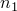

# 35.2 CommonOptions 对象

CommonOptions 对象存储与所有绘图状态通用的值和属性。CommonOptions 对象没有构造函数命令。当您导入 Visualization 模块时，Abaqus 会创建 *defaultOdbDisplay.commonOptions* 成员。当创建 [OdbDisplay](pt01ch35pyo01.md) 对象时，Abaqus 会创建 *commonOptions* 成员，使用 *defaultOdbDisplay.commonOptions* 的值。创建视口时，Abaqus 会创建 *odbDisplay* 成员，使用 *defaultOdbDisplay* 的值。

CommonOptions 对象通过两种方式之一访问：
- 默认通用选项。创建其他 *commonOptions* 成员时使用这些设置作为默认值。可以设置这些值以自定义用户首选项。
- 与特定视口关联的通用选项。

CommonOptions 对象派生自 [DGCommonOptions](pt01ch40pyo02.md) 对象。

**访问**

```
import visualization
session.defaultOdbDisplay.commonOptions
session.viewports[*name*].assemblyDisplay.displayGroupInstances[*name*]\
.odbDisplayOptions.commonOptions
session.viewports[*name*].layers[*name*].assemblyDisplay\
.displayGroupInstances[*name*].odbDisplayOptions.commonOptions
session.viewports[*name*].layers[*name*].odbDisplay.commonOptions
session.viewports[*name*].layers[*name*].odbDisplay\
.displayGroupInstances[*name*].odbDisplayOptions.commonOptions
session.viewports[*name*].layers[*name*].partDisplay\
.displayGroupInstances[*name*].odbDisplayOptions.commonOptions
session.viewports[*name*].odbDisplay.commonOptions
session.viewports[*name*].odbDisplay.displayGroupInstances[*name*]\
.odbDisplayOptions.commonOptions
session.viewports[*name*].partDisplay.displayGroupInstances[*name*]\
.odbDisplayOptions.commonOptions
```

### 35.2.1 setValues(...)

此方法修改 CommonOptions 对象。

**必要参数**

无。

**可选参数**

*options*

要从中复制值的 CommonOptions 对象。如果还向 `setValues` 提供其他参数，它们将覆盖 *options* 中的值。默认值为 `None`。

*renderStyle*

一个 SymbolicConstant，指定绘图的渲染样式。可能的值为 WIREFRAME、FILLED、HIDDEN 和 SHADED。默认值为 SHADED。

*visibleEdges*

一个 SymbolicConstant，指定要绘制的边。可能的值为 ALL、EXTERIOR、FEATURE、FREE 和 NONE。默认值为 EXTERIOR。

NONE 仅在 *renderStyle*=SHADED 时可用。

*deformationScaling*

一个 SymbolicConstant，指定变形比例因子模式。可能的值为 AUTO、UNIFORM 和 NONUNIFORM。默认值为 AUTO。

*uniformScaleFactor*

一个 Float，指定当 *deformationScaling*=UNIFORM 时的均匀变形比例常数。默认值为 *autoDeformationScaleValue*。

*nonuniformScaleFactor*

三个浮点数序列，指定当 *deformationScaling*=NONUNIFORM 时在三个坐标方向中的变形比例。默认值为 (*autoDeformationScaleValue*, *autoDeformationScaleValue*, *autoDeformationScaleValue*)。

*edgeColorWireHide*

一个字符串，指定当 *renderStyle*=WIREFRAME 或 HIDDEN 时用于绘制模型边的颜色。默认值为 "White"。

*edgeColorFillShade*

一个字符串，指定当 *renderStyle*=FILLED 或 SHADED 时用于绘制模型边的颜色。默认值为 "Black"。

*edgeLineStyle*

一个 SymbolicConstant，指定边线样式。可能的值为 SOLID、DASHED、DOTTED 和 DOT_DASH。默认值为 SOLID。

*edgeLineThickness*

一个 SymbolicConstant，指定边线厚度。可能的值为 VERY_THIN、THIN、MEDIUM 和 THICK。默认值为 VERY_THIN。

*fillColor*

一个字符串，指定当 *renderStyle*=FILLED 或 SHADED 时用于填充单元的颜色。默认值为 "White"。

*colorCodeOverride*

一个布尔值，指定是否允许输出数据库中的颜色编码项目覆盖边和填充颜色设置。默认值为 ON。

*labelFont*

一个字符串，指定用于所有模型标签的标签字体。默认值为 "-*-courier-medium-r-normal-*-*-120-*-*-m-*-*-*"。

*elemLabels*

一个布尔值，指定是否绘制单元标签。默认值为 OFF。

*elemLabelColor*

一个字符串，指定用于绘制单元标签的颜色。默认值为 "Cyan"。

*faceLabels*

一个布尔值，指定是否绘制面标签。默认值为 OFF。

*faceLabelColor*

一个字符串，指定用于绘制面标签的颜色。默认值为 "Red"。

*nodeLabels*

一个布尔值，指定是否绘制节点标签。默认值为 OFF。

*nodeLabelColor*

一个字符串，指定用于绘制节点标签的颜色。默认值为 "Yellow"。

*nodeSymbols*

一个布尔值，指定是否绘制节点符号。默认值为 OFF。

*nodeSymbolType*

一个 SymbolicConstant，指定节点符号类型。可能的值为：
- FILLED_CIRCLE
- FILLED_SQUARE
- FILLED_DIAMOND
- FILLED_TRI
- HOLLOW_CIRCLE
- HOLLOW_SQUARE
- HOLLOW_DIAMOND
- HOLLOW_TRI
- CROSS
- XMARKER

默认值为 HOLLOW_CIRCLE。

*nodeSymbolColor*

一个字符串，指定用于绘制节点符号的颜色。默认值为 "Yellow"。

*nodeSymbolSize*

一个 SymbolicConstant，指定节点符号大小。可能的值为 SMALL、MEDIUM 和 LARGE。默认值为 SMALL。

*elementShrink*

一个布尔值，指定是否以收缩格式显示单元。默认值为 OFF。

*elementShrinkFactor*

一个整数，指定当 *elementShrink*=ON 时收缩单元的百分比。可能的值为 0 *elementShrinkPercentage*  90。默认值为 5。

*coordinateScale*

一个布尔值，指定是否缩放坐标。默认值为 OFF。

*coordinateScaleFactors*

三个浮点数序列，指定当 *coordinateScale*=ON 时在三个坐标方向中的坐标缩放。默认值为 (1, 1, 1)。

*normals*

一个布尔值，指定是否绘制指示单元和表面法线方向的箭头。默认值为 OFF。

*normalDisplay*

一个 SymbolicConstant，指定绘制单元法线还是表面法线。可能的值为 ELEMENT 和 SURFACE。默认值为 ELEMENT。

*faceNormalColor*

一个字符串，指定用于绘制非梁单元或表面法线的颜色。默认值为 "Red"。

*beamN1Color*

一个字符串，指定用于沿梁  方向绘制箭头的颜色。默认值为 "Blue"。

*beamN2Color*

一个字符串，指定用于沿梁  方向绘制箭头的颜色。默认值为 "Red"。

*beamTangentColor*

一个字符串，指定用于沿梁切线方向绘制箭头的颜色。默认值为 "White"。

*normalArrowLength*

一个 SymbolicConstant，指定法线箭头长度。可能的值为 SHORT、MEDIUM 和 LONG。默认值为 MEDIUM。

*normalLineThickness*

一个 SymbolicConstant，指定法线箭头厚度。可能的值为 VERY_THIN、THIN、MEDIUM 和 THICK。默认值为 VERY_THIN。

*normalArrowheadStyle*

一个 SymbolicConstant，指定法线箭头箭头样式。可能的值为 NONE、FILLED 和 WIRE。默认值为 WIRE。

*translucency*

一个布尔值，指定是否设置透明度。默认值为 OFF。

*translucencyFactor*

一个 Float，指定当 *translucency*=ON 时的透明度因子。可能的值为 0.0 *translucencyFactor*  1.0。默认值为 0.3。

**返回值**

无

**异常**

RangeError。

### 35.2.2 成员

CommonOptions 对象可以具有以下成员：

*deformationScaling*

一个 SymbolicConstant，指定变形比例因子模式。可能的值为 AUTO、UNIFORM 和 NONUNIFORM。默认值为 AUTO。

*uniformScaleFactor*

一个 Float，指定当 *deformationScaling*=UNIFORM 时的均匀变形比例常数。默认值为 *autoDeformationScaleValue*。

*autoDeformationScaleValue*

一个 Float，指定当 *deformationScaling*=AUTO 时的变形比例因子值。此值是只读的。

*nonuniformScaleFactor*

三个浮点数元组，指定当 *deformationScaling*=NONUNIFORM 时在三个坐标方向中的变形比例。默认值为 (*autoDeformationScaleValue*, *autoDeformationScaleValue*, *autoDeformationScaleValue*)。

*renderStyle*

一个 SymbolicConstant，指定绘图的渲染样式。可能的值为 WIREFRAME、FILLED、HIDDEN 和 SHADED。默认值为 SHADED。

*visibleEdges*

一个 SymbolicConstant，指定要绘制的边。可能的值为 ALL、EXTERIOR、FEATURE、FREE 和 NONE。默认值为 EXTERIOR。

NONE 仅在 *renderStyle*=SHADED 时可用。

*edgeLineStyle*

一个 SymbolicConstant，指定边线样式。可能的值为 SOLID、DASHED、DOTTED 和 DOT_DASH。默认值为 SOLID。

*edgeLineThickness*

一个 SymbolicConstant，指定边线厚度。可能的值为 VERY_THIN、THIN、MEDIUM 和 THICK。默认值为 VERY_THIN。

*colorCodeOverride*

一个布尔值，指定是否允许输出数据库中的颜色编码项目覆盖边和填充颜色设置。默认值为 ON。

*elemLabels*

一个布尔值，指定是否绘制单元标签。默认值为 OFF。

*faceLabels*

一个布尔值，指定是否绘制面标签。默认值为 OFF。

*nodeLabels*

一个布尔值，指定是否绘制节点标签。默认值为 OFF。

*nodeSymbols*

一个布尔值，指定是否绘制节点符号。默认值为 OFF。

*nodeSymbolType*

一个 SymbolicConstant，指定节点符号类型。可能的值为：
- FILLED_CIRCLE
- FILLED_SQUARE
- FILLED_DIAMOND
- FILLED_TRI
- HOLLOW_CIRCLE
- HOLLOW_SQUARE
- HOLLOW_DIAMOND
- HOLLOW_TRI
- CROSS
- XMARKER

默认值为 HOLLOW_CIRCLE。

*nodeSymbolSize*

一个 SymbolicConstant，指定节点符号大小。可能的值为 SMALL、MEDIUM 和 LARGE。默认值为 SMALL。

*elementShrink*

一个布尔值，指定是否以收缩格式显示单元。默认值为 OFF。

*elementShrinkFactor*

一个整数，指定当 *elementShrink*=ON 时收缩单元的百分比。可能的值为 0 *elementShrinkPercentage*  90。默认值为 5。

*coordinateScale*

一个布尔值，指定是否缩放坐标。默认值为 OFF。

*normals*

一个布尔值，指定是否绘制指示单元和表面法线方向的箭头。默认值为 OFF。

*normalDisplay*

一个 SymbolicConstant，指定绘制单元法线还是表面法线。可能的值为 ELEMENT 和 SURFACE。默认值为 ELEMENT。

*normalArrowLength*

一个 SymbolicConstant，指定法线箭头长度。可能的值为 SHORT、MEDIUM 和 LONG。默认值为 MEDIUM。

*normalLineThickness*

一个 SymbolicConstant，指定法线箭头厚度。可能的值为 VERY_THIN、THIN、MEDIUM 和 THICK。默认值为 VERY_THIN。

*normalArrowheadStyle*

一个 SymbolicConstant，指定法线箭头箭头样式。可能的值为 NONE、FILLED 和 WIRE。默认值为 WIRE。

*translucency*

一个布尔值，指定是否设置透明度。默认值为 OFF。

*translucencyFactor*

一个 Float，指定当 *translucency*=ON 时的透明度因子。可能的值为 0.0 *translucencyFactor*  1.0。默认值为 0.3。

*edgeColorWireHide*

一个字符串，指定当 *renderStyle*=WIREFRAME 或 HIDDEN 时用于绘制模型边的颜色。默认值为 "White"。

*edgeColorFillShade*

一个字符串，指定当 *renderStyle*=FILLED 或 SHADED 时用于绘制模型边的颜色。默认值为 "Black"。

*fillColor*

一个字符串，指定当 *renderStyle*=FILLED 或 SHADED 时用于填充单元的颜色。默认值为 "White"。

*labelFont*

一个字符串，指定用于所有模型标签的标签字体。默认值为 "-*-courier-medium-r-normal-*-*-120-*-*-m-*-*-*"。

*elemLabelColor*

一个字符串，指定用于绘制单元标签的颜色。默认值为 "Cyan"。

*faceLabelColor*

一个字符串，指定用于绘制面标签的颜色。默认值为 "Red"。

*nodeLabelColor*

一个字符串，指定用于绘制节点标签的颜色。默认值为 "Yellow"。

*nodeSymbolColor*

一个字符串，指定用于绘制节点符号的颜色。默认值为 "Yellow"。

*faceNormalColor*

一个字符串，指定用于绘制非梁单元或表面法线的颜色。默认值为 "Red"。

*beamN1Color*

一个字符串，指定用于沿梁  方向绘制箭头的颜色。默认值为 "Blue"。

*beamN2Color*

一个字符串，指定用于沿梁  方向绘制箭头的颜色。默认值为 "Red"。

*beamTangentColor*

一个字符串，指定用于沿梁切线方向绘制箭头的颜色。默认值为 "White"。

*coordinateScaleFactors*

三个浮点数元组，指定当 *coordinateScale*=ON 时在三个坐标方向中的坐标缩放。默认值为 (1, 1, 1)。
