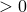

# 47.9 NumberFormat object


The NumberFormat               object is a formatting template used to define formatting options for certain numeric output.

**Access**

```
import visualization
session.defaultFieldReportOptions.numberFormat
session.fieldReportOptions.numberFormat
session.journalOptions.defaultFormat
session.journalOptions.fieldReportFormat
session.journalOptions.geometryFormat
```

### 47.9.1 NumberFormat(...)

This method creates a NumberFormat object.

**Path**

```
session.defaultFieldReportOptions.NumberFormat
session.fieldReportOptions.NumberFormat
session.journalOptions.NumberFormat
```

**Required arguments**

None.

**Optional arguments**

*blankPad*

A Boolean specifying whether the printed digits should be padded with blank characters to ensure equal sized fields. The *blankPad*                  argument is useful when your printed output includes columns.                 The default value is ON.

*format*

A SymbolicConstant specifying the formatting type. Possible values are ENGINEERING, SCIENTIFIC, and AUTOMATIC. The default value is ENGINEERING.

*numDigits*

An Int specifying the number of digits to be displayed in the result. *numDigits*                   .                 The default value is 6.

*precision*

An Int specifying the number of decimal places to which the number is to be truncated for display. *precision*                   . If *precision*                  =0, no truncation is applied.                 The default value is 0.

**Return value**

A NumberFormat object.

**Exceptions**

None.

### 47.9.2 Members

The NumberFormat object has members with the same names and descriptions as the arguments to the [NumberFormat](pt01ch47pyo09.md#ker-numberformat-numberformat-pyc) method.


