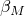

# 50.13 RayleighDampingByFrequencyComponent 对象

RayleighDampingByFrequencyComponent 对象用于定义一系列频率的 Rayleigh 阻尼。

**访问**

```
import step
mdb.models[*name*].steps[*name*].rayleighDampingByFrequency.components[*i*]
```

### 50.13.1 成员

RayleighDampingByFrequencyComponent 对象具有以下成员：

*frequency*

一个 Float，指定频率值（周期/时间）。

*alpha*

一个 Float，指定质量比例阻尼 。

*beta*

一个 Float，指定刚度比例阻尼 。
