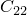
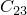
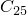
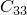
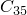
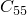

# 58.4 ConnectorDamping object


The ConnectorDamping object defines damping behavior for one or more components of a connector's relative motion.

The ConnectorDamping object is derived from the [ConnectorBehaviorOption](pt02ch58pyo01.md) object.

**Access**

```
sectionApi.sections()[*name*].behaviorOptions(*i*)
```

### 58.4.1 ConnectorDamping(...)

This method creates a connector damping behavior option for a [ConnectorSection](pt02ch63pyo08.md) object.

**Path**

```
sectionApi.sections()[*name*].ConnectorDamping
```

**Prototype**

```
odb_ConnectorDamping&
ConnectorDamping(const odb_String& behavior,
                const odb_String& coupling,
                int dependencies,
                bool temperatureDependency,
                bool frequencyDependency,
                const odb_SequenceSequenceDouble& table,
                const odb_SequenceInt& independentComponents,
                const odb_SequenceInt& components);
```

**Required arguments**

None.

**Optional arguments**

*behavior*

An odb_String specifying if the damping behavior is linear or nonlinear. Possible values are "LINEAR" and "NONLINEAR". The default value is "LINEAR".

*coupling*

An odb_String specifying whether the damping behavior is coupled between the connector's components of relative motion. If *behavior*="LINEAR", then possible values are "UNCOUPLED" and "COUPLED". If *behavior*="NONLINEAR", then possible values are "UNCOUPLED", "COUPLED_POSITION", and "COUPLED_MOTION". Possible values are "UNCOUPLED", "COUPLED", "COUPLED_POSITION", and "COUPLED_MOTION". The default value is "UNCOUPLED".

*dependencies*

An Int specifying the number of field variable dependencies. The default value is 0.

*temperatureDependency*

A Boolean specifying whether the behavior data depend on temperature. The default value is false.

*frequencyDependency*

A Boolean specifying whether the behavior data depend on frequency. This value is applicable only if *behavior*= "LINEAR" and *coupling*="UNCOUPLED". The default value is false.

*table*

An odb_SequenceSequenceDouble specifying damping properties. Items in the table data are described below. The default value is an empty sequence.

*independentComponents*

An odb_SequenceInt specifying the list of independent components that are included in the definition of the connector damping data. This argument is applicable only if *behavior*="NONLINEAR" and *coupling*="COUPLED_POSITION" or "COUPLED_MOTION". When this argument is applicable, at least one value must be specified. Only available components can be specified. The default value is an empty sequence.

*components*

An odb_SequenceInt specifying the components of relative motion for which the behavior is defined.  Possible values are 1  *components*  6. Only available components can be specified. The default value is an empty sequence.

**Table data**

If *behavior*=LINEAR and *coupling*=UNCOUPLED, then each sequence of the table data specifies the following:
- Damping coefficient (force or moment per relative velocity).
- Frequency (cycles/time), if the data depend on frequency.
- Temperature, if the data depend on temperature.
- Value of the first field variable, if the data depend on field variables.
- Value of the second field variable.
- Etc.

If *behavior*=NONLINEAR and *coupling*=UNCOUPLED, then each sequence of the table data specifies the following:- Force or moment.
- Relative displacement or rotation.
- Temperature, if the data depend on temperature.
- Value of the first field variable, if the data depend on field variables.
- Value of the second field variable.
- Etc.

If *behavior*=LINEAR and *coupling*=COUPLED, the table data specify the symmetric portion of the damping matrix for the specified components followed by any temperature data and then any field data. For example, if components 2, 3, and 5 are specified, the table portion of the command is as follows: 
```
table=( (, , , , , ,), )
```
The following items should then be specified as comma-separated data:- Temperature, if the data depend on temperature.
- Value of the first field variable, if the data depend on field variables.
- Value of the second field variable.
- Etc.

If *behavior*=NONLINEAR and *coupling*=COUPLED_POSITION or COUPLED_MOTION, each sequence of the table data specifies the following:- Force or moment for the directions in the *components* list.
- Relative velocity for the directions in the *components* list.
- Relative position or angle for the first *independentComponents* direction if *coupling*=COUPLED_POSITION. Relative displacement or rotation for the first *independentComponents* direction if *coupling*=COUPLED_MOTION.
- Relative position or angle for the second *independentComponents* direction if *coupling*=COUPLED_POSITION. Relative displacement or rotation for the second *independentComponents* direction if *coupling*=COUPLED_MOTION.
- Etc. up to the Nth *independentComponents* direction.
- Temperature, if the data depend on temperature.
- Value of the first field variable, if the data depend on field variables.
- Value of the second field variable.
- Etc.

**Return value**

A ConnectorDamping object.

**Exceptions**

ValueError and TextError.

### 58.4.2 setValues(...)

This method modifies the ConnectorDamping object.

**Required arguments**

None.

**Optional arguments**

The optional arguments to `setValues` are the same as the arguments to the [ConnectorDamping](pt02ch58pyo04.md#ker-connectordamping-connectordamping-cpp) method.

**Return value**

None

**Exceptions**

ValueError.

### 58.4.3 Members

The ConnectorDamping object has members with the same names and descriptions as the arguments to the [ConnectorDamping](pt02ch58pyo04.md#ker-connectordamping-connectordamping-cpp) method.

In addition, the ConnectorDamping object can have the following member:

**Prototype**

```
odb_ConnectorOptions options() const;
```

*options*

A [ConnectorOptions](pt02ch58pyo09.md) object specifying the [ConnectorOptions](pt02ch58pyo09.md) used         to define tabular options for this [ConnectorBehaviorOption](pt02ch58pyo01.md).

### 58.4.4 Corresponding analysis keywords

| [*CONNECTOR DAMPING](../key/key-link.md#usb-kws-mconnectordamping) |
| --- |


