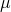
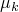
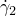

# 58.14 TangentialBehavior object


The TangentialBehavior object specifies tangential behavior for a connector friction behavior option.

**Access**

```
sectionApi.sections()[*name*].behaviorOptions(*i*).tangentialBehavior()
```

### 58.14.1 TangentialBehavior(...)

This method creates a TangentialBehavior object.

**Path**

```
sectionApi.sections()[*name*].behaviorOptions(*i*).TangentialBehavior
```

**Prototype**

```
odb_TangentialBehavior&
TangentialBehavior(const odb_String& formulation,
                bool slipRateDependency,
                bool pressureDependency,
                bool temperatureDependency,
                int dependencies,
                const odb_String& exponentialDecayDefinition,
                odb_Union shearStressLimit,
                const odb_String& maximumElasticSlip,
                double fraction,
                odb_Union absoluteDistance,
                const odb_SequenceSequenceDouble& table);
```

**Required arguments**

None.

**Optional arguments**

*formulation*

An odb_String specifying the friction coefficient formulation. Possible values are "PENALTY" and "EXPONENTIAL_DECAY". The default value is "PENALTY".

*slipRateDependency*

A Boolean specifying whether the data depend on slip rate. The default value is false.

*pressureDependency*

A Boolean specifying whether the data depend on contact pressure. The default value is false.

*temperatureDependency*

A Boolean specifying whether the data depend on temperature. The default value is false.

*dependencies*

An Int specifying the number of field variables for the data. The default value is 0.

*exponentialDecayDefinition*

An odb_String specifying the exponential decay definition for the data. Possible values are "COEFFICIENTS" and "TEST_DATA". The default value is "COEFFICIENTS".

*shearStressLimit*

The string "NONE" or a Double specifying no upper limit or the friction coefficient shear stress limit. The default value is "NONE".

*maximumElasticSlip*

An odb_String specifying the method for modifying the allowable elastic slip. Possible values are "FRACTION" and "ABSOLUTE_DISTANCE". The default value is "FRACTION".

This argument applies only to Abaqus/Standard analyses.

*fraction*

A Double specifying the ratio of the allowable maximum elastic slip to a characteristic model dimension.  The default value is 10–4.

This argument applies only to Abaqus/Standard analyses.

*absoluteDistance*

The string "NONE" or a Double specifying the absolute magnitude of the allowable elastic slip. The default value is "NONE".

This argument applies only to Abaqus/Standard analyses.

*table*

An odb_SequenceSequenceDouble specifying the tangential properties. Items in the table data are described below. The default value is an empty sequence.

**Table data**

If *formulation*=PENALTY, the table data specify the following:
- Friction coefficient in the slip direction, .
- Slip rate, if the data depend on slip rate.
- Contact pressure, if the data depend on contact pressure.
- Temperature, if the data depend on temperature.
- Value of the first field variable, if the data depend on field variables.
- Value of the second field variable.
- Etc.

If *formulation*=EXPONENTIAL_DECAY and *exponentialDecayDefinition*=COEFFICIENTS, the table data specify the following:
- Static friction coefficient, .
- Kinetic friction coefficient, .
- Decay coefficient, .

If *formulation*=EXPONENTIAL_DECAY and *exponentialDecayDefinition*=TEST_DATA, the table data specify the following:
- Static coefficient of friction.
- Dynamic friction coefficient measured at the reference slip rate, .
- Reference slip rate, , used to measure the dynamic friction coefficient.
- Kinetic friction coefficient, . This value corresponds to the asymptotic value of the friction coefficient at infinite slip rate, .

**Return value**

A TangentialBehavior object.

**Exceptions**

None.

### 58.14.2 setValues(...)

This method modifies the TangentialBehavior object.

**Required arguments**

None.

**Optional arguments**

The optional arguments to `setValues` are the same as the arguments to the [TangentialBehavior](pt02ch58pyo14.md#ker-tangentialbehavior-tangentialbehavior-cpp) method.

**Return value**

None

**Exceptions**

None.

### 58.14.3 Members

The TangentialBehavior object has members with the same names and descriptions as the arguments to the [TangentialBehavior](pt02ch58pyo14.md#ker-tangentialbehavior-tangentialbehavior-cpp) method.

### 58.14.4 Corresponding analysis keywords

| [*FRICTION](../key/key-link.md#usb-kws-hfriction) |
| --- |


