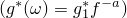
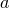
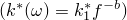
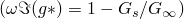
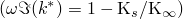

# 60.106 Viscoelastic 对象


Viscoelastic 对象指定与弹性一起使用的耗散行为。

**访问**

```
materialApi.materials()[*name*].viscoelastic()
```

### 60.106.1 Viscoelastic(...)

此方法创建一个 Viscoelastic 对象。

**路径**

```
materialApi.materials()[*name*].Viscoelastic
```

**原型**

```
odb_Viscoelastic&
Viscoelastic(const odb_String& domain,
           const odb_SequenceSequenceDouble& table,
           const odb_String& frequency,
           const odb_String& type,
           const odb_String& preload,
           const odb_String& time,
           double errtol,
           int nmax,
           const odb_SequenceSequenceDouble& volumetricTable);
```

**必需参数**

*domain*

一个 odb_String，指定域定义。可能的值为：
- "FREQUENCY"，指定频域。此域仅适用于 Abaqus/Standard 分析。
- "TIME"，指定时域。

*table*

一个 odb_SequenceSequenceDouble，指定下述项目。

**可选参数**

*frequency*

一个 odb_String，指定频域定义。此参数仅在 *domain*="FREQUENCY" 时需要。可能的值为 "FORMULA"、"TABULAR"、"PRONY"、"CREEP_TEST_DATA" 和 "RELAXATION_TEST_DATA"。默认值为 "FORMULA"。

*type*

一个 odb_String，指定类型。此参数仅在 *domain*="FREQUENCY" 且 *frequency*="TABULAR" 时需要。可能的值为 "ISOTROPIC" 和 "TRACTION"。默认值为 "ISOTROPIC"。

*preload*

一个 odb_String，指定预载荷。此参数仅在 *domain*="FREQUENCY" 且 *frequency*="TABULAR" 时需要。可能的值为 "NONE"、"UNIAXIAL"、"VOLUMETRIC" 和 "UNIAXIAL_VOLUMETRIC"。默认值为 "NONE"。

*time*

一个 odb_String，指定时域定义。此参数仅在 *domain*="TIME" 时需要。可能的值为 "PRONY"、"CREEP_TEST_DATA"、"RELAXATION_TEST_DATA" 和 "FREQUENCY_DATA"。默认值为 "PRONY"。

*errtol*

一个 Double，指定数据点最小二乘拟合的平均均方根误差。Float 值对应百分比；例如，0.01 为 1%。默认值为 0.01。

此参数仅在 *time*="CREEP_TEST_DATA"、"RELAXATION_TEST_DATA" 或 "FREQUENCY_DATA" 时有效；或者仅在 *frequency*="CREEP_TEST_DATA" 或 "RELAXATION_TEST_DATA" 时有效。

*nmax*

一个 Int，指定 Prony 级数中项的最大数量 。最大值为 13。默认值为 13。

此参数仅在 *time*="CREEP_TEST_DATA"、"RELAXATION_TEST_DATA" 或 "FREQUENCY_DATA" 时有效；或者仅在 *frequency*="CREEP_TEST_DATA" 或 "RELAXATION_TEST_DATA" 时有效。

*volumetricTable*

一个 odb_SequenceSequenceDouble，指定下述项目。默认值为空序列。

**表数据**

如果 *frequency*=FORMULA，*table* 的表数据指定以下内容：
-  的实部 。
-  的虚部。
-  的值。
-  的实部 。如果材料不可压缩，此值将被忽略。
-  的虚部。如果材料不可压缩，此值将被忽略。
-  的值。如果材料不可压缩，此值将被忽略。

如果 *frequency*=TABULAR 且 *type*=ISOTROPIC 且 *preload*=NONE，或 *time*=FREQUENCY_DATA，*table* 的表数据指定以下内容：
-  的实部 。
-  的虚部 。
-  的实部 。如果材料不可压缩，此值将被忽略。
-  的虚部 。如果材料不可压缩，此值将被忽略。
- 频率 ，单位为周期/时间。

如果 *frequency*=TABULAR 且 *type*=ISOTROPIC 且 *preload*=UNIAXIAL，*table* 的表数据指定以下内容：
- 损耗模量。
- 储能模量。
- 频率。
- 单轴应变。

如果 *frequency*=TABULAR 且 *type*=TRACTION 且 *preload*=NONE，*table* 的表数据指定以下内容：
- 归一化损耗模量。
- 归一化剪切模量。
- 频率。

如果 *frequency*=TABULAR 且 *type*=TRACTION 且 *preload*=UNIAXIAL 或 *preload*=UNIAXIAL_VOLUMETRIC，*table* 的表数据指定以下内容：
- 损耗模量。
- 储能模量。
- 频率。
- 闭合量。

如果 *time*=PRONY 或 *frequency*=PRONY，*table* 的表数据指定以下内容：
- ，Prony 级数展开中剪切松弛模量第一项的模量比。
- ，Prony 级数展开中体积松弛模量第一项的模量比。
- ，Prony 级数展开第一项的松弛时间。

如果 *frequency*=TABULAR 且 *type*=ISOTROPIC 且 *preload*=VOLUMETRIC 或 *preload*=UNIAXIAL_VOLUMETRIC，*volumetricTable* 的表数据指定以下内容：
- 损耗模量。
- 储能模量。
- 频率。
- 体积比。

**返回值**

一个 Viscoelastic 对象。

**异常**

RangeError。

### 60.106.2 成员

Viscoelastic 对象的成员与 [Viscoelastic](pt02ch60pyo106.md#ker-viscoelastic-viscoelastic-cpp) 方法的参数具有相同的名称和描述。

此外，Viscoelastic 对象可以具有以下成员：

**原型**

```
odb_CombinedTestData combinedTestData() const;
odb_ShearTestData shearTestData() const;
odb_Trs trs() const;
odb_VolumetricTestData volumetricTestData() const;
```

*combinedTestData*

一个 [CombinedTestData](pt02ch60pyo17.md) 对象。

*shearTestData*

一个 [ShearTestData](pt02ch60pyo90.md) 对象。

*trs*

一个 [Trs](pt02ch60pyo100.md) 对象。

*volumetricTestData*

一个 [VolumetricTestData](pt02ch60pyo110.md) 对象。

### 60.106.3 对应的分析关键字

| [*VISCOELASTIC](../key/key-link.md#usb-kws-mviscoelast) |
| --- |


