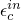
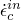

# 60.20 ConcreteCompressionHardening 对象

ConcreteCompressionHardening 对象用于指定混凝土损伤塑性模型的硬化。

**访问**

```
materialApi.materials()[*name*].concreteDamagedPlasticity()\
.concreteCompressionHardening()
```

### 60.20.1 ConcreteCompressionHardening(...)

此方法创建一个 ConcreteCompressionHardening 对象。

**路径**

```
materialApi.materials()[*name*].concreteDamagedPlasticity()\
.ConcreteCompressionHardening
```

**原型**

```
odb_ConcreteCompressionHardening&
ConcreteCompressionHardening(const odb_SequenceSequenceDouble& table,
                             bool rate,
                             bool temperatureDependency,
                             int dependencies);
```

**必需参数**

*table*

一个 odb_SequenceSequenceDouble，指定如下所述的项目。

**可选参数**

*rate*

一个布尔值，指定数据是否依赖速率。默认值为 false。

*temperatureDependency*

一个布尔值，指定数据是否依赖温度。默认值为 false。

*dependencies*

一个整数，指定场变量依赖数量。默认值为 0。

**表数据**

- 压缩屈服应力，。
- 非弹性（压碎）应变，。
- 非弹性（压碎）应变率，。
- 温度（如果数据依赖温度）。
- 第一个场变量的值（如果数据依赖场变量）。
- 第二个场变量的值。
- 依此类推。

**返回值**

一个 ConcreteCompressionHardening 对象。

**异常**

RangeError。

### 60.20.2 成员

ConcreteCompressionHardening 对象的成员与 [ConcreteCompressionHardening](pt02ch60pyo20.md#ker-concretecompressionhardening-concretecompressionhard-cpp) 方法的参数具有相同的名称和描述。

### 60.20.3 对应的分析关键字

| [*CONCRETE COMPRESSION HARDENING](../key/key-link.md#usb-kws-mconcretecomphard) |
| --- |
