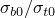

# 60.21 ConcreteDamagedPlasticity 对象

ConcreteDamagedPlasticity 对象用于指定混凝土损伤塑性模型。

**访问**

```
materialApi.materials()[*name*].concreteDamagedPlasticity()
```

### 60.21.1 ConcreteDamagedPlasticity(...)

此方法创建一个 ConcreteDamagedPlasticity 对象。

**路径**

```
materialApi.materials()[*name*].ConcreteDamagedPlasticity
```

**原型**

```
odb_ConcreteDamagedPlasticity&
ConcreteDamagedPlasticity(const odb_SequenceSequenceDouble& table,
                          bool temperatureDependency,
                          int dependencies);
```

**必需参数**

*table*

一个 odb_SequenceSequenceDouble，指定如下所述的项目。

**可选参数**

*temperatureDependency*

一个布尔值，指定数据是否依赖温度。默认值为 false。

*dependencies*

一个整数，指定场变量依赖数量。默认值为 0。

**表数据**

表数据指定以下内容：
- 剪胀角，（度），在 -- 平面内。
- 流动势偏心率，。默认值为 0.1。
- ，初始等双轴压缩屈服应力与初始单轴压缩屈服应力之比。默认值为 1.16。
- ，在任意给定的压力不变量 ，用于 Abaqus/Standard 分析中混凝土本构方程的粘塑性正则化。此参数在 Abaqus/Explicit 分析中被忽略。默认值为 0.0。
- 温度（如果数据依赖温度）。
- 第一个场变量的值（如果数据依赖场变量）。
- 第二个场变量的值。
- 依此类推。

**返回值**

一个 ConcreteDamagedPlasticity 对象。

**异常**

RangeError。

### 60.21.2 成员

ConcreteDamagedPlasticity 对象的成员与 [ConcreteDamagedPlasticity](pt02ch60pyo21.md#ker-concretedamagedplasticity-concretedamagedplasticity-cpp) 方法的参数具有相同的名称和描述。

此外，ConcreteDamagedPlasticity 对象可以具有以下成员：

**原型**

```
odb_ConcreteCompressionHardening concreteCompressionHardening() const;
odb_ConcreteTensionStiffening concreteTensionStiffening() const;
odb_ConcreteCompressionDamage concreteCompressionDamage() const;
odb_ConcreteTensionDamage concreteTensionDamage() const;
```

*concreteCompressionHardening*

一个 [ConcreteCompressionHardening](pt02ch60pyo20.md) 对象。

*concreteTensionStiffening*

一个 [ConcreteTensionStiffening](pt02ch60pyo23.md) 对象。

*concreteCompressionDamage*

一个 [ConcreteCompressionDamage](pt02ch60pyo19.md) 对象。

*concreteTensionDamage*

一个 [ConcreteTensionDamage](pt02ch60pyo22.md) 对象。

### 60.21.3 对应的分析关键字

| [*CONCRETE DAMAGED PLASTICITY](../key/key-link.md#usb-kws-mconcretedamagedplast) |
| --- |
