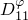
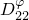
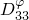
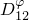
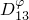
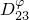

# 60.40 Dielectric 对象

Dielectric 对象用于指定介电材料特性。

**访问**

```
materialApi.materials()[*name*].dielectric()
```

### 60.40.1 Dielectric(...)

此方法创建一个 Dielectric 对象。

**路径**

```
materialApi.materials()[*name*].Dielectric
```

**原型**

```
odb_Dielectric&
Dielectric(const odb_SequenceSequenceDouble& table,
           const odb_String& type,
           bool frequencyDependency,
           bool temperatureDependency,
           int dependencies);
```

**必需参数**

*table*

一个 odb_SequenceSequenceDouble，指定如下所述的项目。

**可选参数**

*type*

一个 odb_String，指定介电行为。可能的值为"ISOTROPIC"、"ORTHOTROPIC"和"ANISOTROPIC"。默认值为"ISOTROPIC"。

*frequencyDependency*

一个布尔值，指定数据是否依赖频率。默认值为 false。

*temperatureDependency*

一个布尔值，指定数据是否依赖温度。默认值为 false。

*dependencies*

一个整数，指定场变量依赖数量。默认值为 0。

**表数据**

如果 *type*=ISOTROPIC，表数据指定以下内容：
- 介电常数。
- 频率（如果数据依赖频率）。
- 温度（如果数据依赖温度）。
- 第一个场变量的值（如果数据依赖场变量）。
- 第二个场变量的值。
- 依此类推。

如果 *type*=ORTHOTROPIC，表数据指定以下内容：
- 。
- 。
- 。
- 频率（如果数据依赖频率）。
- 温度（如果数据依赖温度）。
- 第一个场变量的值（如果数据依赖场变量）。
- 第二个场变量的值。
- 依此类推。

如果 *type*=ANISOTROPIC，表数据指定以下内容：
- 。
- 。
- 。
- 。
- 。
- 。
- 频率（如果数据依赖频率）。
- 温度（如果数据依赖温度）。
- 第一个场变量的值（如果数据依赖场变量）。
- 第二个场变量的值。
- 依此类推。

**返回值**

一个 Dielectric 对象。

**异常**

无。

### 60.40.2 成员

Dielectric 对象的成员与 [Dielectric](pt02ch60pyo40.md#ker-dielectric-dielectric-cpp) 方法的参数具有相同的名称和描述。

### 60.40.3 对应的分析关键字

| [*DIELECTRIC](../key/key-link.md#usb-kws-mdielectric) |
| --- |
