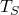
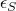
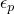

# 60.76 PlanarTestData object


The PlanarTestData object specifies planar test (or pure shear) data (compression and/or tension).

**Access**

```
materialApi.materials()[*name*].hyperelastic().planarTestData()
materialApi.materials()[*name*].hyperfoam().planarTestData()
materialApi.materials()[*name*].mullinsEffect().planarTests(*i*)
```

### 60.76.1 PlanarTestData(...)

This method creates a PlanarTestData object.

**Path**

```
materialApi.materials()[*name*].hyperelastic().PlanarTestData
materialApi.materials()[*name*].hyperfoam().PlanarTestData
materialApi.materials()[*name*].mullinsEffect().PlanarTestData
```

**Prototype**

```
odb_PlanarTestData&
PlanarTestData(const odb_SequenceSequenceDouble& table,
               odb_Union smoothing,
               bool lateralNominalStrain,
               bool temperatureDependency,
               int dependencies);
```

**Required argument**

*table*

An odb_SequenceSequenceDouble specifying the items described below.

**Optional arguments**

*smoothing*

The string "NONE" or an Int specifying the value for smoothing. If *smoothing*="NONE", no smoothing is employed. The default value is "NONE".

*lateralNominalStrain*

A Boolean specifying whether to include lateral nominal strain. The default value is false.

*temperatureDependency*

A Boolean specifying whether the data depend on temperature. The default value is false.

*dependencies*

An Int specifying the number of field variable dependencies. The default value is 0.

**Table data**

For a hyperelastic material model, the table data specify the following:
- Nominal stress, .
- Nominal strain in the direction of loading, .

For a hyperfoam material model, the table data specify the following:- Nominal stress, .
- Nominal strain in the direction of loading, .
- Nominal transverse strain, . The default value is 0.

**Return value**

A PlanarTestData object.

**Exceptions**

None.

### 60.76.2 Members

The PlanarTestData object has members with the same names and descriptions as the arguments to the [PlanarTestData](pt02ch60pyo76.md#ker-planartestdata-planartestdata-cpp) method.

### 60.76.3 Corresponding analysis keywords

| [*PLANAR TEST DATA](../key/key-link.md#usb-kws-mplanartestdata) |
| --- |


