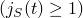

# 60.90 ShearTestData object


The ShearTestData object specifies the normalized shear creep compliance or relaxation modulus as a function of time.

**Access**

```
materialApi.materials()[*name*].viscoelastic().shearTestData()
```

### 60.90.1 ShearTestData(...)

This method creates a ShearTestData object.

**Path**

```
materialApi.materials()[*name*].viscoelastic().ShearTestData
```

**Prototype**

```
odb_ShearTestData&
ShearTestData(const odb_SequenceSequenceDouble& table,
              odb_Union shrinf);
```

**Required argument**

*table*

An odb_SequenceSequenceDouble specifying values that depend on the *time* member of the [Viscoelastic](pt02ch60pyo106.md) object.

If *time*="RELAXATION_TEST_DATA", the table data specify the following:
- Normalized shear relaxation modulus . .
- Time . .

If *time*="CREEP_TEST_DATA", the table data specify the following:
- Normalized shear compliance . .
- Time . .

**Optional argument**

*shrinf*

The string "NONE" or a Double specifying a normalized shear. The value of *shrinf* depends on the value of the *time* member of the [Viscoelastic](pt02ch60pyo106.md) object. The default value is "NONE".

If *time*="RELAXATION_TEST_DATA", *shrinf* specifies the value of the long-term, normalized shear modulus .

If *time*="CREEP_TEST_DATA", *shrinf* specifies the value of the long-term, normalized shear compliance .

**Return value**

A ShearTestData object.

**Exceptions**

None.

### 60.90.2 Members

The ShearTestData object has members with the same names and descriptions as the arguments to the [ShearTestData](pt02ch60pyo90.md#ker-sheartestdata-sheartestdata-cpp) method.

### 60.90.3 Corresponding analysis keywords

| [*SHEAR TEST DATA](../key/key-link.md#usb-kws-msheartestdata) |
| --- |


