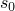

# 60.94 Sorption object


The Sorption object defines absorption and exsorption behaviors of a partially saturated porous medium in the analysis of coupled wetting liquid flow and porous medium stress.

**Access**

```
materialApi.materials()[*name*].sorption()
```

### 60.94.1 Sorption(...)

This method creates a Sorption object.

**Path**

```
materialApi.materials()[*name*].Sorption
```

**Prototype**

```
odb_Sorption&
Sorption(const odb_SequenceSequenceDouble& absorptionTable,
         const odb_String& lawAbsorption,
         bool exsorption,
         const odb_String& lawExsorption,
         double scanning,
         const odb_SequenceSequenceDouble& exsorptionTable);
```

**Required argument**

*absorptionTable*

An odb_SequenceSequenceDouble specifying the items described below.

**Optional arguments**

*lawAbsorption*

An odb_String specifying absorption behavior. Possible values are "LOG" and "TABULAR". The default value is "TABULAR".

*exsorption*

A Boolean specifying whether the exsorption data is specified. The default value is false.

*lawExsorption*

An odb_String specifying exsorption behavior. Possible values are "LOG" and "TABULAR". The default value is "TABULAR".

*scanning*

A Double specifying the slope of the scanning line, . This slope must be positive and larger than the slope of the absorption or exsorption behaviors. The default value is 0.0.

*exsorptionTable*

An odb_SequenceSequenceDouble specifying the items described below. The default value is an empty sequence.

**Table data**

If *lawAbsorption*=TABULAR or *lawExsorption*=TABULAR, the *absorptionTable* and *exsorptionTable* data respectively specify the following: 
- Pore pressure, .
- Saturation, .

If *lawAbsorption*=LOG or *lawExsorption*=LOG, the *absorptionTable* and *exsorptionTable* data respectively specify the following: 
- A.
- B.
- .
- .

**Return value**

A Sorption object.

**Exceptions**

RangeError.

### 60.94.2 Members

The Sorption object has members with the same names and descriptions as the arguments to the [Sorption](pt02ch60pyo94.md#ker-sorption-sorption-cpp) method.

### 60.94.3 Corresponding analysis keywords

| [*SORPTION](../key/key-link.md#usb-kws-msorption) |
| --- |


