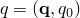

# 61.5 FieldBulkData 对象


FieldBulkData 对象表示一类元素或节点的整个场数据。一个类中的所有元素对应于相同的元素类型和材料。

**访问**

```
odb.steps()[*name*].frames(*i*).fieldOutputs()[*name*].bulkDataBlocks(*i*)
```

### 61.5.1 成员

FieldBulkData 对象可以具有以下成员：

**原型**

```
odb_Enum::odb_ResultPositionEnum position() const;
               odb_Enum::odb_PrecisionEnum precision() const;
               int* elementLabels() const;
               int* nodeLabels() const;
               int* integrationPoints() const;
               odb_String baseElementType() const;
               odb_Enum::odb_ElementFaceEnum* faces() const;
               odb_Enum::odb_DataTypeEnum type() const;
               float* data() const;
               double* dataDouble() const;
               float* conjugateData() const;
               double* conjugateDataDouble() const;
               float* mises() const;
               float* localCoordSystem() const;
               double* localCoordSystemDouble() const;
               int orientationWidth() const;
               int numberOfElements() const;
               int length() const;
               int valuesPerElement() const;
               int width() const;
               const odb_Instance& instance() const;
               const odb_SectionPoint& sectionPoint() const;
               odb_SequenceString componentLabels() const;
```

*position*

一个 odb_Enum::odb_ResultPositionEnum，指定输出的位置。可能的值为：
- odb_Enum::NODAL，指定在节点处计算的值。
- odb_Enum::INTEGRATION_POINT，指定在积分点处计算的值。
- odb_Enum::ELEMENT_NODAL，指定通过外推在积分点处计算的结果获得的值。
- odb_Enum::ELEMENT_FACE，指定为诸如空腔辐射等针对元素表面面定义的面变量获得的结果。
- odb_Enum::CENTROID，指定通过外推在积分点处计算的结果获得的质心处的值。

*precision*

一个 odb_Enum::odb_PrecisionEnum，指定输出的精度。可能的值为：
- odb_Enum::SINGLE_PRECISION，指定输出为单精度。
- odb_Enum::DOUBLE_PRECISION，指定输出为双精度。

*type*

一个 odb_Enum::odb_DataTypeEnum，指定输出类型。可能的值为 odb_Enum::SCALAR、odb_Enum::VECTOR、odb_Enum::TENSOR_3D_FULL、odb_Enum::TENSOR_3D_PLANAR、odb_Enum::TENSOR_3D_SURFACE、odb_Enum::TENSOR_2D_PLANAR 和 odb_Enum::TENSOR_2D_SURFACE。

*orientationWidth*

一个 Int，指定在每个输出位置指定局部坐标系所需的方向余弦的数量。使用 *orientationWidth* 从 *localCoordSystem* 读取方向数据。

*numberOfElements*

一个 Int，指定当前数据块中元素的数量。

*length*

一个 Int，指定当前数据块中输出位置的数量。

*valuesPerElement*

一个 Int，指定当前数据块中每个元素的值的数量。如果 *position*=odb_Enum::ELEMENT_NODAL，*valuesPerElement* 是当前数据块中所有元素每元素的节点数。

*width*

一个 Int，指定每个输出位置的分量数量。

*baseElementType*

一个 odb_String，指定与当前数据块对应的元素类型。

*instance*

一个 [OdbInstance](pt02ch61pyo16.md) 对象，指定标签所属的部件。

*sectionPoint*

一个 [SectionPoint](pt02ch61pyo28.md) 对象，指定当前数据块的截面点号。

*elementLabels*

一个指向 Int 数组的指针，指定块中元素的元素标签。*elementLabels* 仅在 *position*=odb_Enum::INTEGRATION_POINT、odb_Enum::CENTROID、odb_Enum::ELEMENT_NODAL 或 odb_Enum::ELEMENT_FACE 时有效。如果 *position*=odb_Enum::NODAL，*elementLabels* 返回 NULL 指针。

*nodeLabels*

一个指向 Int 数组的指针，指定块中节点的节点标签。*nodeLabels* 仅在 *position*=odb_Enum::NODAL 或 odb_Enum::ELEMENT_NODAL 时有效。如果 *position*=odb_Enum::INTEGRATION_POINT、odb_Enum::CENTROID、odb_Enum::ELEMENT_NODAL 或 odb_Enum::ELEMENT_FACE，*nodeLabels* 返回 NULL 指针。

*integrationPoints*

一个指向 Int 数组的指针，指定块中元素的积分点。*integrationPoints* 仅在 *position*=odb_Enum::INTEGRATION_POINT 时可用。

*faces*

一个指向 odb_Enum::odb_ElementFaceEnum 枚举数组的指针，指定块中元素的面。*faces* 仅在 *position*=odb_Enum::ELEMENT_FACE 时可用。

*data*

一个指向 Float 数组的指针，以 *type* 描述的顺序指定场的数据。如果 *type*=odb_Enum::TENSOR 或 odb_Enum::VECTOR，*data* 是一个包含块中每个元素或节点的分量的数组。如果底层数据为双精度，将抛出异常。

*dataDouble*

一个指向 Double 数组的指针，以 *type* 描述的顺序指定场的数据。如果 *type*=odb_Enum::TENSOR 或 odb_Enum::VECTOR，*data* 是一个包含块中每个元素或节点的分量的数组。如果底层数据为单精度，将抛出异常。

*conjugateData*

一个指向 Float 数组的指针，指定复数结果的虚部。Float 的顺序由 *type* 描述。如果 *type*=odb_Enum::TENSOR 或 odb_Enum::VECTOR，*conjugateData* 是一个包含块中每个元素或节点分量的虚部的数组。如果底层数据为双精度，将抛出异常。

*conjugateDataDouble*

一个指向 Double 数组的指针，指定复数结果的虚部。Double 的顺序由 *type* 描述。如果 *type*=odb_Enum::TENSOR 或 odb_Enum::VECTOR，*conjugateData* 是一个包含块中每个元素或节点分量的虚部的数组。如果底层数据为单精度，将抛出异常。

*mises*

一个指向 Float 数组的指针，指定块中元素数据每个输出位置计算的 von Mises 应力，或 NULL。如果 *validInvariants* 包含 odb_Enum::MISES，*mises* 返回一个数组指针。如果 *validInvariants* 不包含 odb_Enum::MISES，*mises* 返回 NULL 指针。在不变量计算中忽略共轭数据。

*localCoordSystem*

一个指向 Float 数组的指针，指定表示每个输出位置局部坐标系的四元数。四元数以形式  返回，这与"Abaqus Theory Guide"第 1.3.1 节"Rotation variables"中显示的相反。*localCoordSystem* 仅对以局部坐标系编写的 odb_Enum::TENSOR 数据可用。如果底层数据为双精度，将抛出异常。

*localCoordSystemDouble*

一个指向 Double 数组的指针，指定表示每个输出位置局部坐标系的四元数。四元数以形式  返回，这与"Abaqus Theory Guide"第 1.3.1 节"Rotation variables"中显示的相反。*localCoordSystemDouble* 仅对以局部坐标系编写的 odb_Enum::TENSOR 数据可用。如果底层数据为单精度，将抛出异常。

*componentLabels*

一个 odb_SequenceString，指定分量标签。


