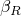
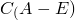

# 63.4 BeamSection object


The BeamSection object defines the properties of a beam section.

The BeamSection object is derived from the [Section](pt02ch63pyo01.md) object.

**Access**

```
sectionApi.sections()[*name*]
```

### 63.4.1 BeamSection(...)

This method creates a BeamSection object.

**Path**

```
sectionApi.BeamSection
```

**Prototype**

```
odb_BeamSection&
BeamSection(const odb_String& name,
            const odb_String& integration,
            const odb_String& profile,
            double poissonRatio,
            bool thermalExpansion,
            bool temperatureDependency,
            int dependencies,
            odb_Union density,
            odb_Union referenceTemperature,
            const odb_String& temperatureVar,
            double alphaDamping,
            double betaDamping,
            double compositeDamping,
            bool useFluidInertia,
            const odb_String& submerged,
            odb_Union fluidMassDensity,
            odb_Union crossSectionRadius,
            double lateralMassCoef,
            double axialMassCoef,
            double massOffsetX,
            double massOffsetY,            
            const odb_String& material,
            const odb_SequenceSequenceDouble& table,
            const odb_SequenceSequenceDouble& outputPts,
            const odb_SequenceDouble& centroid,
            const odb_SequenceDouble& shearCenter);
```

**Required arguments**

*name*

An odb_String specifying the repository key.

*integration*

An odb_String specifying the integration method for the section. Possible values are "BEFORE_ANALYSIS" and "DURING_ANALYSIS".

*profile*

An odb_String specifying the name of the profile.

**Optional arguments**

*poissonRatio*

A Double specifying the Poisson's ratio of the section. The default value is 0.0.

*thermalExpansion*

A Boolean specifying whether to use thermal expansion data. The default value is false.

*temperatureDependency*

A Boolean specifying whether the data depend on temperature. The default value is false.

*dependencies*

An Int specifying the number of field variable dependencies. The default value is 0.

*density*

The string "NONE" or a Double specifying the density of the section. The default value is "NONE".

*referenceTemperature*

The string "NONE" or a Double specifying the reference temperature of the section. The default value is "NONE".

*temperatureVar*

An odb_String specifying the temperature variation for the section. Possible values are "LINEAR" and "INTERPOLATED". The default value is "LINEAR".

*alphaDamping*

A Double specifying the  factor to create mass proportional damping in direct-integration dynamics. The default value is 0.0.

*betaDamping*

A Double specifying the  factor to create stiffness proportional damping in direct-integration dynamics. The default value is 0.0.

*compositeDamping*

A Double specifying the fraction of critical damping to be used in calculating composite damping factors for the modes (for use in modal dynamics). The default value is 0.0.

*useFluidInertia*

A Boolean specifying whether added mass effects will be simulated. The default value is false.

*submerged*

An odb_String specifying whether the section is either full submerged or half submerged. This argument applies only when *useFluidInertia* = True. Possible values are "FULLY" and "HALF". The default value is "FULLY".

*fluidMassDensity*

The string "NONE" or a Double specifying the mass density of the fluid. This argument applies only when *useFluidInertia* = True and must be specified in that case. The default value is "NONE".

*crossSectionRadius*

The string "NONE" or a Double specifying the radius of the cylindrical cross-section. This argument applies only when *useFluidInertia* = True and must be specified in that case. The default value is "NONE".

*lateralMassCoef*

A Double specifying the added mass coefficient, , for lateral motions of the beam. This argument applies only when*useFluidInertia* = True. The default value is 1.0.

*axialMassCoef*

A Double specifying the added mass coefficient, , for motions along the axis of the beam.  This argument affects only the term added to the free end(s) of the beam, and applies only when *useFluidInertia* = True. The default value is 0.0.

*massOffsetX*

A Double specifying the local 1-coordinate of the center of the cylindrical cross-section with respect to the beam cross-section. This argument applies only when *useFluidInertia* = True. The default value is 0.0.

*massOffsetY*

A Double specifying the local 2-coordinate of the center of the cylindrical cross-section with respect to the beam cross-section. This argument applies only when *useFluidInertia* = True. The default value is 0.0.

*material*

An odb_String specifying the name of the material. The default value is an empty string. The material is required when *integration* is "DURING_ANALYSIS".                 

*table*

An odb_SequenceSequenceDouble specifying the items described below. The default value is an empty sequence.

*outputPts*

An odb_SequenceSequenceDouble specifying the positions at which output is requested. The default value is an empty sequence.

*centroid*

An odb_SequenceDouble specifying the *X–Y* coordinates of the centroid. The default value is (0.0, 0.0).

*shearCenter*

An odb_SequenceDouble specifying the *X–Y* coordinates of the shear center. The default value is (0.0, 0.0).

**Table data**

The table data specify the following:
- E, the Young's modulus of the section.
- G, the torsional shear modulus of the section.
- Thermal expansion coefficient, if using thermal expansion.
- Temperature, if the data depend on temperature.
- Value of the first field variable, if the data depend on field variables.
- Value of the second field variable.
- Etc.

**Return value**

A BeamSection object.

**Exceptions**

None.

### 63.4.2 Members

The BeamSection object has members with the same names and descriptions as the arguments to the [BeamSection](pt02ch63pyo04.md#ker-beamsection-beamsection-cpp) method.

In addition, the BeamSection object can have the following member:

**Prototype**

```
odb_TransverseShearBeam beamTransverseShear() const;
```

*beamTransverseShear*

A [TransverseShearBeam](pt02ch63pyo24.md) object specifying the transverse shear stiffness properties.

### 63.4.3 Corresponding analysis keywords

| [*BEAM GENERAL SECTION](../key/key-link.md#usb-kws-mbeamgensect) |
| --- |
| [*BEAM SECTION](../key/key-link.md#usb-kws-mbeamsection) |
| [*BEAM FLUID INERTIA](../key/key-link.md#usb-kws-mbeamfluidinertia) |
| [*CENTROID](../key/key-link.md#usb-kws-mcentroid) |
| [*DAMPING](../key/key-link.md#usb-kws-mdamping) |
| [*SHEAR CENTER](../key/key-link.md#usb-kws-mshearcenter) |
| [*SECTION POINTS](../key/key-link.md#usb-kws-msectionpoints) |


