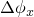

# 63.18 PEGSection object


The PEGSection object defines the properties of a solid section.

The PEGSection object is derived from the [Section](pt02ch63pyo01.md) object.

**Access**

```
sectionApi.sections()[*name*]
```

### 63.18.1 PEGSection(...)

This method creates a PEGSection object.

**Path**

```
sectionApi.PEGSection
```

**Prototype**

```
odb_PEGSection&
PEGSection(const odb_String& name,
           const odb_String& material,
           double thickness,
           double wedgeAngle1,
           double wedgeAngle2);
```

**Required arguments**

*name*

An odb_String specifying the repository key.

*material*

An odb_String specifying the name of the material.

**Optional arguments**

*thickness*

A Double specifying the thickness of the section. Possible values are *thickness*  0.0. The default value is 1.0.

*wedgeAngle1*

A Double specifying the value of the x component of the angle between the bounding planes, . The default value is 0.0.

*wedgeAngle2*

A Double specifying the value of the y component of the angle between the bounding planes, . The default value is 0.0.

**Return value**

A PEGSection object.

**Exceptions**

InvalidNameError and RangeError.

### 63.18.2 Members

The PEGSection object has members with the same names and descriptions as the arguments to the [PEGSection](pt02ch63pyo18.md#ker-pegsection-pegsection-cpp) method.

### 63.18.3 Corresponding analysis keywords

| [*SOLID SECTION](../key/key-link.md#usb-kws-msolidsection) |
| --- |


