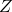

# 25.75 SurfaceToSurfaceContactStd object


The SurfaceToSurfaceContactStd object defines surface-to-surface contact during an Abaqus/Standard analysis.

The SurfaceToSurfaceContactStd object is derived from the [Interaction](pt01ch25pyo01.md) object.

**Access**

```
import interaction
mdb.models[*name*].interactions[*name*]
```

### 25.75.1 SurfaceToSurfaceContactStd(...)

This method creates a SurfaceToSurfaceContactStd object.

**Path**

```
mdb.models[*name*].SurfaceToSurfaceContactStd
```

**Required arguments**

*name*

A String specifying the repository key.

*createStepName*

A String specifying the name of the step in which the SurfaceToSurfaceContactStd object is created.

*master*

A [Region](pt01ch45pyo03.md) object specifying the master surface.

*slave*

A [Region](pt01ch45pyo03.md) object specifying the slave surface.

*sliding*

A SymbolicConstant specifying the contact formulation. Possible values are FINITE and SMALL.

*interactionProperty*

A String specifying the name of the [ContactProperty](pt01ch25pyo21.md) object associated with this interaction.

**Optional arguments**

*interferenceType*

A SymbolicConstant specifying the type of time-dependent allowable interference for contact pairs and contact elements. Possible values are:
- NONE, specifying no allowable contact interference.
- SHRINK_FIT.
- UNIFORM.

The default value is NONE.

*overclosure*

A Float specifying the maximum overclosure distance allowed. This argument applies only when *interferenceType*=UNIFORM. The default value is 0.0.

*interferenceDirectionType*

A SymbolicConstant specifying the method used to determine the interference direction. Possible values are COMPUTED and DIRECTION_COSINE. The default value is COMPUTED.

*direction*

A sequence of three Floats specifying the following:
- -direction cosine of the interference direction vector.
- -direction cosine of the interference direction vector.
- -direction cosine of the interference direction vector.

This argument is required only when *interferenceDirectionType*=DIRECTION_COSINE.

*amplitude*

A String specifying the name of the amplitude curve that defines the magnitude of the prescribed interference during the step. Use `None` to specify that the prescribed interference is applied immediately at the beginning of the step and ramped down to zero linearly over the step.

*smooth*

A Float specifying the degree of smoothing used for deformable or rigid master surfaces involved when *enforcement*=NODE_TO_SURFACE. The value given must lie between 0.0 and 0.5. The default value is 0.2.

*hcrit*

A Float specifying the distance by which a slave node must penetrate the master surface before Abaqus/Standard abandons the current increment and tries again with a smaller increment. The default value is 0.0.

*extensionZone*

A Float specifying a fraction of the end segment or facet edge length by which the master surface is to be extended to avoid numerical round-off errors associated with contact modeling. The value given must lie between 0.0 and 0.2. The default value is 0.1.

*adjustMethod*

A SymbolicConstant specifying the adjust method. Possible values are NONE, OVERCLOSED, TOLERANCE, and SET. The default value is NONE.

*adjustTolerance*

A Float specifying the adjust tolerance. The default value is 0.0.

*adjustSet*

A [Region](pt01ch45pyo03.md) object specifying the Set object to which the adjustment is to be applied.

*enforcement*

A SymbolicConstant specifying the discretization method. Possible values are NODE_TO_SURFACE and SURFACE_TO_SURFACE. The default value is SURFACE_TO_SURFACE.

*thickness*

A Boolean specifying whether shell/membrane element thickness is considered. The default value is ON.

This argument is not valid when *sliding*=FINITE and *enforcement*=NODE_TO_SURFACE.

*contactControls*

A String specifying the name of the [ContactControl](pt01ch25pyo16.md) object associated with this interaction. The empty string indicates that the default contact controls will be used. The default value is an empty string.

*tied*

A Boolean specifying whether the surfaces are to be "tied" together for the duration of the simulation. The default value is OFF.

*initialClearance*

A SymbolicConstant or a Float specifying the initial clearance at regions of contact. Possible values are OMIT and COMPUTED. The default value is OMIT.

*halfThreadAngle*

 `None` or a sequence of Floats specifying the half thread angle used for bolt clearance. The default value is `None`.

*pitch*

 `None` or a sequence of Floats specifying the pitch used for bolt clearance. The default value is `None`.

*majorBoltDiameter*

The SymbolicConstant COMPUTED or a Float specifying the major diameter of the bolt used for bolt clearance. The default value is COMPUTED.

*meanBoltDiameter*

The SymbolicConstant COMPUTED or a Float specifying the mean diameter of the bolt used for bolt clearance. The default value is COMPUTED.

*datumAxis*

A [DatumAxis](pt01ch15pyo02.md) object specifying the orientation of the bolt hole when specifying bolt clearance.

*useReverseDatumAxis*

A Boolean specifying whether to reverse the bolt clearance direction given by the datum axis. The default value is OFF.

*clearanceRegion*

A [Region](pt01ch45pyo03.md) object specifying the contact region for which clearance is specified.

*surfaceSmoothing*

A SymbolicConstant specifying whether to use surface smoothing for geometric surfaces in SurfaceToSurfaceContactStd interactions.  Possible values are AUTOMATIC and NONE. The default value is NONE.

*bondingSet*

A [Region](pt01ch45pyo03.md) object specifying the slave node sub-set for bonding, used only when the contact property [CohesiveBehavior](pt01ch25pyo11.md) option specifies use.

**Return value**

A SurfaceToSurfaceContactStd object.

**Exceptions**

None.

### 25.75.2 swapSurfaces()

This method switches the master and slave surfaces of a surface-to-surface contact pair. This command is valid only for the step in which the interaction is created.

**Arguments**

None.

**Return value**

None

**Exceptions**

None.

### 25.75.3 setValues(...)

This method modifies the data for an existing SurfaceToSurfaceContactStd object in the step where it is created.

**Required arguments**

None.

**Optional arguments**

The optional arguments to `setValues` are the same as the arguments to the [SurfaceToSurfaceContactStd](pt01ch25pyo75.md#ker-surfacetosurfacecontactstd-surfacetosurfacecontactst-pyc) method, except for the *name* and *createStepName* arguments.

**Return value**

None

**Exceptions**

None.

### 25.75.4 setValuesInStep(...)

This method modifies the propagating data for an existing SurfaceToSurfaceContactStd object in the specified step.

**Required argument**

*stepName*

A String specifying the name of the step in which the interaction is modified.

**Optional arguments**

*interactionProperty*

A String specifying the name of the [ContactProperty](pt01ch25pyo21.md) object associated with this interaction.

*interferenceType*

A SymbolicConstant specifying the type of time-dependent allowable interference for contact pairs and contact elements. Possible values are:
- NONE, specifying no allowable contact interference.
- SHRINK_FIT.
- UNIFORM.

The default value is NONE.

*overclosure*

A Float specifying the maximum overclosure distance allowed. This argument applies only when *interferenceType*=UNIFORM. The default value is 0.0.

*interferenceDirectionType*

A SymbolicConstant specifying the method used to determine the interference direction. Possible values are COMPUTED and DIRECTION_COSINE. The default value is COMPUTED.

*direction*

A sequence of three Floats specifying the following:
- -direction cosine of the interference direction vector.
- -direction cosine of the interference direction vector.
- -direction cosine of the interference direction vector.

This argument is required only when *interferenceDirectionType*=DIRECTION_COSINE.

*amplitude*

A String specifying the name of the amplitude curve that defines the magnitude of the prescribed interference during the step. Use `None` to specify that the prescribed interference is applied immediately at the beginning of the step and ramped down to zero linearly over the step.

*contactControls*

A String specifying the name of the [ContactControl](pt01ch25pyo16.md) object associated with this interaction. The empty string indicates that the default contact controls will be used. The default value is an empty string.

**Return value**

None

**Exceptions**

None.

### 25.75.5 Members

The SurfaceToSurfaceContactStd object has members with the same names and descriptions as the arguments to the [SurfaceToSurfaceContactStd](pt01ch25pyo75.md#ker-surfacetosurfacecontactstd-surfacetosurfacecontactst-pyc) method.

In addition, the SurfaceToSurfaceContactStd object has the following members:

*contactTracking*

A SymbolicConstant specifying the choice of contact tracking algorithm. The STATE tracking algorithm uses only normal projections and is specified by using ONE_CONFIG. The PATH tracking algorithm uses crossing and normal projections and is specified by using TWO_CONFIG. Possible values are ONE_CONFIG and TWO_CONFIG. The default value is TWO_CONFIG.

This argument is valid only when *sliding*=FINITE and *enforcement*=SURFACE_TO_SURFACE.

*supplementaryContact*

A SymbolicConstant specifying the manner in which mid-face constraints are employed. Possible values are SELECTIVE, NEVER, and ALWAYS. The default value is SELECTIVE.

This argument is not valid when *sliding*=FINITE and *enforcement*=SURFACE_TO_SURFACE.


