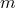

# 29.9 CapCreepConsolidation object


The CapCreepConsolidation object specifies a cap creep model and material properties.

**Access**

```
import material
mdb.models[*name*].materials[*name*].capPlasticity.capCreepConsolidation
import odbMaterial
session.odbs[*name*].materials[*name*].capPlasticity.capCreepConsolidation
```

### 29.9.1 CapCreepConsolidation(...)

This method creates a CapCreepConsolidation object.

**Path**

```
mdb.models[*name*].materials[*name*].capPlasticity.CapCreepConsolidation
session.odbs[*name*].materials[*name*].capPlasticity.CapCreepConsolidation
```

**Required argument**

*table*

A sequence of sequences of Floats specifying the items described below.

**Optional arguments**

*law*

A SymbolicConstant specifying the cap creep law. Possible values are STRAIN, TIME, SINGHM, and USER. The default value is STRAIN.

*temperatureDependency*

A Boolean specifying whether the data depend on temperature. The default value is OFF.

*dependencies*

An Int specifying the number of field variable dependencies. The default value is 0.

**Table data**

If *law*=STRAIN or *law*=TIME, the table data specify the following:
- .
- .
- .
- Temperature, if the data depend on temperature.
- Value of the first field variable, if the data depend on field variables.
- Value of the second field variable.
- Etc.

If *law*=SINGHM, the table data specify the following:- .
- .
- .
- .
- Temperature, if the data depend on temperature.
- Value of the first field variable, if the data depend on field variables.
- Value of the second field variable.
- Etc.

**Return value**

A CapCreepConsolidation object.

**Exceptions**

None.

### 29.9.2 setValues(...)

This method modifies the CapCreepConsolidation object.

**Required arguments**

None.

**Optional arguments**

The optional arguments to `setValues` are the same as the arguments to the [CapCreepConsolidation](pt01ch29pyo09.md#ker-capcreepconsolidation-capcreepconsolidation-pyc) method.

**Return value**

None

**Exceptions**

None.

### 29.9.3 Members

The CapCreepConsolidation object has members with the same names and descriptions as the arguments to the [CapCreepConsolidation](pt01ch29pyo09.md#ker-capcreepconsolidation-capcreepconsolidation-pyc) method.

### 29.9.4 Corresponding analysis keywords

| [*CAP CREEP](../key/key-link.md#usb-kws-mcapcreep) |
| --- |


