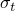
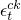
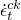
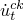

# 29.23 ConcreteTensionStiffening object


The ConcreteTensionStiffening object specifies hardening for the concrete damaged plasticity model.

**Access**

```
import material
mdb.models[*name*].materials[*name*].concreteDamagedPlasticity\
.concreteTensionStiffening
import odbMaterial
session.odbs[*name*].materials[*name*].concreteDamagedPlasticity\
.concreteTensionStiffening
```

### 29.23.1 ConcreteTensionStiffening(...)

This method creates a ConcreteTensionStiffening object.

**Path**

```
mdb.models[*name*].materials[*name*].concreteDamagedPlasticity\
.ConcreteTensionStiffening
session.odbs[*name*].materials[*name*].concreteDamagedPlasticity\
.ConcreteTensionStiffening
```

**Required argument**

*table*

A sequence of sequences of Floats specifying the items described below.

**Optional arguments**

*rate*

A Boolean specifying whether the data depend on rate. The default value is OFF.

*type*

A SymbolicConstant specifying the type of postcracking behavior data. Possible values are:
- STRAIN, specifying postfailure stress as a function of cracking strain.
- DISPLACEMENT, specifying postfailure stress as a function of cracking displacement.
- GFI, specifying failure stress as a function of the fracture energy.

The default value is STRAIN.

*temperatureDependency*

A Boolean specifying whether the data depend on temperature. The default value is OFF.

*dependencies*

An Int specifying the number of field variable dependencies. The default value is 0.

**Table data**

If *type*=STRAIN, the table data specify the following:
- Remaining direct stress after cracking, .
- Direct cracking strain, .
- Direct cracking strain rate, .
- Temperature, if the data depend on temperature.
- Value of the first field variable, if the data depend on field variables.
- Value of the second field variable.
- Etc.

If *type*=DISPLACEMENT, the table data specify the following:- Remaining direct stress after cracking, .
- Direct cracking displacement, .
- Direct cracking displacement rate, .
- Temperature, if the data depend on temperature.
- Value of the first field variable, if the data depend on field variables.
- Value of the second field variable.
- Etc.

If *type*=GFI, the table data specify the following:

- Failure stress, .
- Fracture energy, .
- Direct cracking displacement rate, .
- Temperature, if the data depend on temperature.
- Value of the first field variable, if the data depend on field variables.
- Value of the second field variable.
- Etc.

**Return value**

A ConcreteTensionStiffening object.

**Exceptions**

RangeError.

### 29.23.2 setValues(...)

This method modifies the ConcreteTensionStiffening object.

**Required arguments**

None.

**Optional arguments**

The optional arguments to `setValues` are the same as the arguments to the [ConcreteTensionStiffening](pt01ch29pyo23.md#ker-concretetensionstiffening-concretetensionstiffening-pyc) method.

**Return value**

None

**Exceptions**

RangeError.

### 29.23.3 Members

The ConcreteTensionStiffening object has members with the same names and descriptions as the arguments to the [ConcreteTensionStiffening](pt01ch29pyo23.md#ker-concretetensionstiffening-concretetensionstiffening-pyc) method.

### 29.23.4 Corresponding analysis keywords

| [*CONCRETE TENSION STIFFENING](../key/key-link.md#usb-kws-mconcretetensstiff) |
| --- |


