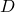
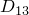

# 29.41 Diffusivity object


The Diffusivity object specifies mass diffusivity.

**Access**

```
import material
mdb.models[*name*].materials[*name*].diffusivity
import odbMaterial
session.odbs[*name*].materials[*name*].diffusivity
```

### 29.41.1 Diffusivity(...)

This method creates a Diffusivity object.

**Path**

```
mdb.models[*name*].materials[*name*].Diffusivity
session.odbs[*name*].materials[*name*].Diffusivity
```

**Required argument**

*table*

A sequence of sequences of Floats specifying the items described below.

**Optional arguments**

*type*

A SymbolicConstant specifying the type of diffusivity. Possible values are ISOTROPIC, ORTHOTROPIC, and ANISOTROPIC. The default value is ISOTROPIC.

*law*

A SymbolicConstant specifying the diffusion behavior. Possible values are GENERAL and FICK. The default value is GENERAL.

*temperatureDependency*

A Boolean specifying whether the data depend on temperature. The default value is OFF.

*dependencies*

An Int specifying the number of field variable dependencies. The default value is 0.

**Table data**

If *type*=ISOTROPIC, the table data specify the following:
- Diffusivity, .
- Concentration, .
- Temperature, if the data depend on temperature.
- Value of the first field variable, if the data depend on field variables.
- Value of the second field variable.
- Etc.

If *type*=ORTHOTROPIC, the table data specify the following:- .
- .
- .
- Concentration, .
- Temperature, if the data depend on temperature.
- Value of the first field variable, if the data depend on field variables.
- Value of the second field variable.
- Etc.

If *type*=ANISOTROPIC, the table data specify the following:- .
- .
- .
- .
- .
- .
- Concentration, .
- Temperature, if the data depend on temperature.
- Value of the first field variable, if the data depend on field variables.
- Value of the second field variable.
- Etc.

**Return value**

A Diffusivity object.

**Exceptions**

RangeError.

### 29.41.2 setValues(...)

This method modifies the Diffusivity object.

**Required arguments**

None.

**Optional arguments**

The optional arguments to `setValues` are the same as the arguments to the [Diffusivity](pt01ch29pyo41.md#ker-diffusivity-diffusivity-pyc) method.

**Return value**

None

**Exceptions**

RangeError.

### 29.41.3 Members

The Diffusivity object has members with the same names and descriptions as the arguments to the [Diffusivity](pt01ch29pyo41.md#ker-diffusivity-diffusivity-pyc) method.

In addition, the Diffusivity object can have the following members:

*pressureEffect*

A [PressureEffect](pt01ch29pyo84.md) object.

*soretEffect*

A [SoretEffect](pt01ch29pyo93.md) object.

### 29.41.4 Corresponding analysis keywords

| [*DIFFUSIVITY](../key/key-link.md#usb-kws-mdiffusivity) |
| --- |


