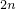

# 29.43 DruckerPragerCreep object


The DruckerPragerCreep object specifies creep for Drucker-Prager plasticity models.

**Access**

```
import material
mdb.models[*name*].materials[*name*].druckerPrager.druckerPragerCreep
import odbMaterial
session.odbs[*name*].materials[*name*].druckerPrager.druckerPragerCreep
```

### 29.43.1 DruckerPragerCreep(...)

This method creates a DruckerPragerCreep object.

**Path**

```
mdb.models[*name*].materials[*name*].druckerPrager.DruckerPragerCreep
session.odbs[*name*].materials[*name*].druckerPrager.DruckerPragerCreep
```

**Required argument**

*table*

A sequence of sequences of Floats specifying the items described below.

**Optional arguments**

*law*

A SymbolicConstant specifying the type of data defining the creep law. Possible values are:
- STRAIN, specifying a strain-hardening power law.
- TIME, specifying a time-hardening power law.
- SINGHM, specifying a Singh-Mitchell type law.
- USER, specifying the creep law is input from user subroutine [`CREEP`](../sub/sub-link.md#sub-xsl-creep).

The default value is STRAIN.

*temperatureDependency*

A Boolean specifying whether the data depend on temperature. The default value is OFF.

*dependencies*

An Int specifying the number of field variable dependencies. The default value is 0.

**Table data**

If *law*=TIME or *law*=STRAIN, the table data specify the following:
- . (Units of [FLT](../popups/usb-int-iconventions-unitsym.md).)
- .
- .
- Temperature, if the data depend on temperature.
- Value of the first field variable, if the data depend on field variables.
- Value of the second field variable.
- Etc.

If *law*=SINGHM, the table data specify the following:- . (Units of [T1](../popups/usb-int-iconventions-unitsym.md).)
- . (Units of [F1L2](../popups/usb-int-iconventions-unitsym.md).)
- .
- . (Units of [T](../popups/usb-int-iconventions-unitsym.md).)
- Temperature, if the data depend on temperature.
- Value of the first field variable, if the data depend on field variables.
- Value of the second field variable.
- Etc.

**Return value**

A DruckerPragerCreep object.

**Exceptions**

RangeError.

### 29.43.2 setValues(...)

This method modifies the DruckerPragerCreep object.

**Required arguments**

None.

**Optional arguments**

The optional arguments to `setValues` are the same as the arguments to the [DruckerPragerCreep](pt01ch29pyo43.md#ker-druckerpragercreep-druckerpragercreep-pyc) method.

**Return value**

None

**Exceptions**

RangeError.

### 29.43.3 Members

The DruckerPragerCreep object has members with the same names and descriptions as the arguments to the [DruckerPragerCreep](pt01ch29pyo43.md#ker-druckerpragercreep-druckerpragercreep-pyc) method.

### 29.43.4 Corresponding analysis keywords

| [*DRUCKER PRAGER CREEP](../key/key-link.md#usb-kws-mdruckerpragercreep) |
| --- |


