# 29.45 Elastic object


The Elastic object specifies elastic material properties.

**Access**

```
import material
mdb.models[*name*].materials[*name*].elastic
import odbMaterial
session.odbs[*name*].materials[*name*].elastic
```

### 29.45.1 Elastic(...)

This method creates an Elastic object.

**Path**

```
mdb.models[*name*].materials[*name*].Elastic
session.odbs[*name*].materials[*name*].Elastic
```

**Required argument**

*table*

A sequence of sequences of Floats specifying the items described below.

**Optional arguments**

*type*

A SymbolicConstant specifying the type of elasticity data provided. Possible values are:
- ISOTROPIC
- ORTHOTROPIC
- ANISOTROPIC
- ENGINEERING_CONSTANTS
- LAMINA
- TRACTION
- COUPLED_TRACTION
- SHORT_FIBER
- SHEAR

The default value is ISOTROPIC.

*noCompression*

A Boolean specifying whether compressive stress is allowed. The default value is OFF.

*noTension*

A Boolean specifying whether tensile stress is allowed. The default value is OFF.

*temperatureDependency*

A Boolean specifying whether the data depend on temperature. The default value is OFF.

*dependencies*

An Int specifying the number of field variable dependencies. The default value is 0.

*moduli*

A SymbolicConstant specifying the time-dependence of the elastic material constants. Possible values are INSTANTANEOUS and LONG_TERM. The default value is LONG_TERM.

**Table data**

If *type*=ISOTROPIC, the table data specify the following:
- The Young's modulus, .
- The Poisson's ratio, .
- Temperature, if the data depend on temperature.
- Value of the first field variable, if the data depend on field variables.
- Value of the second field variable.
- Etc.

If *type*=SHEAR, the table data specify the following:- The shear modulus,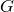.
- Temperature, if the data depend on temperature.
- Value of the first field variable, if the data depend on field variables.
- Value of the second field variable.
- Etc.

If *type*=ENGINEERING_CONSTANTS, the table data specify the following:- .
- .
- .
- .
- .
- .
- .
- .
- .
- Temperature, if the data depend on temperature.
- Value of the first field variable, if the data depend on field variables.
- Value of the second field variable.
- Etc.

If *type*=LAMINA, the table data specify the following:- .
- .
- .
- .
- . This shear modulus is needed to define transverse shear behavior in shells.
- . This shear modulus is needed to define transverse shear behavior in shells.
- Temperature, if the data depend on temperature.
- Value of the first field variable, if the data depend on field variables.
- Value of the second field variable.
- Etc.

If *type*=ORTHOTROPIC, the table data specify the following:- 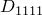.
- 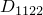.
- 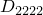.
- .
- .
- .
- 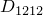.
- 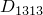.
- 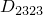.
- Temperature, if the data depend on temperature.
- Value of the first field variable, if the data depend on field variables.
- Value of the second field variable.
- Etc.

If *type*=ANISOTROPIC, the table data specify the following:- .
- .
- .
- .
- .
- .
- 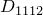.
- 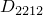.
- 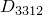.
- .
- 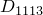.
- .
- .
- .
- .
- .
- 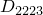.
- .
- 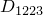.
- .
- .
- Temperature, if the data depend on temperature.
- Value of the first field variable, if the data depend on field variables.
- Value of the second field variable.
- Etc.

If *type*=TRACTION, the table data specify the following:-  for warping elements;  for cohesive elements.
-  for warping elements; 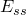 for cohesive elements.
-  for warping elements;  for cohesive elements.
- Temperature, if the data depend on temperature.
- Value of the first field variable, if the data depend on field variables.
- Value of the second field variable.
- Etc.

If *type*=COUPLED_TRACTION, the table data specify the following:- .
- .
- .
- .
- 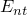.
- 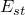.
- Temperature, if the data depend on temperature.
- Value of the first field variable, if the data depend on field variables.
- Value of the second field variable.
- Etc.

If *type*=SHORT_FIBER, there is no table data.

**Return value**

An Elastic object.

**Exceptions**

RangeError.

### 29.45.2 setValues(...)

This method modifies the Elastic object.

**Required arguments**

None.

**Optional arguments**

The optional arguments to `setValues` are the same as the arguments to the [Elastic](pt01ch29pyo45.md#ker-elastic-elastic-pyc) method.

**Return value**

None

**Exceptions**

RangeError.

### 29.45.3 Members

The Elastic object has members with the same names and descriptions as the arguments to the [Elastic](pt01ch29pyo45.md#ker-elastic-elastic-pyc) method.

In addition, the Elastic object can have the following members:

*failStress*

A [FailStress](pt01ch29pyo51.md) object.

*failStrain*

A [FailStrain](pt01ch29pyo50.md) object.

### 29.45.4 Corresponding analysis keywords

| [*ELASTIC](../key/key-link.md#usb-kws-melastic) |
| --- |


