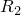
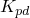
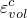

# 29.47 Eos object


 The Eos object specifies an equation of state model.

**Access**

```
import material
mdb.models[*name*].materials[*name*].eos
import odbMaterial
session.odbs[*name*].materials[*name*].eos
```

### 29.47.1 Eos(...)

 This method creates an Eos object.

**Path**

```
mdb.models[*name*].materials[*name*].Eos
session.odbs[*name*].materials[*name*].Eos
```

**Required arguments**

None.

**Optional arguments**

*type*

A SymbolicConstant specifying the equation of state. Possible values are USUP, JWL, IDEALGAS, TABULAR, and IGNITIONANDGROWTH. The default value is IDEALGAS.

*temperatureDependency*

A Boolean specifying whether the data in *gasSpecificTable* depend on temperature. The default value is OFF.

*dependencies*

An Int specifying the number of field variable dependencies for the data in *gasSpecificTable*. The default value is 0.

*detonationEnergy*

A Float specifying the detonation energy text field.  The default value is 0.0.

*solidTable*

A sequence of sequences of Floats specifying the following:
- $A_{s}$.
- $B_{s}$.
- ${\omega}_{s}$.
- $R_{1s}$.
- $R_{2s}$.

The default value is an empty sequence.

*gasTable*

A sequence of sequences of Floats specifying the following:
- $A_{g}$.
- $B_{g}$.
- ${\omega}_{g}$.
- $R_{1g}$.
- $R_{2g}$.

The default value is an empty sequence.

*reactionTable*

A sequence of sequences of Floats specifying the following:
- Initial Pressure, $I$.
- Product co-volume, $a$.
- Exponent on the unreacted fraction (ignition term), $x$.
- First burn rate coefficient, $G_{1}$
- Exponent on the unreacted fraction (growth term), $c$.
- Exponent on the reacted fraction (growth term), $d$.
- Pressure exponent (growth term), $y$.
- Second burn rate coefficient, $G_{2}$.
- Exponent on the unreacted fraction (completion term), $e$.
- Exponent on the reacted fraction (completion term), $g$.
- Pressure exponent (completion term), $z$.
- Initial reacted fraction, ${F^{max}}_{ig}$.
- Maximum reacted fraction for the growth term, ${F^{max}}_{G1}$.
- Minimum reacted fraction, ${F^{min}}_{G2}$.

The default value is an empty sequence.

*gasSpecificTable*

A sequence of sequences of Floats specifying the following:
- Specific Heat per unit mass.
- Temperature dependent data.
- Value of first field variable.
- Value of second field variable.
- Etc.

The default value is an empty sequence.

*table*

A sequence of sequences of Floats specifying the items described below. The default value is an empty sequence.

**Table data**

 If *type*=IDEALGAS, the table data represents the following:
- Gas constant, .
- The ambient pressure, . If this field is left blank, a default of 0.0 is used.

 If *type*=JWL, the table data represents the following:
- Detonation wave speed, .
- .
- .
- . (Dimensionless.)
- . (Dimensionless.)
- . (Dimensionless.)
- Pre-detonation bulk modulus, .
- Detonation energy density, .

 If *type*=USUP, the table data represents the following:
- .
- . (Dimensionless.)
- . (Dimensionless.)

 If *type*=TABULAR, the table data represents the following:
- .
- .
- . (Dimensionless.)

**Return value**

An Eos object.

**Exceptions**

None.

### 29.47.2 setValues(...)

This method modifies the Eos object.

**Required arguments**

None.

**Optional arguments**

The optional arguments to `setValues` are the same as the arguments to the [Eos](pt01ch29pyo47.md#ker-eos-eos-pyc) method.

**Return value**

None

**Exceptions**

None.

### 29.47.3 Members

The Eos object has members with the same names and descriptions as the arguments to the [Eos](pt01ch29pyo47.md#ker-eos-eos-pyc) method.

In addition, the Eos object can have the following members:

*detonationPoint*

A [DetonationPoint](pt01ch29pyo39.md) object.

*eosCompaction*

An [EosCompaction](pt01ch29pyo48.md) object.

### 29.47.4 Corresponding analysis keywords

| [*EOS](../key/key-link.md#usb-kws-meos) |
| --- |


