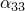
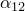
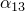

# 29.49 Expansion object


The Expansion object specifies thermal expansion.

**Access**

```
import material
mdb.models[*name*].materials[*name*].expansion
import odbMaterial
session.odbs[*name*].materials[*name*].expansion
```

### 29.49.1 Expansion(...)

This method creates an Expansion object.

**Path**

```
mdb.models[*name*].materials[*name*].Expansion
session.odbs[*name*].materials[*name*].Expansion
```

**Required arguments**

None.

**Optional arguments**

*type*

A SymbolicConstant specifying the type of expansion. Possible values are ISOTROPIC, ORTHOTROPIC, ANISOTROPIC, and SHORT_FIBER. The default value is ISOTROPIC.

*userSubroutine*

A Boolean specifying whether a user subroutine is used to define the increments of thermal strain. The default value is OFF.

*zero*

A Float specifying the value of  if the thermal expansion is temperature-dependent or field-variable-dependent. The default value is 0.0.

*temperatureDependency*

A Boolean specifying whether the data depend on temperature. The default value is OFF.

*dependencies*

An Int specifying the number of field variable dependencies. The default value is 0.

*table*

A sequence of sequences of Floats specifying the items described below. The default value is an empty sequence.

This argument is required only if *type* is not USER.

**Table data**

If *type*=ISOTROPIC, the table data specify the following:
- .
- Temperature, if the data depend on temperature.
- Value of the first field variable, if the data depend on field variables.
- Value of the second field variable.
- Etc.

If *type*=ORTHOTROPIC, the table data specify the following:- .
- .
- .
- Temperature, if the data depend on temperature.
- Value of the first field variable, if the data depend on field variables.
- Value of the second field variable.
- Etc.

If *type*=ANISOTROPIC, the table data specify the following:- .
- .
- . (Not used for plane stress case.)
- .
- .
- .
- Temperature, if the data depend on temperature.
- Value of the first field variable, if the data depend on field variables.
- Value of the second field variable.
- Etc.

If *type*=SHORT_FIBER, there is no table data.

**Return value**

An Expansion object.

**Exceptions**

RangeError.

### 29.49.2 setValues(...)

This method modifies the Expansion object.

**Required arguments**

None.

**Optional arguments**

The optional arguments to `setValues` are the same as the arguments to the [Expansion](pt01ch29pyo49.md#ker-expansion-expansion-pyc) method.

**Return value**

None

**Exceptions**

RangeError.

### 29.49.3 Members

The Expansion object has members with the same names and descriptions as the arguments to the [Expansion](pt01ch29pyo49.md#ker-expansion-expansion-pyc) method.

### 29.49.4 Corresponding analysis keywords

| [*EXPANSION](../key/key-link.md#usb-kws-mexpansion) |
| --- |


