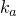

# 29.58 Gel object


The Gel object defines a swelling gel.

**Access**

```
import material
mdb.models[*name*].materials[*name*].gel
import odbMaterial
session.odbs[*name*].materials[*name*].gel
```

### 29.58.1 Gel(...)

This method creates a Gel object.

**Path**

```
mdb.models[*name*].materials[*name*].Gel
session.odbs[*name*].materials[*name*].Gel
```

**Required argument**

*table*

A sequence of sequences of Floats specifying the items described below.

**Optional arguments**

None.

**Table data**

- Radius of gel particles when completely dry, .
- Fully swollen radius of gel particles, .
- Number of gel particles per unit volume, .
- Relaxation time constant for long-term swelling of gel particles, .

**Return value**

A Gel object.

**Exceptions**

None.

### 29.58.2 setValues(...)

This method modifies the Gel object.

**Required arguments**

None.

**Optional arguments**

The optional arguments to `setValues` are the same as the arguments to the [Gel](pt01ch29pyo58.md#ker-gel-gel-pyc) method.

**Return value**

None

**Exceptions**

None.

### 29.58.3 Members

The Gel object has members with the same names and descriptions as the arguments to the [Gel](pt01ch29pyo58.md#ker-gel-gel-pyc) method.

### 29.58.4 Corresponding analysis keywords

| [*GEL](../key/key-link.md#usb-kws-mgel) |
| --- |


