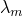
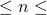
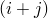
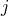
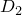

# 29.60 Hyperelastic object


The Hyperelastic object specifies elastic properties for approximately incompressible elastomers.

**Access**

```
import material
mdb.models[*name*].materials[*name*].hyperelastic
import odbMaterial
session.odbs[*name*].materials[*name*].hyperelastic
```

### 29.60.1 Hyperelastic(...)

This method creates a Hyperelastic object.

**Path**

```
mdb.models[*name*].materials[*name*].Hyperelastic
session.odbs[*name*].materials[*name*].Hyperelastic
```

**Required argument**

*table*

A sequence of sequences of Floats specifying the items described below. This argument is valid only if *testData*=OFF.

**Optional arguments**

*type*

A SymbolicConstant specifying the type of strain energy potential. Possible values are:
- ARRUDA_BOYCE
- MARLOW
- MOONEY_RIVLIN
- NEO_HOOKE
- OGDEN
- POLYNOMIAL
- REDUCED_POLYNOMIAL
- USER
- VAN_DER_WAALS
- YEOH
- UNKNOWN

The default value is UNKNOWN.

*moduliTimeScale*

A SymbolicConstant specifying the nature of the time response. Possible values are INSTANTANEOUS and LONG_TERM. The default value is LONG_TERM.

*temperatureDependency*

A Boolean specifying whether the data depend on temperature. The default value is OFF.

*n*

An Int specifying the order of the strain energy potential. The default value is 1.

If *testData*=ON and *type*=POLYNOMIAL, *n* can take only the values 1 or 2.

If *testData*=ON and *type*=OGDEN or if *testData*=OFF for either type, 1  6.

If *type*=USER, this argument cannot be used.

*beta*

The SymbolicConstant FITTED_VALUE or a Float specifying the invariant mixture parameter. This argument is valid only if *testData*=ON and *type*=VAN_DER_WAALS. The default value is FITTED_VALUE.

*testData*

A Boolean specifying whether test data are supplied. The default value is ON.

*compressible*

A Boolean specifying whether the hyperelastic material is compressible. This parameter is applicable only to user-defined hyperelastic materials. The default value is OFF.

*properties*

An Int specifying the number of property values needed as data for the user-defined hyperelastic material. The default value is 0.

*deviatoricResponse*

A SymbolicConstant specifying which test data to use. Possible values are UNIAXIAL, BIAXIAL, and PLANAR. The default value is UNIAXIAL.

*volumetricResponse*

A SymbolicConstant specifying the volumetric response. Possible values are DEFAULT, VOLUMETRIC_DATA, POISSON_RATIO, and LATERAL_NOMINAL_STRAIN. The default value is DEFAULT.

*poissonRatio*

A Float specifying the poisson ratio. This argument is valid only if *volumetricResponse*=POISSON_RATIO. The default value is 0.0.

*materialType*

A SymbolicConstant specifying the type of material. Possible values are ISOTROPIC and ANISOTROPIC. The default value is ISOTROPIC.

*anisotropicType*

A SymbolicConstant specifying the type of strain energy potential. Possible values are FUNG_ANISOTROPIC, FUNG_ORTHOTROPIC, HOLZAPFEL, and USER_DEFINED. The default value is FUNG_ANISOTROPIC.

*formulation*

A SymbolicConstant specifying the type of formulation. Possible values are STRAIN and INVARIANT. The default value is STRAIN.

*behaviorType*

A SymbolicConstant specifying the type of anisotropic hyperelastic material behavior. Possible values are INCOMPRESSIBLE and COMPRESSIBLE. The default value is INCOMPRESSIBLE.

*dependencies*

An Int specifying the number of field variable dependencies for the data in*volumetricTable*                  .                 The default value is 0.

*localDirections*

An Int specifying the number of local directions for the data in*volumetricTable*                  .                 The default value is 0.

**Table data**

If *type*=ARRUDA_BOYCE, the table data specify the following:
- .
- .
- .
- Temperature, if the data depend on temperature.

If *type*=MOONEY_RIVLIN, the table data specify the following:- .
- .
- .
- Temperature, if the data depend on temperature.

If *type*=NEO_HOOKE, the table data specify the following:- .
- .
- Temperature, if the data depend on temperature.

If *type*=OGDEN, the table data specify the following for values of :-  and  for  from 1 to .
-  coefficients .
- Temperature, if the data depend on temperature. Temperature dependence is not allowed for 4  6 in an Abaqus/Explicit analysis.

If *type*=POLYNOMIAL, the table data specify the following for values of :-  for each value of  from  to  with  decreasing from  to zero and  increasing from zero to .
-  coefficients .
- Temperature, if the data depend on temperature. Temperature dependence is not allowed for 3  6 in an Abaqus/Explicit analysis.

If *type*=REDUCED_POLYNOMIAL, the table data specify the following for values of :-  for  from 1 to .
-  coefficients .
- Temperature, if the data depend on temperature. Temperature dependence is not allowed for 4  6 in an Abaqus/Explicit analysis.

If *type*=VAN_DER_WAALS, the table data specify the following:- .
- .
- .
- .
- .
- Temperature, if the data depend on temperature.

If *type*=YEOH, the table data specify the following:- .
- .
- .
- .
- .
- .
- Temperature, if the data depend on temperature. Temperature dependence is not allowed in an Abaqus/Explicit analysis.

The `None` object is the default value if *testData*=ON.

**Return value**

A Hyperelastic object.

**Exceptions**

InvalidNameError and RangeError.

### 29.60.2 setValues(...)

This method modifies the Hyperelastic object.

**Required arguments**

None.

**Optional arguments**

The optional arguments to `setValues` are the same as the arguments to the [Hyperelastic](pt01ch29pyo60.md#ker-hyperelastic-hyperelastic-pyc) method.

**Return value**

None

**Exceptions**

RangeError.

### 29.60.3 Members

The Hyperelastic object has members with the same names and descriptions as the arguments to the [Hyperelastic](pt01ch29pyo60.md#ker-hyperelastic-hyperelastic-pyc) method.

In addition, the Hyperelastic object can have the following members:

*biaxialTestData*

A [BiaxialTestData](pt01ch29pyo04.md) object.

*planarTestData*

A [PlanarTestData](pt01ch29pyo76.md) object.

*uniaxialTestData*

A [UniaxialTestData](pt01ch29pyo101.md) object.

*volumetricTestData*

A [VolumetricTestData](pt01ch29pyo110.md) object.

*hysteresis*

A [Hysteresis](pt01ch29pyo63.md) object.

### 29.60.4 Corresponding analysis keywords

| [*HYPERELASTIC](../key/key-link.md#usb-kws-mhyperelast) |
| --- |


