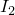
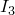

# 29.62 Hypoelastic object


The Hypoelastic object specifies hypoelastic material properties.

**Access**

```
import material
mdb.models[*name*].materials[*name*].hypoelastic
import odbMaterial
session.odbs[*name*].materials[*name*].hypoelastic
```

### 29.62.1 Hypoelastic(...)

This method creates a Hypoelastic object.

**Path**

```
mdb.models[*name*].materials[*name*].Hypoelastic
session.odbs[*name*].materials[*name*].Hypoelastic
```

**Required argument**

*table*

A sequence of sequences of Floats specifying the items described below.

**Optional argument**

*user*

A Boolean specifying that hypoelasticity is defined by user subroutine [`UHYPEL`](../sub/sub-link.md#sub-xsl-uhypel). The default value is OFF.

**Table data**

- Instantaneous Young's modulus, .
- Instantaneous Poisson's ratio, .
- First strain invariant, .
- Second strain invariant, .
- Third strain invariant, .

**Return value**

A Hypoelastic object.

**Exceptions**

None.

### 29.62.2 setValues(...)

This method modifies the Hypoelastic object.

**Required arguments**

None.

**Optional arguments**

The optional arguments to `setValues` are the same as the arguments to the [Hypoelastic](pt01ch29pyo62.md#ker-hypoelastic-hypoelastic-pyc) method.

**Return value**

None

**Exceptions**

None.

### 29.62.3 Members

The Hypoelastic object has members with the same names and descriptions as the arguments to the [Hypoelastic](pt01ch29pyo62.md#ker-hypoelastic-hypoelastic-pyc) method.

### 29.62.4 Corresponding analysis keywords

| [*HYPOELASTIC](../key/key-link.md#usb-kws-mhypoelastic) |
| --- |


