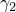

# 29.77 Plastic object


The Plastic object specifies a metal plasticity model.

**Access**

```
import material
mdb.models[*name*].materials[*name*].plastic
import odbMaterial
session.odbs[*name*].materials[*name*].plastic
```

### 29.77.1 Plastic(...)

This method creates a Plastic object.

**Path**

```
mdb.models[*name*].materials[*name*].Plastic
session.odbs[*name*].materials[*name*].Plastic
```

**Required argument**

*table*

A sequence of sequences of Floats specifying the items described below.

**Optional arguments**

*hardening*

A SymbolicConstant specifying the type of hardening. Possible values are ISOTROPIC, KINEMATIC, COMBINED, JOHNSON_COOK, and USER. The default value is ISOTROPIC.

*rate*

A Boolean specifying whether the data depend on rate. The default value is OFF.

*dataType*

A SymbolicConstant specifying the type of combined hardening. This argument is only valid if *hardening*=COMBINED. Possible values are HALF_CYCLE, PARAMETERS, and STABILIZED. The default value is HALF_CYCLE.

*strainRangeDependency*

A Boolean specifying whether the data depend on strain range. This argument is only valid if *hardening*=COMBINED and *dataType*=STABILIZED. The default value is OFF.

*numBackstresses*

An Int specifying the number of backstresses. This argument is only valid if *hardening*=COMBINED.                 The default value is 1.

*temperatureDependency*

A Boolean specifying whether the data depend on temperature. The default value is OFF.

*dependencies*

An Int specifying the number of field variable dependencies. The default value is 0.

**Table data**

If *hardening*=ISOTROPIC, or if *hardening*=COMBINED and *dataType*=HALF_CYCLE, the table data specify the following:
- Yield stress.
- Plastic strain.
- Equivalent plastic strain rate, .
- Temperature, if the data depend on temperature.
- Value of the first field variable, if the data depend on field variables.
- Value of the second field variable.
- Etc.

If *hardening*=COMBINED and *dataType*=STABILIZED, the table data specify the following:- Yield stress.
- Plastic strain.
- Strain range, if the data depend on strain range.
- Temperature, if the data depend on temperature.
- Value of the first field variable, if the data depend on field variables.
- Value of the second field variable.
- Etc.

If *hardening*=COMBINED and *dataType*=PARAMETERS, the table data specify the following:- Yield stress at zero plastic strain.
- The first kinematic hardening parameter, .
- The first kinematic hardening parameter, .
- If applicable, the second kinematic hardening parameter, .
- If applicable, the second kinematic hardening parameter, .
- Etc.
- Temperature, if the data depend on temperature.
- Value of the first field variable, if the data depend on field variables.
- Value of the second field variable.
- Etc.

If *hardening*=KINEMATIC, the table data specify the following:- Yield stress.
- Plastic strain.
- Temperature, if the data depend on temperature.

If *hardening*=JOHNSON_COOK, the table data specify the following:- A.
- B.
- n.
- m.
- Melting temperature.
- Transition temperature.

If *hardening*=USER, the table data specify the following:- Hardening properties.

**Return value**

A Plastic object.

**Exceptions**

RangeError.

### 29.77.2 setValues(...)

This method modifies the Plastic object.

**Required arguments**

None.

**Optional arguments**

The optional arguments to `setValues` are the same as the arguments to the [Plastic](pt01ch29pyo77.md#ker-plastic-plastic-pyc) method.

**Return value**

None

**Exceptions**

RangeError.

### 29.77.3 Members

The Plastic object has members with the same names and descriptions as the arguments to the [Plastic](pt01ch29pyo77.md#ker-plastic-plastic-pyc) method.

In addition, the Plastic object can have the following members:

*rateDependent*

A [RateDependent](pt01ch29pyo85.md) object.

*potential*

A [Potential](pt01ch29pyo83.md) object.

*cyclicHardening*

A [CyclicHardening](pt01ch29pyo30.md) object.

*ornl*

An [Ornl](pt01ch29pyo73.md) object.

*cycledPlastic*

A [CycledPlastic](pt01ch29pyo29.md) object.

*annealTemperature*

An [AnnealTemperature](pt01ch29pyo03.md) object.

### 29.77.4 Corresponding analysis keywords

| [*PLASTIC](../key/key-link.md#usb-kws-mplastic) |
| --- |


