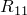

# 29.83 Potential object


The Potential object defines an anisotropic yield/creep model.

**Access**

```
import material
mdb.models[*name*].materials[*name*].creep.potential
mdb.models[*name*].materials[*name*].plastic.potential
mdb.models[*name*].materials[*name*].viscous.potential
import odbMaterial
session.odbs[*name*].materials[*name*].creep.potential
session.odbs[*name*].materials[*name*].plastic.potential
session.odbs[*name*].materials[*name*].viscous.potential
```

### 29.83.1 Potential(...)

This method creates a Potential object.

**Path**

```
mdb.models[*name*].materials[*name*].creep.Potential
mdb.models[*name*].materials[*name*].plastic.Potential
mdb.models[*name*].materials[*name*].viscous.Potential
session.odbs[*name*].materials[*name*].creep.Potential
session.odbs[*name*].materials[*name*].plastic.Potential
session.odbs[*name*].materials[*name*].viscous.Potential
```

**Required argument**

*table*

A sequence of sequences of Floats specifying the items described below.

**Optional arguments**

*temperatureDependency*

A Boolean specifying whether the data depend on temperature. The default value is OFF.

*dependencies*

An Int specifying the number of field variable dependencies. The default value is 0.

**Table data**

- .
- .
- .
- .
- .
- .
- Temperature, if the data depend on temperature.
- Value of the first field variable, if the data depend on field variables.
- Value of the second field variable.
- Etc.

**Return value**

A Potential object.

**Exceptions**

RangeError.

### 29.83.2 setValues(...)

This method modifies the Potential object.

**Required arguments**

None.

**Optional arguments**

The optional arguments to `setValues` are the same as the arguments to the [Potential](pt01ch29pyo83.md#ker-potential-potential-pyc) method.

**Return value**

None

**Exceptions**

RangeError.

### 29.83.3 Members

The Potential object has members with the same names and descriptions as the arguments to the [Potential](pt01ch29pyo83.md#ker-potential-potential-pyc) method.

### 29.83.4 Corresponding analysis keywords

| [*POTENTIAL](../key/key-link.md#usb-kws-mpotential) |
| --- |


