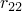

# 29.86 Ratios object


The Ratios object specifies ratios that define anisotropic swelling.

**Access**

```
import material
mdb.models[*name*].materials[*name*].moistureSwelling.ratios
mdb.models[*name*].materials[*name*].swelling.ratios
import odbMaterial
session.odbs[*name*].materials[*name*].moistureSwelling.ratios
session.odbs[*name*].materials[*name*].swelling.ratios
```

### 29.86.1 Ratios(...)

This method creates a Ratios object.

**Path**

```
mdb.models[*name*].materials[*name*].moistureSwelling.Ratios
mdb.models[*name*].materials[*name*].swelling.Ratios
session.odbs[*name*].materials[*name*].moistureSwelling.Ratios
session.odbs[*name*].materials[*name*].swelling.Ratios
```

**Required argument**

*table*

A sequence of sequences of Floats specifying the items described below.

**Optional arguments**

*temperatureDependency*

A Boolean specifying whether the data depend on temperature. The default value is OFF.

*dependencies*

An Int specifying the number of field variable dependencies. The default value is 0.

**Table data**

- .
- .
- .
- Temperature, if the data depend on temperature.
- Value of the first field variable, if the data depend on field variables.
- Value of the second field variable.
- Etc.

**Return value**

A Ratios object.

**Exceptions**

RangeError.

### 29.86.2 setValues(...)

This method modifies the Ratios object.

**Required arguments**

None.

**Optional arguments**

The optional arguments to `setValues` are the same as the arguments to the [Ratios](pt01ch29pyo86.md#ker-ratios-ratios-pyc) method.

**Return value**

None

**Exceptions**

RangeError.

### 29.86.3 Members

The Ratios object has members with the same names and descriptions as the arguments to the [Ratios](pt01ch29pyo86.md#ker-ratios-ratios-pyc) method.

### 29.86.4 Corresponding analysis keywords

| [*RATIOS](../key/key-link.md#usb-kws-mswellratios) |
| --- |


