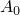
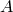
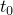

# 56.4 DecayAmplitude object


The DecayAmplitude object defines an amplitude curve using an exponential decay.

The DecayAmplitude object is derived from the [Amplitude](pt02ch56pyo01.md) object.

**Access**

```
amplitudeApi.amplitudes()[*name*]
```

### 56.4.1 DecayAmplitude(...)

This method creates a DecayAmplitude object.

**Path**

```
amplitudeApi.DecayAmplitude
```

**Prototype**

```
odb_DecayAmplitude&
DecayAmplitude(const odb_String& name,
               double initial,
               double maximum,
               double start,
               double decayTime,
               const odb_String& timeSpan);
```

**Required arguments**

*name*

An odb_String specifying the repository key.

*initial*

A Double specifying the constant .

*maximum*

A Double specifying the coefficient .

*start*

A Double specifying the starting time . Possible values are non-negative numbers.

*decayTime*

A Double specifying the decay time . Possible values are non-negative numbers.

**Optional argument**

*timeSpan*

An odb_String specifying the time span of the amplitude. Possible values are "STEP" and "TOTAL". The default value is "STEP".

**Return value**

A DecayAmplitude object.

**Exceptions**

InvalidNameError and RangeError.

### 56.4.2 setValues(...)

This method modifies the DecayAmplitude object.

**Required arguments**

None.

**Optional arguments**

The optional arguments to `setValues` are the same as the arguments to the [DecayAmplitude](pt02ch56pyo04.md#ker-decayamplitude-decayamplitude-cpp) method, except for the *name* argument.

**Return value**

None

**Exceptions**

RangeError.

### 56.4.3 Members

The DecayAmplitude object has members with the same names and descriptions as the arguments to the [DecayAmplitude](pt02ch56pyo04.md#ker-decayamplitude-decayamplitude-cpp) method.

### 56.4.4 Corresponding analysis keywords

| [*AMPLITUDE](../key/key-link.md#usb-kws-mamplitude) |
| --- |


