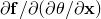

# 60.103 UserMaterial object


The UserMaterial object defines material constants for use in subroutines [`UMAT`](../sub/sub-link.md#sub-xsl-umat), [`UMATHT`](../sub/sub-link.md#sub-xsl-umatht), or [`VUMAT`](../sub/sub-link.md#sub-xsl-vumat).

**Access**

```
materialApi.materials()[*name*].userMaterial()
```

### 60.103.1 UserMaterial(...)

This method creates a UserMaterial object.

**Path**

```
materialApi.materials()[*name*].UserMaterial
```

**Prototype**

```
odb_UserMaterial&
UserMaterial(const odb_String& type,
             bool unsymm,
             const odb_SequenceDouble& mechanicalConstants,
             const odb_SequenceDouble& thermalConstants);
```

**Required arguments**

None.

**Optional arguments**

*type*

An odb_String specifying the type of material behavior defined by the command. Possible values are "MECHANICAL", "THERMAL", and "THERMOMECHANICAL". The default value is "MECHANICAL".

*unsymm*

A Boolean specifying if the material stiffness matrix, , is not symmetric or, when a thermal constitutive model is used, if  is not symmetric. The default value is false.

This argument is valid only for an Abaqus/Standard analysis.

*mechanicalConstants*

An odb_SequenceDouble specifying the mechanical constants of the material. This argument is valid only when *type*="MECHANICAL" or "THERMOMECHANICAL". The default value is an empty sequence.

*thermalConstants*

An odb_SequenceDouble specifying the thermal constants of the material. This argument is valid only when *type*="THERMAL" or "THERMOMECHANICAL". The default value is an empty sequence.

**Return value**

A UserMaterial object.

**Exceptions**

RangeError.

### 60.103.2 Members

The UserMaterial object has members with the same names and descriptions as the arguments to the [UserMaterial](pt02ch60pyo103.md#ker-usermaterial-usermaterial-cpp) method.

### 60.103.3 Corresponding analysis keywords

| [*USER MATERIAL](../key/key-link.md#usb-kws-musermaterial) |
| --- |


