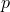
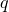
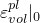
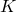

# 60.11 CapPlasticity object


The CapPlasticity object specifies the modified Drucker-Prager/Cap plasticity model.

**Access**

```
materialApi.materials()[*name*].capPlasticity()
```

### 60.11.1 CapPlasticity(...)

This method creates a CapPlasticity object.

**Path**

```
materialApi.materials()[*name*].CapPlasticity
```

**Prototype**

```
odb_CapPlasticity&
CapPlasticity(const odb_SequenceSequenceDouble& table,
              bool temperatureDependency,
              int dependencies);
```

**Required argument**

*table*

An odb_SequenceSequenceDouble specifying the items described below.

**Optional arguments**

*temperatureDependency*

A Boolean specifying whether the data depend on temperature. The default value is false.

*dependencies*

An Int specifying the number of field variable dependencies. The default value is 0.

**Table data**

- Material cohesion, , in the -- plane (Abaqus/Standard) or in the -- plane (Abaqus/Explicit).
- Material angle of friction, , in the -- plane (Abaqus/Standard) or in the -- plane (Abaqus/Explicit). Give the value in degrees.
- Cap eccentricity parameter, . Its value must be greater than zero (typically 0.0  1.0).
- Initial cap yield surface position, .
- Transition surface radius parameter, . The default value is 0.0 (i.e., no transition surface).
- (Not used in Abaqus/Explicit) , the ratio of the flow stress in triaxial tension to the flow stress in triaxial compression. Possible values are 0.778  1.0. If the default value of 0.0 is accepted, Abaqus/Standard assumes  1.0.
- Temperature, if the data depend on temperature.
- Value of the first field variable, if the data depend on field variables.
- Value of the second field variable.
- Etc.

**Return value**

A CapPlasticity object.

**Exceptions**

RangeError.

### 60.11.2 Members

The CapPlasticity object has members with the same names and descriptions as the arguments to the [CapPlasticity](pt02ch60pyo11.md#ker-capplasticity-capplasticity-cpp) method.

In addition, the CapPlasticity object can have the following members:

**Prototype**

```
odb_CapCreepCohesion capCreepCohesion() const;
odb_CapCreepConsolidation capCreepConsolidation() const;
odb_CapHardening capHardening() const;
```

*capCreepCohesion*

A [CapCreepCohesion](pt02ch60pyo08.md) object.

*capCreepConsolidation*

A [CapCreepConsolidation](pt02ch60pyo09.md) object.

*capHardening*

A [CapHardening](pt02ch60pyo10.md) object.

### 60.11.3 Corresponding analysis keywords

| [*CAP PLASTICITY](../key/key-link.md#usb-kws-mcapplasticity) |
| --- |


