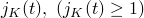

# 60.110 VolumetricTestData object


The VolumetricTestData object provides volumetric test data.

**Access**

```
materialApi.materials()[*name*].hyperelastic().volumetricTestData()
materialApi.materials()[*name*].hyperfoam().volumetricTestData()
materialApi.materials()[*name*].viscoelastic().volumetricTestData()
```

### 60.110.1 VolumetricTestData(...)

This method creates a VolumetricTestData object.

**Path**

```
materialApi.materials()[*name*].hyperelastic().VolumetricTestData
materialApi.materials()[*name*].hyperfoam().VolumetricTestData
materialApi.materials()[*name*].viscoelastic().VolumetricTestData
```

**Prototype**

```
odb_VolumetricTestData&
VolumetricTestData(const odb_SequenceSequenceDouble& table,
                   odb_Union volinf,
                   odb_Union smoothing,
                   bool temperatureDependency,
                   int dependencies);
```

**Required argument**

*table*

An odb_SequenceSequenceDouble specifying the items described below.

**Optional arguments**

*volinf*

The string "NONE" or a Double specifying a normalized volumetric value that depends on the value of the *time* member of the [Viscoelastic](pt02ch60pyo106.md) object. The default value is "NONE".

If *time*="RELAXATION_TEST_DATA", *volinf* specifies the value of the long-term, normalized volumetric modulus, .

If *time*="CREEP_TEST_DATA", *volinf* specifies the value of the long-term, normalized volumetric compliance, .

This argument is valid only for a viscoelastic material model.

*smoothing*

The string "NONE" or an Int specifying the value for smoothing. If *smoothing*="NONE", no smoothing is employed. The default value is "NONE".

*temperatureDependency*

A Boolean specifying whether the data depend on temperature. The default value is false.

*dependencies*

An Int specifying the number of field variable dependencies. The default value is 0.

**Table data**

For a hyperelastic or hyperfoam material model, the table data specify the following:
- Pressure, .
- Volume ratio,  (current volume/original volume).

For a viscoelastic material model, the values depend on the value of the *time* member of the [Viscoelastic](pt02ch60pyo106.md) object.

If *time*=RELAXATION_TEST_DATA, the table data specify the following:
- Normalized volumetric (bulk) modulus .
- Time  .

If *time*=CREEP_TEST_DATA, the table data specify the following:
- Normalized volumetric (bulk) compliance .
- Time  .

**Return value**

A VolumetricTestData object.

**Exceptions**

None.

### 60.110.2 Members

The VolumetricTestData object has members with the same names and descriptions as the arguments to the [VolumetricTestData](pt02ch60pyo110.md#ker-volumetrictestdata-volumetrictestdata-cpp) method.

### 60.110.3 Corresponding analysis keywords

| [*VOLUMETRIC TEST DATA](../key/key-link.md#usb-kws-mvoltestdata) |
| --- |


