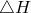

# 60.26 Creep object


The Creep object defines a creep law.

**Access**

```
materialApi.materials()[*name*].creep()
```

### 60.26.1 Creep(...)

This method creates a Creep object.

**Path**

```
materialApi.materials()[*name*].Creep
```

**Prototype**

```
odb_Creep&
Creep(const odb_SequenceSequenceDouble& table,
      const odb_String& law,
      bool temperatureDependency,
      int dependencies);
```

**Required argument**

*table*

An odb_SequenceSequenceDouble specifying the items described below.

**Optional arguments**

*law*

An odb_String specifying the strain-hardening law. Possible values are "STRAIN", "TIME", "HYPERBOLIC_SINE", and "USER". The default value is "STRAIN".

*temperatureDependency*

A Boolean specifying whether the data depend on temperature. The default value is false.

*dependencies*

An Int specifying the number of field variable dependencies. The default value is 0.

**Table data**

If *law*=STRAIN or *law*=TIME, the table data specify the following:
- .
- .
- .
- Temperature, if the data depend on temperature.
- Value of the first field variable, if the data depend on field variables.
- Value of the second field variable.
- Etc.

If *law*=HYPERBOLIC_SINE, the table data specify the following:- .
- .
- .
- , if the data depend on temperature.
- .
- Value of the first field variable, if the data depend on field variables.
- Value of the second field variable.
- Etc.

**Return value**

A Creep object.

**Exceptions**

RangeError.

### 60.26.2 Members

The Creep object has members with the same names and descriptions as the arguments to the [Creep](pt02ch60pyo26.md#ker-creep-creep-cpp) method.

In addition, the Creep object can have the following members:

**Prototype**

```
odb_Ornl ornl() const;
odb_Potential potential() const;
```

*ornl*

An [Ornl](pt02ch60pyo73.md) object.

*potential*

A [Potential](pt02ch60pyo83.md) object.

### 60.26.3 Corresponding analysis keywords

| [*CREEP](../key/key-link.md#usb-kws-mcreep) |
| --- |


