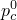

# 60.27 CrushableFoam object


The CrushableFoam object specifies the crushable foam plasticity model.

**Access**

```
materialApi.materials()[*name*].crushableFoam()
```

### 60.27.1 CrushableFoam(...)

This method creates a CrushableFoam object.

**Path**

```
materialApi.materials()[*name*].CrushableFoam
```

**Prototype**

```
odb_CrushableFoam&
CrushableFoam(const odb_SequenceSequenceDouble& table,
              const odb_String& hardening,
              bool temperatureDependency,
              int dependencies);
```

**Required argument**

*table*

An odb_SequenceSequenceDouble specifying the items described below.

**Optional arguments**

*hardening*

An odb_String specifying the type of hardening/softening definition. Possible values are "VOLUMETRIC" and "ISOTROPIC". The default value is "VOLUMETRIC".

*temperatureDependency*

A Boolean specifying whether the data depend on temperature. The default value is false.

*dependencies*

An Int specifying the number of field variable dependencies. The default value is 0.

**Table data**

If *hardening*=VOLUMETRIC, the table data specify the following:
- Ratio, , of initial yield stress in uniaxial compression, , to initial yield stress in hydrostatic compression, ; 0.0  3.0.
- Ratio, , of yield stress in hydrostatic tension, , to initial yield stress in hydrostatic compression, . The default value is 1.0.
- Temperature, if the data depend on temperature.
- Value of the first field variable, if the data depend on field variables.
- Value of the second field variable.
- Etc.

If *hardening*=ISOTROPIC, the table data specify the following:- Ratio, , of initial yield stress in uniaxial compression, , to initial yield stress in hydrostatic compression, ; 0.0  3.0.
- Plastic Poisson's ratio.; -10.5.
- Temperature, if the data depend on temperature.
- Value of the first field variable, if the data depend on field variables.
- Value of the second field variable.
- Etc.

**Return value**

A CrushableFoam object.

**Exceptions**

RangeError.

### 60.27.2 Members

The CrushableFoam object has members with the same names and descriptions as the arguments to the [CrushableFoam](pt02ch60pyo27.md#ker-crushablefoam-crushablefoam-cpp) method.

In addition, the CrushableFoam object can have the following members:

**Prototype**

```
odb_CrushableFoamHardening crushableFoamHardening() const;
odb_RateDependent rateDependent() const;
```

*crushableFoamHardening*

A [CrushableFoamHardening](pt02ch60pyo28.md) object.

*rateDependent*

A [RateDependent](pt02ch60pyo85.md) object.

### 60.27.3 Corresponding analysis keywords

| [*CRUSHABLE FOAM](../key/key-link.md#usb-kws-mcrushfoam) |
| --- |


