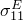
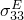
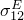
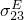

# 60.46 ElectricalConductivity object


The ElectricalConductivity object specifies electrical conductivity.

**Access**

```
materialApi.materials()[*name*].electricalConductivity()
```

### 60.46.1 ElectricalConductivity(...)

This method creates an ElectricalConductivity object.

**Path**

```
materialApi.materials()[*name*].ElectricalConductivity
```

**Prototype**

```
odb_ElectricalConductivity&
ElectricalConductivity(const odb_SequenceSequenceDouble& table,
                       const odb_String& type,
                       bool frequencyDependency,
                       bool temperatureDependency,
                       int dependencies);
```

**Required argument**

*table*

An odb_SequenceSequenceDouble specifying the items described below.

**Optional arguments**

*type*

An odb_String specifying the type of electrical conductivity. Possible values are "ISOTROPIC", "ORTHOTROPIC", and "ANISOTROPIC". The default value is "ISOTROPIC".

*frequencyDependency*

A Boolean specifying whether the data depend on frequency. The default value is false.

*temperatureDependency*

A Boolean specifying whether the data depend on temperature. The default value is false.

*dependencies*

An Int specifying the number of field variable dependencies. The default value is 0.

**Table data**

If *type*=ISOTROPIC, the table data specify the following:
- Electrical conductivity.
- Frequency, if the data depend on frequency.
- Temperature, if the data depend on temperature.
- Value of the first field variable, if the data depend on field variables.
- Value of the second field variable.
- Etc.

If *type*=ORTHOTROPIC, the table data specify the following:- .
- .
- .
- Frequency, if the data depend on frequency.
- Temperature, if the data depend on temperature.
- Value of the first field variable, if the data depend on field variables.
- Value of the second field variable.
- Etc.

If *type*=ANISOTROPIC, the table data specify the following:- .
- .
- .
- .
- .
- .
- Frequency, if the data depend on frequency.
- Temperature, if the data depend on temperature.
- Value of the first field variable, if the data depend on field variables.
- Value of the second field variable.
- Etc.

**Return value**

An ElectricalConductivity object.

**Exceptions**

RangeError.

### 60.46.2 Members

The ElectricalConductivity object has members with the same names and descriptions as the arguments to the [ElectricalConductivity](pt02ch60pyo46.md#ker-electricalconductivity-electricalconductivity-cpp) method.

### 60.46.3 Corresponding analysis keywords

| [*ELECTRICAL CONDUCTIVITY](../key/key-link.md#usb-kws-melectricconduct) |
| --- |


