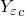
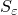

# 60.50 FailStrain object


The FailStrain object defines parameters for strain-based failure measures.

**Access**

```
materialApi.materials()[*name*].elastic().failStrain()
```

### 60.50.1 FailStrain(...)

This method creates a FailStrain object.

**Path**

```
materialApi.materials()[*name*].elastic().FailStrain
```

**Prototype**

```
odb_FailStrain&
FailStrain(const odb_SequenceSequenceDouble& table,
           bool temperatureDependency,
           int dependencies);
```

**Required argument**

*table*

An odb_SequenceSequenceDouble specifying the items described below.

**Optional arguments**

*temperatureDependency*

A Boolean specifying whether the data depend on temperature. The default value is false.

*dependencies*

An Int specifying the number of field variable dependencies. The default value is 0.

**Table data**

- Tensile strain limit in fiber direction, .
- Compressive strain limit in fiber direction, .
- Tensile strain limit in transverse direction, .
- Compressive strain limit in transverse direction, .
- Shear strain limit in the -- plane, .
- Temperature, if the data depend on temperature.
- Value of the first field variable, if the data depend on field variables.
- Value of the second field variable.
- Etc.

**Return value**

A FailStrain object.

**Exceptions**

RangeError.

### 60.50.2 Members

The FailStrain object has members with the same names and descriptions as the arguments to the [FailStrain](pt02ch60pyo50.md#ker-failstrain-failstrain-cpp) method.

### 60.50.3 Corresponding analysis keywords

| [*FAIL STRAIN](../key/key-link.md#usb-kws-mefailstrain) |
| --- |


