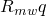

# 60.70 MohrCoulombPlasticity object


The MohrCoulombPlasticity object specifies the extended Mohr-Coulomb plasticity model.

**Access**

```
materialApi.materials()[*name*].mohrCoulombPlasticity()
```

### 60.70.1 MohrCoulombPlasticity(...)

This method creates a MohrCoulombPlasticity object.

**Path**

```
materialApi.materials()[*name*].MohrCoulombPlasticity
```

**Prototype**

```
odb_MohrCoulombPlasticity&
MohrCoulombPlasticity(const odb_SequenceSequenceDouble& table,
                      odb_Union deviatoricEccentricity,
                      double meridionalEccentricity,
                      bool temperatureDependency,
                      int dependencies,
                      bool useTensionCutoff);
```

**Required argument**

*table*

An odb_SequenceSequenceDouble specifying the items described below.

**Optional arguments**

*deviatoricEccentricity*

The string "NONE" or a Double specifying the flow potential eccentricity in the deviatoric plane, ; 1/2  1.0. If *deviatoricEccentricity*="NONE", Abaqus calculates the value using the specified Mohr-Coulomb angle of friction. The default value is "NONE".

*meridionalEccentricity*

A Double specifying the flow potential eccentricity in the meridional plane, . The default value is 0.1.

*temperatureDependency*

A Boolean specifying whether the data depend on temperature. The default value is false.

*dependencies*

An Int specifying the number of field variable dependencies. The default value is 0.

*useTensionCutoff*

A Boolean specifying whether tension cutoff specification is needed. The default value is false.

**Table data**

The table data specify the following:
- Friction angle (given in degrees), , at high confining pressure in the -- plane.
- Dilation angle, , at high confining pressure in the -- plane.
- Temperature, if the data depend on temperature.
- Value of the first field variable, if the data depend on field variables.
- Value of the second field variable.
- Etc.

**Return value**

A MohrCoulombPlasticity object.

**Exceptions**

RangeError.

### 60.70.2 Members

The MohrCoulombPlasticity object has members with the same names and descriptions as the arguments to the [MohrCoulombPlasticity](pt02ch60pyo70.md#ker-mohrcoulombplasticity-mohrcoulombplasticity-cpp) method.

In addition, the MohrCoulombPlasticity object can have the following members:

**Prototype**

```
odb_MohrCoulombHardening mohrCoulombHardening() const;
odb_TensionCutOff tensionCutOff() const;
```

*mohrCoulombHardening*

A [MohrCoulombHardening](pt02ch60pyo69.md) object.

*tensionCutOff*

A [TensionCutOff](pt02ch60pyo97.md) object.

### 60.70.3 Corresponding analysis keywords

| [*MOHR COULOMB](../key/key-link.md#usb-kws-mmohrcoulomb) |
| --- |


