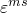
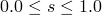

# 60.71 MoistureSwelling object


The MoistureSwelling object defines moisture-driven swelling.

**Access**

```
materialApi.materials()[*name*].moistureSwelling()
```

### 60.71.1 MoistureSwelling(...)

This method creates a MoistureSwelling object.

**Path**

```
materialApi.materials()[*name*].MoistureSwelling
```

**Prototype**

```
odb_MoistureSwelling&
MoistureSwelling(const odb_SequenceSequenceDouble& table);
```

**Required argument**

*table*

An odb_SequenceSequenceDouble specifying the items described below.

**Optional arguments**

None.

**Table data**

- Volumetric moisture swelling strain, .
- Saturation, . This value must lie in the range .

**Return value**

A MoistureSwelling object.

**Exceptions**

None.

### 60.71.2 Members

The MoistureSwelling object has members with the same names and descriptions as the arguments to the [MoistureSwelling](pt02ch60pyo71.md#ker-moistureswelling-moistureswelling-cpp) method.

In addition, the MoistureSwelling object can have the following member:

**Prototype**

```
odb_Ratios ratios() const;
```

*ratios*

A [Ratios](pt02ch60pyo86.md) object.

### 60.71.3 Corresponding analysis keywords

| [*MOISTURE SWELLING](../key/key-link.md#usb-kws-mmoistureswell) |
| --- |


