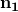

# 61.20 OdbPart object


The OdbPart               object is similar to the kernel Part object and contains nodes and elements, but not geometry.

**Access**

```
odb.parts()[*name*]
```

### 61.20.1 Part(...)

This method creates an OdbPart                     object. Nodes and elements are added to this object at a later stage.

**Path**

```
odb.Part
```

**Prototype**

```
odb_Part&
Part(const odb_String& name,
     odb_Enum::odb_DimensionEnum embeddedSpace,
     odb_Enum::odb_PartTypeEnum type);
```

**Required arguments**

*name*

An odb_String specifying the part name.

*embeddedSpace*

An odb_Enum::odb_DimensionEnum specifying the dimensionality of the [OdbPart](pt02ch61pyo20.md)                  object.                 Possible values are odb_Enum::THREE_D, odb_Enum::TWO_D_PLANAR, and odb_Enum::AXISYMMETRIC.

*type*

An odb_Enum::odb_PartTypeEnum specifying the type of the [OdbPart](pt02ch61pyo20.md)                  object.                 Possible values are odb_Enum::DEFORMABLE_BODY and odb_Enum::ANALYTIC_RIGID_SURFACE.

**Optional arguments**

None.

**Return value**

An OdbPart                     object.

**Exceptions**

None.

### 61.20.2 addElements(...)

This method adds elements to an OdbPart                    object using element labels and nodal connectivity.

**Warning:**Adding elements not in ascending order of their labels may cause Abaqus/Viewer to plot contours incorrectly.

**Prototype**

```
void
addElements(const odb_SequenceInt& labels,
            const odb_SequenceSequenceInt& connectivity,
            const odb_String& type,
            const odb_String& elementSetName,
            const odb_SectionCategory& sectionCategory);
```

**Required arguments**

*labels*

An odb_SequenceInt specifying the element labels.

*connectivity*

An odb_SequenceSequenceInt specifying the nodal connectivity.

*type*

A String specifying the element type.

**Optional arguments**

*elementSetName*

A String specifying a name for this element set. The default value is the empty string.

*sectionCategory*

A [SectionCategory](pt02ch61pyo27.md)                              object for this element set.

**Return value**

None

**Exceptions**

None.

### 61.20.3 addNodes(...)

This method adds nodes to an OdbPart                     object using node labels and coordinates.

**Warning:**Adding nodes not in ascending order of their labels may cause Abaqus/Viewer to plot contours incorrectly.

**Prototype**

```
void
addNodes(const odb_SequenceInt& labels,
         const odb_SequenceSequenceFloat& coordinates,
         const odb_String& nodeSetName);
```

**Required arguments**

*labels*

An odb_SequenceInt specifying the node labels.

*coordinates*

An odb_SequenceSequenceFloat specifying the nodal coordinates.

**Optional argument**

*nodeSetName*

A String specifying a name for this node set. The default value is None.

**Return value**

None

**Exceptions**

None.

### 61.20.4 assignBeamOrientation(...)

This method assigns a beam section orientation to a region of a part instance.

**Prototype**

```
void
assignBeamOrientation(const odb_Set& region,
                  odb_Enum::odb_OrientationMethodEnum method,
                  const odb_SequenceFloat& vector);
```

**Required arguments**

*region*

An [OdbSet](pt02ch61pyo24.md)                              specifying a region on an instance.

*method*

An odb_Enum::odb_OrientationMethodEnum specifying the assignment method. Only a value of odb_Enum::N1_COSINES                              is currently supported.

*vector*

An odb_SequenceFloat specifying the approximate local                                -direction of the beam cross-section.

**Optional arguments**

None.

**Return value**

None

**Exceptions**

None.

### 61.20.5 assignMaterialOrientation(...)

This method assigns a material orientation to a region of a part instance.

**Prototype**

```
void
assignMaterialOrientation(const odb_Set& region,
             const odb_DatumCsys& localCSys,
             odb_Enum::odb_AxisEnum axis,
             float angle,
             odb_Enum::odb_StackDirectionEnum stackDirection);
```

**Required arguments**

*region*

An [OdbSet](pt02ch61pyo24.md)                              specifying a region on an instance.

*localCSys*

An [OdbDatumCsys](pt02ch61pyo14.md)                              object specifying the local coordinate system or `None`, indicating the global coordinate system.

**Optional arguments**

*axis*

An odb_Enum::odb_AxisEnum specifying the axis of a cylindrical or spherical datum coordinate system about which an additional rotation is applied. For shells this axis is also the shell normal. Possible values are odb_Enum::AXIS_1, odb_Enum::AXIS_2, and odb_Enum::AXIS_3. The default value is odb_Enum::AXIS_1.

*angle*

A Float specifying the angle of the additional rotation. The default value is 0.0.

*stackDirection*

An odb_Enum::odb_StackDirectionEnum specifying the stack or thickness direction of the material. Possible values are odb_Enum::STACK_1, odb_Enum::STACK_2, odb_Enum::STACK_3, and odb_Enum::STACK_ORIENTATION. The default value is odb_Enum::STACK_3.

**Return value**

None

**Exceptions**

None.

### 61.20.6 assignRebarOrientation(...)

This method assigns a rebar reference orientation to a region of a part instance.

**Prototype**

```
void
assignRebarOrientation(const odb_Set& region,
                       const odb_DatumCsys& localCsys,
                       odb_Enum::odb_AxisEnum axis,
                       float angle);
```

**Required arguments**

*region*

An [OdbSet](pt02ch61pyo24.md)                              specifying a region on an instance.

*localCsys*

An [OdbDatumCsys](pt02ch61pyo14.md)                              object specifying the local coordinate system or `None`, indicating the global coordinate system.

**Optional arguments**

*axis*

An odb_Enum::odb_AxisEnum specifying the axis of a cylindrical or spherical datum coordinate system about which an additional rotation is applied. For shells this axis is also the shell normal. Possible values are odb_Enum::AXIS_1, odb_Enum::AXIS_2, and odb_Enum::AXIS_3. The default value is odb_Enum::AXIS_1.

*angle*

A Float specifying the angle of the additional rotation. The default value is 0.0.

**Return value**

None

**Exceptions**

None.

### 61.20.7 getElementFromLabel(...)

This method is used to retrieved an element with a specific label from a part object.

**Prototype**

```
odb_Element
getElementFromLabel(int label);
```

**Required argument**

*label*

An Int specifying the element label.

**Optional arguments**

None.

**Return value**

An [OdbMeshElement](pt02ch61pyo18.md)                     object.

**Exceptions**

If no element with the specified label exists:

```
OdbError: Invalid element label
```

### 61.20.8 getNodeFromLabel(...)

This method is used to retrieved a node with a specific label from a part object.

**Prototype**

```
odb_Node
getNodeFromLabel(int label);
```

**Required argument**

*label*

An Int specifying the node label.

**Optional arguments**

None.

**Return value**

An [OdbMeshNode](pt02ch61pyo19.md)                     object.

**Exceptions**

If no node with the specified label exists:

```
OdbError: Invalid node label
```

### 61.20.9 AnalyticRigidSurf2DPlanar(...)

This method is used to define a two-dimensional [AnalyticSurface](pt02ch61pyo02.md)                     object on the part object.

**Prototype**

```
void
AnalyticRigidSurf2DPlanar(const odb_String& name,
           const odb_SequenceAnalyticSurfaceSegment& profile,
           double filletRadius);
```

**Required arguments**

*name*

The name of the analytic surface.

*profile*

A sequence of [AnalyticSurfaceSegment](pt02ch61pyo03.md)                              objects or an [OdbSequenceAnalyticSurfaceSegment](pt02ch61pyo23.md)                              object.

**Optional argument**

*filletRadius*

A Double specifying the radius of curvature to smooth discontinuities between adjoining segments. The default value is 0.0.

**Return value**

None

**Exceptions**

If OdbPart                           is of type THREE_D: 

```
OdbError: 2D-Planar Analytic Rigid Surface can be defined only if the part is of type                             TWO_D_PLANAR                            or                             AXISYMMETRIC.                         
```

### 61.20.10 AnalyticRigidSurfExtrude(...)

This method is used to define a three-dimensional cylindrical [AnalyticSurface](pt02ch61pyo02.md)                     on the part object.

**Prototype**

```
void
AnalyticRigidSurfExtrude(const odb_String& name,
           const odb_SequenceAnalyticSurfaceSegment& profile,
           double filletRadius);
```

**Required arguments**

*name*

The name of the analytic surface.

*profile*

A sequence of [AnalyticSurfaceSegment](pt02ch61pyo03.md)                              objects or an [OdbSequenceAnalyticSurfaceSegment](pt02ch61pyo23.md)                              object.

**Optional argument**

*filletRadius*

A Double specifying the radius of curvature to smooth discontinuities between adjoining segments. The default value is 0.0.

**Return value**

None

**Exceptions**

If OdbPart                           is not of type THREE_D:

```
OdbError:  Analytic Rigid Surface of type                            CYLINDER                            can be defined only if the part is of type                             THREE_D.                         
```

### 61.20.11 AnalyticRigidSurfRevolve(...)

This method is used to define a three-dimensional [AnalyticSurface](pt02ch61pyo02.md)                     of revolution on the part object.

**Prototype**

```
void
AnalyticRigidSurfRevolve(const odb_String& name,
           const odb_SequenceAnalyticSurfaceSegment& profile,
           double filletRadius);
```

**Required arguments**

*name*

The name of the analytic surface.

*profile*

A sequence of [AnalyticSurfaceSegment](pt02ch61pyo03.md)                              objects or an [OdbSequenceAnalyticSurfaceSegment](pt02ch61pyo23.md)                              object.

**Optional argument**

*filletRadius*

A Double specifying the radius of curvature to smooth discontinuities between adjoining segments. The default value is 0.0.

**Return value**

None

**Exceptions**

If OdbPart                           is not of type THREE_D:

```
OdbError:  Analytic Rigid Surface of type                             REVOLUTION                            can be defined only if the part is of type                             THREE_D.                         
```

### 61.20.12 RigidBody(...)

This method defines an [OdbRigidBody](pt02ch61pyo22.md)                     on the part object.

**Prototype**

```
void
RigidBody(const odb_Set& referenceNode,
          odb_Enum::odb_PositionEnum position,
          bool isothermal,
          const odb_Set& elset,
          const odb_Set& pinNodes,
          const odb_Set& tieNodes);
```

**Required argument**

*referenceNode*

An [OdbSet](pt02ch61pyo24.md)                              specifying the reference node assigned to the rigid body.

**Optional arguments**

*position*

A symbolic constant specify if the location of the reference node is to be defined by the user. Possible values are odb_Enum::INPUT and odb_Enum::CENTER_OF_MASS. The default value is odb_Enum::INPUT.

*isothermal*

A Boolean specifying an isothermal rigid body.  The default value is false. This parameter is used only for a fully-coupled thermal stress analysis.

*elset*

An [OdbSet](pt02ch61pyo24.md)                              specifying an element set assigned to the rigid body.

*pinNodes*

An [OdbSet](pt02ch61pyo24.md)                              specifying pin-type nodes assigned to the rigid body.

*tieNodes*

An [OdbSet](pt02ch61pyo24.md)                              specifying tie-type nodes assigned to the rigid body.

**Return value**

None

**Exceptions**

If *referenceNode*                           is not a node set:

```
OdbError: Rigid body definition requires a node set.
```

### 61.20.13 Members

The OdbPart object has members with the same names and descriptions as the arguments to the [Part](pt02ch61pyo20.md#ker-odbpart-part-cpp) method.

In addition, the OdbPart object can have the following members:

**Prototype**

```
odb_String name() const;
               odb_Enum::odb_DimensionEnum embeddedSpace() const;
               odb_Enum::odb_PartTypeEnum type() const;
               odb_Node& nodes(int index) const;
               odb_SequenceNode& nodes() const;
               odb_Element& elements(int index) const;
               odb_SequenceElement& elements() const;
               odb_SetRepository& nodeSets() const;
               odb_SetRepository& elementSets() const;
               odb_SetRepository& surfaces() const;
               odb_SequenceSectionAssignment sectionAssignments() const;
               odb_SequenceBeamOrientation beamOrientations() const;
               odb_SequenceMaterialOrientation materialOrientations() const;
               odb_SequenceRebarOrientation rebarOrientations() const;
               odb_SequenceRigidBody rigidBodies() const;
               bool hasAnalyticSurface() const;
               odb_AnalyticSurface analyticSurface() const;
```

*nodes*

A sequence of [OdbMeshNode](pt02ch61pyo19.md) objects.

*elements*

A sequence of [OdbMeshElement](pt02ch61pyo18.md) objects.

*nodeSets*

A repository of [OdbSet](pt02ch61pyo24.md) objects specifying node sets.

*elementSets*

A repository of [OdbSet](pt02ch61pyo24.md) objects specifying element sets.

*surfaces*

A repository of [OdbSet](pt02ch61pyo24.md) objects specifying surfaces.

*sectionAssignments*

A sequence of [SectionAssignment](pt02ch62pyo01.md) objects.

*beamOrientations*

A sequence of [BeamOrientation](pt02ch61pyo04.md) objects.

*materialOrientations*

A sequence of [MaterialOrientation](#ker-materialorientation-cpp) objects.

*rebarOrientations*

A sequence of [RebarOrientation](pt02ch61pyo26.md) objects.

*rigidBodies*

A sequence of [OdbRigidBody](pt02ch61pyo22.md) objects.

*analyticSurface*

An [AnalyticSurface](pt02ch61pyo02.md) object specifying analytic Surface defined on the instance.


