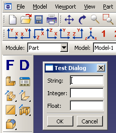

# 2.4 运行原型应用程序


SIMULIA学习社区提供了一个名为原型应用程序的自定义应用程序。原型应用程序允许您尝试对话框的内容，直到产生满意的设计。您可以启动原型应用程序，更改控制对话框内容的代码，并立即在应用程序中看到这些更改。

[SIMULIA学习社区](http://swym.3ds.com/#community:73)提供了plugin和定制应用程序的示例，以及访问促进Abaqus Scripting Interface和Abaqus GUI Toolkit发展的用户社区。在该社区中搜索"Prototype Example"以下载原型应用程序的zip文件，然后解压缩文件并转到包含您下载的文件的目录。要使用原型应用程序，请在文本编辑器中打开文件`testDB.py`。从系统提示符输入以下内容：

```
abaqus cae -custom prototypeApp -noStartup
```
`-custom`参数表示您正在执行Abaqus/CAE的定制版本。`-noStartup`参数表示您要启动Abaqus/CAE而不显示启动屏幕。更多信息，请参见["Abaqus/CAE执行"，Abaqus分析用户指南第3.2.6节](../usb/usb-link.md#usb-int-dcaeproc)。

应用程序在工具箱中创建两个图标，如图[图2-2](pt02ch02s04.md#cus-gst-prototypeapp)所示。

**图2-2** 原型应用程序。



图标重新加载表单代码（`testForm.py`）；图标重新加载对话框代码（`testDB.py`）。如果更改了表单代码，请点击图标重新加载该文件。如果更改了对话框代码，请点击图标重新加载该文件。您不需要退出并重新启动Abaqus/CAE即可在表单或对话框中看到更改。

例如，请尝试以下操作：
- 点击图标显示对话框，并注意对话框中显示的文本标签。
- 点击对话框中的**Cancel**取消显示。
- 更改`testDB.py`中的某个标签并保存文件。
- 再次点击图标显示对话框。您将在对话框中看到修改后的标签。

当您在对话框中点击**OK**时，对话框发出的kernel命令会被写入消息区域，而不是由Abaqus/CAE执行。这允许您在尝试在kernel中执行命令之前调试命令。

在调试完表单和对话框代码后，您可以按照["表单示例"，第7.3.1节](pt04ch07s03.md#cus-mod-modes-form-example)中的示例修改表单以向kernel发出命令。您可以按照["GUI模块示例"，第8.2节](pt05ch08s02.md)中显示的示例将表单连接到您的GUI，而不是连接到图标。


