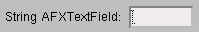
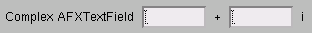
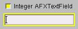
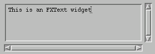

# 3.2 文本widget


本节描述Abaqus GUI Toolkit中允许用户输入文本的widget。涵盖以下主题：
- ["单行文本字段widget"，第3.2.1节](pt03ch03s02.md#cus-wgt-widget-text-single)
- ["多行文本widget"，第3.2.2节](pt03ch03s02.md#cus-wgt-widget-textwidget)

### 3.2.1 单行文本字段widget

`AFXTextField`widget提供单行文本输入字段。`AFXTextField`通过以下功能扩展了标准`FXTextField`widget的功能：
- 可选标签。
- 支持切换版本和只读状态。
- 额外的数值类型（复数）。
- 水平和垂直布局。

例如：
```
AFXTextField(parent, 8, 'String AFXTextField')
```

**图3-10** 来自`AFXTextField`的单行文本字段示例。



文本字段通常连接到关键字，关键字的类型决定了文本字段中允许的输入类型。例如，如果文本字段连接到整数关键字，关键字将验证文本字段中的输入是否为有效整数。您不需要为此行为指定任何选项标志。复数文本字段是个例外——要显示收集复数输入所需的额外字段，必须指定如下例所示的位标志：

```
AFXTextField(parent, 8, 'Complex AFXTextField',
    None, 0, AFXTEXTFIELD_COMPLEX)
```

**图3-11** 来自`AFXTextField`的单行复数数值字段示例。



**切换版本**

在许多情况下，复选按钮位于带标签的文本字段之前。复选按钮允许用户打开或关闭组件；当组件关闭时，文本字段被禁用。当您提供AFXTEXTFIELD_CHECKBUTTON标志时，`AFXTextField`widget会创建具有此行为的复选按钮。下面的示例创建一个带有文本字段的复选按钮。它还以垂直方向配置widget，使标签位于文本字段上方。

```
AFXTextField(parent, 8, 'AFXTextField', None, 0,
    AFXTEXTFIELD_CHECKBUTTON|AFXTEXTFIELD_VERTICAL)
```

**图3-12** 来自`AFXTextField`的带标签文本字段的复选按钮示例。



**不可编辑版本**

在某些情况下，您可能希望更改文本字段的行为，使其不能由用户编辑；例如，当对话框中的某个特定复选按钮未设置时。在这种情况下，您可以通过调用`AFXTextField`widget的`setEditable(False)`方法在复选按钮未设置时使文本字段不可编辑。

**只读版本**

在某些情况下，您可能希望更改文本字段的行为，使其不能由用户编辑并显示为标签，清楚地表明用户不能更改其内容。例如，当您在Abaqus/CAE中使用"Load"模块时，有些值可以在创建负载的分析步骤中指定，但在后续步骤中不能更改。`AFXTextField`widget通过`setReadOnlyState`方法支持只读状态。例如：

```
tf = AFXTextField(parent, 8,
    'String AFXTextField in read-only mode:', keyword)
tf.setReadOnlyState(True)
```

### 3.2.2 多行文本widget

`FXText`提供多行文本输入区域。例如：

```
text = FXText(parent, None, 0,
    LAYOUT_FIX_WIDTH|LAYOUT_FIX_HEIGHT, 0, 0, 300, 100)
text.setText('This is an FXText widget')
```

**图3-13** 来自`FXText`的多行文本输入区域示例。




