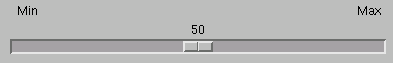

# 3.4 范围widget


本节描述Abaqus GUI Toolkit中允许用户在一定范围内指定值的widget。涵盖以下主题：
- ["滑块"，第3.4.1节](pt03ch03s04.md#cus-wgt-widget-range-sliders)
- ["微调器"，第3.4.2节](pt03ch03s04.md#cus-wgt-widget-range-spinners)

### 3.4.1 滑块

`AFXSlider`widget提供了一个用户只能用鼠标拖动来设置值的手柄。`AFXSlider`通过以下功能扩展了`FXSlider`widget的功能：
- 可选标题。
- 最小和最大范围标签。
- 在拖动手柄上方显示当前值的能力。

例如：
```
slider = AFXSlider(p, None, 0,
    AFXSLIDER_INSIDE_BAR|AFXSLIDER_SHOW_VALUE|LAYOUT_FILL_X)
slider.setMinLabelText('Min')
slider.setMaxLabelText('Max')
slider.setDecimalPlaces(1)
slider.setRange(20, 80)
slider.setValue(50)
```

**图3-17** 来自`AFXSlider`的滑块示例。



### 3.4.2 微调器

`AFXSpinner`widget结合了一个文本字段和两个箭头按钮。箭头递增文本字段中显示的整数值。`AFXSpinner`通过提供可选标签来扩展`FXSpinner`widget的功能。例如：

```
spinner = AFXSpinner(p, 4, 'AFXSpinner:')
spinner.setRange(20, 80)
spinner.setValue(50)
```

**图3-18** 来自`AFXSpinner`的微调器示例。


`AFXFloatSpinner`widget类似于`AFXSpinner`widget，但允许浮点值。


