# 3.6 表格widget


`AFXTable`widget以类似于电子表格的方式将项目排列成行和列。表格可以有前导行和列，用作标题。[图3-21](pt03ch03s06.md#cus-wgt-table-layout)显示了Abaqus GUI Toolkit如何布局表格的示例。

**图3-21** 表格的布局。

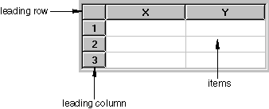

`AFXTable`widget有许多选项和方法，允许您在尝试为特定目的配置表格时获得很大的灵活性。这些选项和方法将在以下部分中讨论。涵盖以下主题：
- ["表格构造函数"，第3.6.1节](pt03ch03s06.md#cus-wgt-tables-constructor)
- ["行和列"，第3.6.2节](pt03ch03s06.md#cus-wgt-tables-rowsandcolumns)
- ["跨距"，第3.6.3节](pt03ch03s06.md#cus-wgt-tables-spanning)
- ["对齐"，第3.6.4节](pt03ch03s06.md#cus-wgt-tables-justification)
- ["编辑"，第3.6.5节](pt03ch03s06.md#cus-wgt-tables-editing)
- ["类型"，第3.6.6节](pt03ch03s06.md#cus-wgt-tables-types)
- ["列表类型"，第3.6.7节](pt03ch03s06.md#cus-wgt-tables-listtype)
- ["布尔类型"，第3.6.8节](pt03ch03s06.md#cus-wgt-tables-booleantype)
- ["图标类型"，第3.6.9节](pt03ch03s06.md#cus-wgt-tables-icontype)
- ["颜色类型"，第3.6.10节](pt03ch03s06.md#cus-wgt-tables-colortype)
- ["弹出菜单"，第3.6.11节](pt03ch03s06.md#cus-wgt-tables-popupmenu)
- ["颜色"，第3.6.12节](pt03ch03s06.md#cus-wgt-tables-colors)
- ["排序"，第3.6.13节](pt03ch03s06.md#cus-wgt-table-sorting)

### 3.6.1 表格构造函数

`AFXTable`构造函数由以下原型定义：

```
AFXTable(p, numVisRows, numVisColumns, numRows, numColumns,
    tgt=None, sel=0, opts=AFXTABLE_NORMAL,
    x=0, y=0, w=0, h=0,
    pl=DEFAULT_MARGIN, pr=DEFAULT_MARGIN,
    pt=DEFAULT_MARGIN, pb=DEFAULT_MARGIN)
```

`AFXTable`构造函数具有以下参数：

**parent**

构造函数中的第一个参数是父参数。`AFXTable`不在其周围绘制框架；因此，您可能希望创建一个`FXVerticalFrame`作为表格的父项。您应该将框架中的填充设为零，以便框架紧密包裹表格。

**可见行数和列数**

表格首次显示时将可见的行数和列数。如果可见行数或列数少于表格中的总行数或列数，则会显示相应的滚动条。

**行数和列数**

创建表格时要创建的行数和列数。这些数字包括前导行和列。如果表格大小固定，您指定总行数和总列数。如果表格大小是动态的，您指定`1`行和`1`列（加上任何前导行或列），并允许用户根据需要添加行或列。

**目标和选择器**

您可以在表格构造函数参数中指定目标和选择器。表格通常连接到具有0选择器的`AFXTableKeyword`，除非表格具有与发送到kernel的命令所需数据不直接相关的列。如果表格具有不依赖于kernel的列，您可以将对话框指定为目标，以便可以由您的代码适当地处理表格中的数据。您还可以使用`AFXColumnItems`对象来自动管理特定表格列中的选择（更多信息，请参见["表格关键字示例"，第6.5.14节"](pt04ch06s05.md#cus-app-commands-gui-connect-table)）。

**opts**

您可以在表格构造函数中指定的选项标志如下表所示：

| 选项标志 | 效果 |
| --- | --- |
| AFXTABLE_NORMAL（默认） | AFXTABLE_COLUMN_RESIZABLE | LAYOUT_FILL_X | LAYOUT_FILL_Y |
| AFXTABLE_COLUMN_RESIZABLE | 允许用户调整列的大小。 |
| AFXTABLE_ROW_RESIZABLE | 允许用户调整行的大小。 |
| AFXTABLE_RESIZE | AFXTABLE_COLUMN_RESIZABLE | AFXTABLE_ROW_RESIZABLE |
| AFXTABLE_NO_COLUMN_SELECT | 当点击其标题时不允许选择整列。 |
| AFXTABLE_NO_ROW_SELECT | 当点击其标题时不允许选择整行。 |
| AFXTABLE_SINGLE_SELECT | 最多允许选择一个项目。 |
| AFXTABLE_BROWSE_SELECT | 强制始终只选择一个项目。 |
| AFXTABLE_ROW_MODE | 选择行中的项目会选择整行。 |
| AFXTABLE_EDITABLE | 允许编辑表格中的所有项目。 |

默认情况下，用户可以在表格中选择多个项目。要更改此行为，您应该使用适当的标志指定单选模式或浏览选择模式。此外，您可以指定当用户选择行中的任何项目时是否应选择整行。Abaqus/CAE在包含多个列的管理器对话框中表现出这种行为。

以下语句使用默认设置创建表格：

```
# Tables do not draw a frame around their border.
# Therefore, add a frame widget with zero padding.

vf = FXVerticalFrame(gb, FRAME_SUNKEN|FRAME_THICK,
    0,0,0,0, 0,0,0,0)
table = AFXTable(vf, 4, 2, 4, 2)
```

**图3-22** 使用默认设置创建的表格。

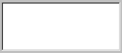

### 3.6.2 行和列

表格支持前导行和列。前导行和列使用粗体文本显示为按钮。前导行显示在表格顶部，前导列显示在表格左侧。

您在表格构造函数中指定的行数和列数是总行数和列数，包括前导行和列。默认情况下，表格没有前导行或列——您必须在构造表格后使用适当的表格方法设置前导行和列。您还可以指定显示在这些行和列中的标签。如果您没有为前导行或列指定任何标签，它将自动编号。您可以使用"\t"在单个字符串中分隔标签来一次设置多个标签。

默认情况下，不绘制项目周围的网格线。您可以使用以下表格方法单独控制水平和垂直网格线的可见性：
- `showHorizontalGrid(True|False)`
- `showVerticalGrid(True|False)`

默认情况下，行的高度由表格使用的字体决定。列的默认宽度是100像素。您可以使用以下表格方法覆盖这些值：
- `setRowHeight(row, height) # 高度以像素为单位`
- `setColumnWidth(column, width) # 宽度以像素为单位`

以下示例说明了一些这些方法的使用：

```
vf = FXVerticalFrame(parent, FRAME_SUNKEN|FRAME_THICK,
    0,0,0,0,0,0,0,0)
table = AFXTable(vf, 4, 3, 4, 3)
table.setLeadingColumns(1)
table.setLeadingRows(1)
table.setLeadingRowLabels('X\tY')
table.showHorizontalGrid(True)
table.showVerticalGrid(True)
table.setColumnWidth(0, 30)
```

**图3-23** 前导行和列。

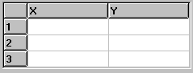

### 3.6.3 跨距

您可以使标题行或列中的项目跨越多行或多列，如下例所示：

```
vf = FXVerticalFrame(parent, FRAME_SUNKEN|FRAME_THICK,
     0,0,0,0, 0,0,0,0)
table = AFXTable(vf, 4, 3, 4, 3)
table.setLeadingColumns(1)
table.setLeadingRows(2)

# Corner item
table.setItemSpan(0, 0, 2, 1)

# Span top row item over 2 columns
table.setItemSpan(0, 1, 1, 2)
table.setLeadingRowLabels('Coordinates')
table.setLeadingRowLabels('X\tY', 1)

table.showHorizontalGrid(True)
table.showVerticalGrid(True)

table.setColumnWidth(0, 30)
```

**图3-24** 跨两个标题列的示例。

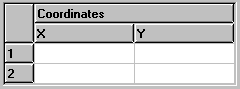

### 3.6.4 对齐

默认情况下，表格显示左对齐的条目。您可以使用以下表格方法更改项目的对齐方式：
- `setColumnJustify(column, justify)`
- `setItemJustify(row, column, justify)`

如果您为列号提供值`-1`，则`setColumn*`方法将设置应用于表格中的所有列。

下表显示了justify参数的可能值：

| 选项标志 | 效果 |
| --- | --- |
| AFXTable.LEFT | 将项目对齐到单元格左侧。 |
| AFXTable.CENTER | 水平居中对齐项目。 |
| AFXTable.RIGHT | 将项目对齐到单元格右侧。 |
| AFXTable.TOP | 将项目对齐到单元格顶部。 |
| AFXTable.MIDDLE | 垂直居中对齐项目。 |
| AFXTable.BOTTOM | 将项目对齐到单元格底部。 |

以下示例显示如何更改对齐方式：
```
vf = FXVerticalFrame(gb, FRAME_SUNKEN|FRAME_THICK,
    0,0,0,0, 0,0,0,0)
table = AFXTable(vf, 4, 3, 4, 3)
table.setLeadingColumns(1)
table.setLeadingRows(1)
table.setLeadingRowLabels('X\tY')
table.showHorizontalGrid(True)
table.showVerticalGrid(True)
table.setColumnWidth(0, 30)

# Center all columns
table.setColumnJustify(-1, AFXTable.CENTER)
```

**图3-25** 对齐的列标题。

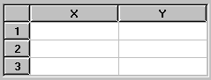

### 3.6.5 编辑

默认情况下，表格中的所有项目都不可编辑。要使表格中的所有项目可编辑，您必须在表格构造函数中指定AFXTABLE_EDITABLE。要更改表格中某些项目的可编辑性，您可以使用以下表格方法：
- `setColumnEditable(column, True|False)`
- `setItemEditable(row, column, True|False)`

### 3.6.6 类型

默认情况下，表格中的所有项目都是文本项目。但是，表格widget还支持下表中所示的其他类型的项目：

| 类型 | 效果 |
| --- | --- |
| BOOL | 项目显示图标，点击可在真和假图标之间切换。 |
| COLOR | 项目显示颜色按钮 |
| FLOAT | 项目显示文本，使用文本字段编辑值 |
| ICON | 项目显示图标，不可编辑。 |
| INT | 项目显示文本，使用文本字段编辑值 |
| LIST | 项目显示文本，使用组合框编辑值。 |
| TEXT | 项目显示文本，使用文本字段编辑值。 |

您可以使用以下表格方法更改列的类型或单个项目的类型：
- `setColumnType(column, type)`
- `setItemType(row, column, type)`

将类型设置为FLOAT或INT不会影响向表格的数据输入；用户可以向这些类型的项目输入任何内容（这允许表达式求值）。但是，当使用表格的`getItemIntValue`或`getItemFloatValue`方法时，您应确保要读取的项目的类型分别为INT或FLOAT，否则可能会返回错误的值。一般来说，您应该利用AFXTableKeyword并设置列类型，以便表格的值自动正确求值。

### 3.6.7 列表类型

如果您希望允许用户通过从项目列表中选择来指定列中的值，首先必须将该列设置为LIST类型。然后创建一个列表并将其分配给该列。当用户点击该列中的项目时，表格将显示一个包含列表条目的不可编辑组合框。以下示例说明如何在表格单元格中创建组合框：

```
vf = FXVerticalFrame(gb, FRAME_SUNKEN|FRAME_THICK,
    0,0,0,0, 0,0,0,0)
table = AFXTable(vf, 4, 2, 4, 2, None, 0,
    AFXTABLE_NORMAL|AFXTABLE_EDITABLE)
table.setLeadingRows(1)
table.setLeadingRowLabels('Size\tQuantity')
table.showHorizontalGrid(True)
table.showVerticalGrid(True)

listId = table.addList('Small\tMedium\tLarge')
table.setColumnType(0, AFXTable.LIST)
table.setColumnListId(0, listId)
```

**图3-26** 表格单元格中的组合框。


您还可以使用表格的`appendListItem`方法添加包含图标的列表项目。

```
icon = createGIFIcon('myIcon.gif')
table.appendListItem(listId, 'Extra large', icon)
```

当您将表格关键字连接到包含列表的表格时，必须适当地设置表格关键字的列类型。如果列表只包含文本，您可以将列类型设置为AFXTABLE_TYPE_STRING，这将关键字的值设置为列表中选中项目的文本。类似地，如果列表只包含图标，您可以将列类型设置为AFXTABLE_TYPE_INT，这将关键字的值设置为列表中选中项目的索引。如果列表同时包含文本和图标，您可以使用任一设置作为列类型。

### 3.6.8 布尔类型

如果您希望允许用户在表格中指定值为True或False，必须将列的类型设置为BOOL。每次用户点击项目时，布尔项目的值都会切换。默认情况下，空白图标表示False，勾选图标表示True。以下示例说明如何将布尔项目包含在表格中：

```
vf = FXVerticalFrame(gb, FRAME_SUNKEN|FRAME_THICK,
    0,0,0,0, 0,0,0,0)
table = AFXTable(vf, 4, 2, 4, 2, None, 0,
    AFXTABLE_NORMAL|AFXTABLE_EDITABLE)
table.setLeadingRows(1)
table.setLeadingRowLabels('Nlgeom\tStep')
table.showHorizontalGrid(True)
table.showVerticalGrid(True)
table.setColumnType(0, table.BOOL)
table.setColumnWidth(0, 50)
table.setColumnJustify(0, AFXTable.CENTER)
```

**图3-27** 表格中的布尔项目。

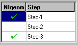

如果您不想使用默认图标，您可以设置自己的真和假图标，如下例所示：

```
vf = FXVerticalFrame(gb, FRAME_SUNKEN|FRAME_THICK,
    0,0,0,0, 0,0,0,0)
table = AFXTable(vf, 4, 2, 4, 2, None, 0,
    AFXTABLE_NORMAL|AFXTABLE_EDITABLE)
table.setLeadingRows(1)
table.setLeadingRowLabels('State\tLayer')
table.showHorizontalGrid(True)
table.showVerticalGrid(True)
table.setColumnType(0, table.BOOL)
table.setColumnWidth(0, 50)
table.setColumnJustify(0, AFXTable.CENTER)

from appIcons import lockedData, unlockedData
trueIcon = FXXPMIcon(getAFXApp(), lockedData)
falseIcon = FXXPMIcon(getAFXApp(), unlockedData)
table.setDefaultBoolIcons(trueIcon, falseIcon)
```

**图3-28** 定义您自己的真和假图标。

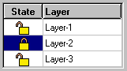

### 3.6.9 图标类型

如果您想在项目中显示图标，必须将列的类型设置为ICON，并将要显示的图标分配给它。此类型的列不能由用户编辑。以下示例显示如何在表格单元格中包含图标：

```
vf = FXVerticalFrame(parent, FRAME_SUNKEN|FRAME_THICK,
    0,0,0,0, 0,0,0,0)
table = AFXTable(vf, 4, 2, 4, 2, None, 0,
    AFXTABLE_NORMAL|AFXTABLE_EDITABLE)
table.setLeadingRows(1)
table.setLeadingRowLabels(' \tStatus')
table.showHorizontalGrid(True)
table.showVerticalGrid(True)
table.setColumnType(0, table.ICON)
table.setColumnWidth(0, 30)
table.setColumnJustify(0, AFXTable.CENTER)

from appIcons import circleData, squareData
circleIcon = FXXPMIcon(getAFXApp(), circleData)
squareIcon = FXXPMIcon(getAFXApp(), squareData)
table.setItemIcon(1, 0, circleIcon)
table.setItemIcon(2, 0, squareIcon)
table.setItemIcon(3, 0, circleIcon)
```

**图3-29** 在表格单元格中包含图标。

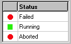

### 3.6.10 颜色类型

如果您想在表格中显示颜色按钮，必须将类型设置为COLOR。如果表格是可编辑的，用户可以使用颜色按钮通过颜色选择对话框更改颜色。颜色按钮是一个飞出按钮，最多可以有三个飞出项目，一个用于特定颜色，一个用于默认颜色，一个用于"原样"颜色。请参阅Abaqus/CAE中的颜色代码对话框以查看这些选项可能如何使用的示例。选项使用下表中的标志指定：

| 选项标志 | 效果 |
| --- | --- |
| COLOR_INCLUDE_COLOR_ONLY | 仅包含颜色飞出项目。 |
| COLOR_INCLUDE_AS_IS | 包含"原样"（=）飞出项目。 |
| COLOR_INCLUDE_DEFAULT | 包含默认（*）飞出项目。 |
| COLOR_INCLUDE_ALL | 包含所有飞出项目。 |

以下示例显示如何在表格中显示颜色按钮：
```
vf = FXVerticalFrame(
    gb, FRAME_SUNKEN|FRAME_THICK, 0,0,0,0, 0,0,0,0)
table = AFXTable(
    vf, 4, 2, 4, 2, None, 0, AFXTABLE_NORMAL|AFXTABLE_EDITABLE)
table.setLeadingRows(1)
table.setLeadingRowLabels('Name\tColor')
table.setColumnType(1,AFXTable.COLOR)
table.setColumnColorOptions(
    1, AFXTable.COLOR_INCLUDE_COLOR_ONLY)
table.setItemText(1, 0, 'Part-1')
table.setItemText(2, 0, 'Part-2')
table.setItemText(3, 0, 'Part-3')
table.setItemColor(1,1, '#FF0000')
table.setItemColor(2,1, '#00FF00')
table.setItemColor(3,1, '#0000FF')
```

**图3-30** 在表格单元格中包含图标。

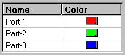

### 3.6.11 弹出菜单

您可以通过使用`setPopupOptions`方法指定适当的标志来向表格添加弹出菜单。当用户在表格任意位置点击鼠标按钮3时，将显示菜单。弹出菜单支持以下选项：

| 选项标志 | 效果 |
| --- | --- |
| POPUP_NONE（默认） | 不显示弹出菜单。 |
| POPUP_CUT | 向弹出菜单添加"剪切"按钮。 |
| POPUP_COPY | 向弹出菜单添加"复制"按钮。 |
| POPUP_PASTE | 向弹出菜单添加"粘贴"按钮。 |
| POPUP_EDIT | POPUP_CUT | POPUP_COPY | POPUP_PASTE |
| POPUP_INSERT_ROW | 向弹出菜单添加"插入行之前/之后"按钮。 |
| POPUP_INSERT_COLUMN | 向弹出菜单添加"插入列之前/之后"按钮。 |
| POPUP_DELETE_ROW | 向弹出菜单添加"删除行"按钮。 |
| POPUP_DELETE_COLUMN | 向弹出菜单添加"删除列"按钮。 |
| POPUP_CLEAR_CONTENTS | 向弹出菜单添加"清除内容/表格"按钮。 |
| POPUP_MODIFY | POPUP_INSERT_ROW | POPUP_INSERT_COLUMN | POPUP_DELETE_ROW | POPUP_DELETE_COLUMN | POPUP_CLEAR_CONTENTS |
| POPUP_READ_FROM_FILE | 向弹出菜单添加"从文件读取"按钮。**注意：**将POPUP_INSERT_ROW与POPUP_READ_FROM_FILE一起包含，以允许表格自动扩展以容纳数据文件中的行数大于当前表格定义。 |
| POPUP_WRITE_TO_FILE | 向弹出菜单添加"写入文件"按钮。 |
| POPUP_ALL | POPUP_EDIT | POPUP_MODIFY | POPUP_READ |

您还可以使用表格的`appendClientPopupItem`方法向弹出菜单添加自定义按钮，如[图3-31](pt03ch03s06.md#cus-wgt-table-popupoptions)所示。

**图3-31** 弹出菜单选项。

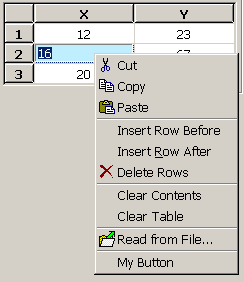

以下示例显示如何启用各种弹出菜单选项：
```
vf = FXVerticalFrame(parent, FRAME_SUNKEN|FRAME_THICK,
     0,0,0,0, 0,0,0,0)
table = AFXTable(vf, 4, 3, 4, 3, None, 0,
    AFXTABLE_NORMAL|AFXTABLE_EDITABLE)

table.setLeadingColumns(1)
table.setLeadingRows(1)
table.setLeadingRowLabels('X\tY')

table.showHorizontalGrid(True)
table.showVerticalGrid(True)

table.setColumnWidth(0, 30)

# Center all columns
table.setColumnJustify(-1, table.CENTER)

table.setPopupOptions(
    AFXTable.POPUP_CUT|AFXTable.POPUP_COPY
   |AFXTable.POPUP_PASTE
   |AFXTable.POPUP_INSERT_ROW
   |AFXTable.POPUP_DELETE_ROW
   |AFXTable.POPUP_CLEAR_CONTENTS
   |AFXTable.POPUP_READ_FROM_FILE
)
table.appendClientPopupItem('My Button', None, self,
    self.ID_MY_BUTTON)
FXMAPFUNC(self, SEL_COMMAND, self.ID_MY_BUTTON, MyDB.onCmdMyBtn)
```

### 3.6.12 颜色

显示字符的表格项目有两组颜色——正常颜色和选中颜色。此外，每个项目都有背景颜色和文本颜色。要更改这些颜色，表格widget提供以下控制：
- 项目文本颜色
- 项目背景颜色
- 选中项目的文本颜色
- 选中项目的背景颜色
- 项目颜色（颜色按钮）（颜色按钮在["颜色按钮"，第3.1.10节](pt03ch03s01.md#cus-wgt-widget-labels-color)中描述。）

您可以使用`setItemTextColor`方法控制显示字符的项目的文本颜色。显示字符的项目包括字符串、数字和列表。您可以使用`setSelTextColor`方法控制这些项目被选中时的文本颜色。您可以使用`setItemBackColor`方法控制任何项目的背景颜色。您可以使用`setSelBackColor`方法控制任何项目被选中时的背景颜色。

如果您不希望在用户选择项目时颜色发生变化，可以将选中项目使用的颜色设置为与未选中项目使用的颜色相同。如以下示例所示：

```
itemColor = table.getItemBackColor(1,1)
table.setSelBackColor(itemColor)
itemTextColor = table.getItemTextColor(1,1)
table.setSelTextColor(itemTextColor)
```

您可以使用颜色名称或使用`FXRGB`函数指定RGB值来设置颜色。（有关有效颜色名称及其对应RGB值的列表，请参见[附录B，"颜色与RGB值"](ap02.md)。）以下示例说明了这两种方法：

```
vf = FXVerticalFrame(parent, FRAME_SUNKEN|FRAME_THICK,
    0,0,0,0, 0,0,0,0)
table = AFXTable(vf, 4, 2, 4, 2, None, 0,
    AFXTABLE_NORMAL|AFXTABLE_EDITABLE)
table.setLeadingRows(1)
table.setLeadingRowLabels('Name\tDescription')

table.showHorizontalGrid(True)
table.showVerticalGrid(True)

table.setItemTextColor(1,0, 'Blue')
table.setItemTextColor(1,1, FXRGB(0, 0, 255))

table.setItemBackColor(3,0, 'Pink')
table.setItemBackColor(3,1, FXRGB(255, 192, 203))
```

**图3-32** 为表格项目设置颜色。

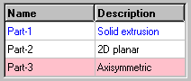

### 3.6.13 排序

您可以将表格中的列设置为可排序。如果某列设置为可排序且用户点击其标题，将在标题中显示一个图形，显示排序的顺序。您必须编写执行实际排序的代码——表格本身只在标题单元格中提供图形反馈。例如：

```
class MyDB(AFXDataDialog):

    def __init(self):

        ...

        # Handle clicks in the table.
        FXMAPFUNC(self, SEL_CLICKED, self.ID_TABLE,
                       MyDB.onClickTable)
        ...

        # Create a table.
        vf = FXVerticalFrame(
            parent, FRAME_SUNKEN|FRAME_THICK, 0,0,0,0, 0,0,0,0)
        self.sortTable = AFXTable(vf, 4, 3, 4, 3, self,
            self.ID_TABLE, AFXTABLE_NORMAL|AFXTABLE_EDITABLE)
        self.sortTable.setLeadingRows(1)
        self.sortTable.setLeadingRowLabels('Name\tX\tY')
        self.sortTable.setColumnSortable(1, True)
        self.sortTable.setColumnSortable(2, True)
        ...

    def onClickTable(self, sender, sel, ptr):

        status, x, y, buttons = self.sortTable.getCursorPosition()
        column = self.sortTable.getColumnAtX(x)
        row = self.sortTable.getRowAtY(y)

        # Ignore clicks on table headers.
        if row != 0 or column == 0:
            return

        values = []
        index = 1
        for row in range(1, self.sortTable.getNumRows()):
            values.append( (self.sortTable.getItemFloatValue(
                row, column), index) )
            index += 1

        values.sort()
        if self.sortTable.getColumnSortOrder(column) == \
            AFXTable.SORT_ASCENDING:
                values.reverse()

        items = []
        for value, index in values:
            name = self.sortTable.getItemValue(index, 0)
            xValue = self.sortTable.getItemValue(index, 1)
            yValue = self.sortTable.getItemValue(index, 2)
            items.append( (name, xValue, yValue) )

        row = 1
        for name, xValue, yValue in items:
            self.sortTable.setItemValue(row, 0, name)
            self.sortTable.setItemValue(row, 1, xValue)
            self.sortTable.setItemValue(row, 2, yValue)
            row += 1
```

**图3-33** 对表格项目进行排序。

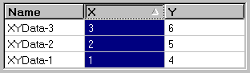


