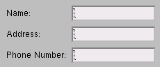

# 4.4 复合子组件的垂直对齐


`AFXVerticalAligner` 组件设计用于对齐包含多个子组件的子组件。`AFXVerticalAligner` 执行以下操作：

1. 找到其每个子组件中第一个子组件的最大宽度。
2. 将所有第一个子组件的宽度设置为最大宽度。

例如：
```
va = AFXVerticalAligner(parent)
AFXTextField(va, 16, 'Name:')
AFXTextField(va, 16, 'Address:')
AFXTextField(va, 16, 'Phone Number:') 
```

**图 4–2** 来自 `AFXVerticalAligner` 的垂直对齐示例。




