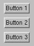

# 4.3 水平和垂直框架


`FXHorizontalFrame` 和 `FXVerticalFrame` 组件分别以行或列的方式排列其子组件。例如：

```
vf = FXVerticalFrame(parent)
FXButton(vf, 'Button 1')
FXButton(vf, 'Button 2')
FXButton(vf, 'Button 3')
```

**图 4–1** 来自 `FXVerticalFrame` 的垂直框架示例。




