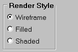

# 4.5 通用布局管理器


Abaqus GUI Toolkit 包含三个具有相似布局功能的通用布局管理器：

**`FXPacker`**

`FXPacker` 是一个通用布局管理器。

**`AFXDialog`**

`AFXDialog` 提供与 `FXPacker` 类似的功能。因此，您不需要在对话框中作为第一个子组件提供顶级布局管理器；您可以使用对话框本身的布局功能。

**`FXGroupBox`**

`FXGroupBox` 提供与 `FXPacker` 相同的功能。此外，`FXGroupBox` 可以显示围绕其子组件的带标签边框。Abaqus/CAE 使用 FRAME_GROOVE 标志在组框子组件周围产生细边框。

例如：
```
gb = FXGroupBox(parent, 'Render Style', FRAME_GROOVE)
FXRadioButton(gb, 'Wireframe')
FXRadioButton(gb, 'Filled')
FXRadioButton(gb, 'Shaded') 
```

**图 4–3** 来自 `FXGroupBox` 的带标签边框组框示例。




