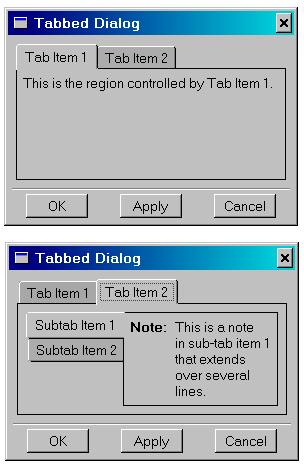

# 4.9 选项卡簿


`FXTabBook` 组件使用"选项卡项"来控制一次显示其"页面"中的一个。`FXTabBook` 期望其奇数子组件是 `FXTabItems`，偶数子组件是某种布局管理器。布局管理器包含要显示在该页面中的任何组件。单击选项卡项将显示与该选项卡关联的布局管理器（及其所有子组件），同时隐藏所有其他布局管理器。通常，水平或垂直框架用作布局管理器，其框架选项设置为 FRAME_RAISED | FRAME_THICK 以提供标准边框。

您可以嵌套选项卡簿以在选项卡内提供选项卡，如下例所示：

```
tabBook1 = FXTabBook(self, None, 0, LAYOUT_FILL_X)
FXTabItem(tabBook1, 'Tab Item 1')
tab1Frame = FXHorizontalFrame(tabBook1, 
    FRAME_RAISED|FRAME_SUNKEN)
FXLabel(tab1Frame, '
    This is the region controlled by Tab Item 1.')
FXTabItem(tabBook1, 'Tab Item 2')
tab2Frame = FXHorizontalFrame(tabBook1, FRAME_RAISED|FRAME_SUNKEN)

tabBook2 = FXTabBook(tab2Frame, None, 0, 
    TABBOOK_LEFTTABS|LAYOUT_FILL_X)
FXTabItem(tabBook2, 'Subtab Item 1', None, TAB_LEFT)
subTab1Frame = FXHorizontalFrame(tabBook2, 
    FRAME_RAISED|FRAME_SUNKEN)
AFXNote(subTab1Frame, 
    'This is a note\nin sub-tab item 1\nthat extends\n' \
    'over several\nlines.')
FXTabItem(tabBook2, 'Subtab Item 2', None, TAB_LEFT)
subTab2Frame = FXHorizontalFrame(tabBook2, 
    FRAME_RAISED|FRAME_SUNKEN) 
```
[图 4-7](pt03ch04s09.md#wgt-layout-tabbed2) 显示了嵌套选项卡簿的示例。

**图 4–7** 两个子选项卡页面的示例。




