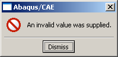
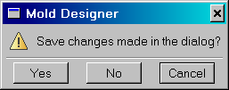
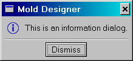

# 5.4 消息对话框


`AFXMessageDialog` 类扩展了 `FXMessageDialog` 类，通过强制执行对话框的某些特性；例如，窗口标题和消息符号。这些特性使 Abaqus/CAE 中的消息对话框一致且易于使用。本节介绍您可以使用 Abaqus GUI Toolkit 创建的消息对话框。以下主题将被涵盖：
- "错误对话框"，第 5.4.1 节
- "警告对话框"，第 5.4.2 节
- "信息对话框"，第 5.4.3 节
- "专用消息对话框"，第 5.4.4 节

### 5.4.1 错误对话框

您在对应用程序无法解决的故障条件做出响应时显示错误对话框。

错误对话框具有以下特性：
- 应用程序名称显示在其标题栏中。
- 对话框左侧显示错误符号。
- 操作区域仅包含**关闭**按钮。
- 它们是模态的。

例如：

```
mainWindow = getAFXApp().getAFXMainWindow()
showAFXErrorDialog(mainWindow, 'An invalid value was supplied.')
```

**图 5–1** 来自 `showAFXErrorDialog` 的错误对话框示例。



### 5.4.2 警告对话框

您在对需要用户协助才能解决的条件做出响应时显示警告对话框。

警告对话框具有以下特性：
- 应用程序名称显示在其标题栏中。
- 对话框左侧显示警告符号。
- 操作区域可能包含**是**、**否**和**取消**按钮。
- 它们是模态的。

要了解用户按下了警告对话框中的哪个按钮，您必须将目标和选择器传递给警告对话框，并且必须在表单中创建消息映射条目来处理该消息。在您的消息处理程序中，您可以调用 `getPressedButtonId` 方法来查询警告对话框。以下示例说明如何创建警告对话框：

您必须在表单类中定义一个 ID：

```
from abaqusGui import *
class MyForm(AFXForm):
    [
        ID_WARNING,
    ] = range(AFXForm.ID_LAST, AFXForm.ID_LAST+1)

    def __init__(self, owner):

        # Construct the base class.
        #
        AFXForm.__init__(self, owner)

        FXMAPFUNC(self, SEL_COMMAND, self.ID_WARNING,
            MyForm.onCmdWarning)

        ...

    def doCustomChecks(self):

        if <someCondition>:
            showAFXWarningDialog( self.getCurrentDialog(),
                'Save changes made in the dialog?',
                AFXDialog.YES | AFXDialog.NO,
                self, self.ID_WARNING)
            return False

        return True

    def onCmdWarning(self, sender, sel, ptr):

        if sender.getPressedButtonId() == \
            AFXDialog.ID_CLICKED_YES:
                self.issueCommands()
        elif sender.getPressedButtonId() == \
            AFXDialog.ID_CLICKED_NO:
                self.deactivate() 
```

**图 5–2** 来自 `showAFXWarningDialog` 的警告对话框示例。



警告对话框还有另外两种变体：
- `showAFXDismissableWarningDialog`
- `showAFXItemsWarningDialog`

由 `showAFXDismissableWarningDialog` 创建的对话框包含一个复选按钮，允许用户指定应用程序是否应在每次发生警告时继续显示警告对话框。您可以通过调用警告对话框的 `getCheckButtonState` 方法来检查按钮的状态。

由 `showAFXItemsWarningDialog` 创建的对话框包含一个滚动列表项目列表以显示给用户。当显示长列表项目时，此列表可防止对话框变得过高。

### 5.4.3 信息对话框

您使用信息对话框来提供解释性消息。信息对话框具有以下特性：
- 应用程序名称显示在其标题栏中。
- 对话框左侧显示信息符号。
- 操作区域仅包含**关闭**按钮。
- 它们是模态的。

例如：
```
mainWindow = getAFXApp().getAFXMainWindow()
showAFXInformationDialog(mainWindow, 
    'This is an information dialog.')
```

**图 5–3** 来自 `showAFXInformationDialog` 的信息对话框示例。



### 5.4.4 专用消息对话框

如果您需要比标准消息对话框更大的灵活性，必须从 `AFXDialog` 派生一个新的对话框并提供专用处理。如需更多信息，请参阅"自定义对话框"，第 5.5 节。


